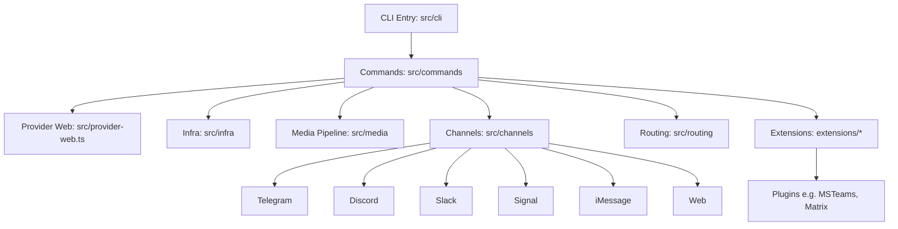
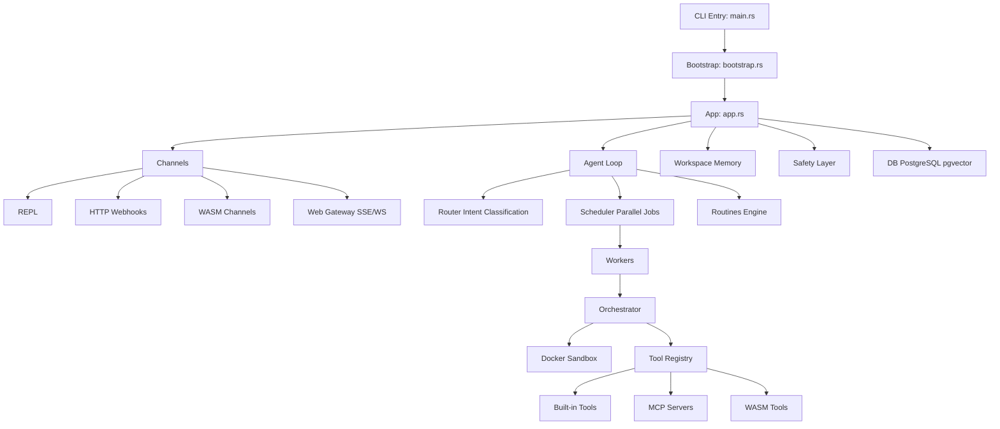
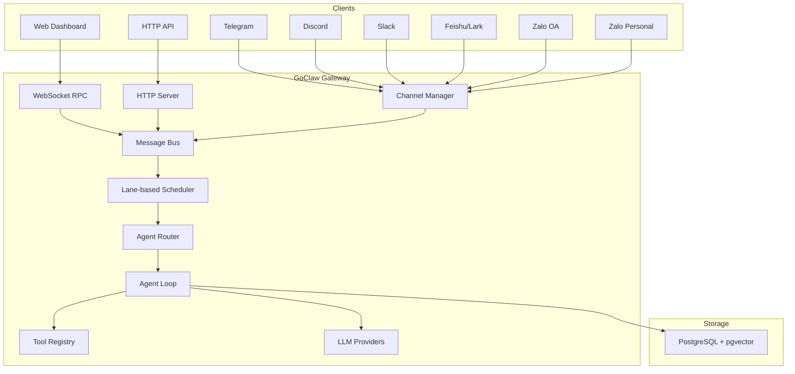
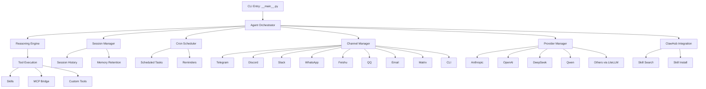
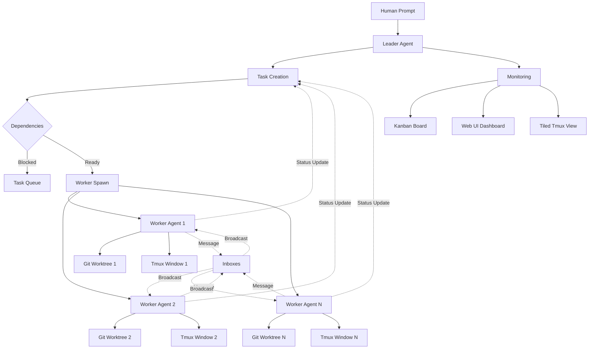

# Architecture Comparison: Zeroclaw vs Openclaw vs NanoClaw vs IronClaw vs GoClaw vs Nanobot vs ClawTeam vs Maxclaw

## Zeroclaw Architecture Summary

**Overview:** Zeroclaw is a Rust-first autonomous agent runtime designed for high performance, efficiency, stability, extensibility, sustainability, and security. It uses a trait-driven, modular architecture to enable pluggable components.

**Key Principles:**
- KISS (Keep It Simple, Stupid)
- YAGNI (You Aren't Gonna Need It)
- DRY + Rule of Three
- SRP + ISP (Single Responsibility + Interface Segregation)
- Fail Fast + Explicit Errors
- Secure by Default + Least Privilege
- Determinism + Reproducibility
- Reversibility + Rollback-First Thinking

**Core Architecture:**
- **Language:** Rust
- **Entry Point:** `src/main.rs` (CLI entrypoint and command routing)
- **Modules:**
  - `src/lib.rs` (module exports and shared command enums)
  - `src/config/` (schema + config loading/merging)
  - `src/agent/` (orchestration loop)
  - `src/gateway/` (webhook/gateway server)
  - `src/security/` (policy, pairing, secret store)
  - `src/memory/` (markdown/sqlite memory backends + embeddings/vector merge)
  - `src/providers/` (model providers and resilient wrapper)
  - `src/channels/` (Telegram/Discord/Slack/etc channels)
  - `src/tools/` (tool execution surface: shell, file, memory, browser)
  - `src/peripherals/` (hardware peripherals: STM32, RPi GPIO)
  - `src/runtime/` (runtime adapters, currently native)
  - `src/observability/` (Observer trait)
- **Extension Points (Traits):**
  - `Provider` (src/providers/traits.rs)
  - `Channel` (src/channels/traits.rs)
  - `Tool` (src/tools/traits.rs)
  - `Memory` (src/memory/traits.rs)
  - `Observer` (src/observability/traits.rs)
  - `RuntimeAdapter` (src/runtime/traits.rs)
  - `Peripheral` (src/peripherals/traits.rs)
- **Factory Pattern:** Most extensions registered in factory modules (e.g., `src/providers/mod.rs`)
- **Documentation:** Task-oriented docs in `docs/`, with unified TOC, references, operations, security, hardware guides. Supports i18n (en, zh-CN, ja, ru, fr, vi).
- **Build/Release:** Cargo.toml with performance optimizations, CI via .github/, docs governance.

**Workflow:** Read before write, define scope, implement minimal patch, validate by risk tier, document impact.

## Openclaw Architecture Summary

**Overview:** Openclaw is a TypeScript-based CLI application for autonomous agents, supporting multiple messaging channels, plugins, and platforms. It emphasizes extensibility through plugins and a modular structure.

**Key Principles:**
- TypeScript (ESM), strict typing, no `any`
- Functional array methods, early returns, const over let
- Formatting via Oxlint/Oxfmt
- No prototype mutation for class behavior
- Concise files (~700 LOC), extract helpers
- Naming: OpenClaw for product, openclaw for CLI/paths

**Core Architecture:**
- **Language:** TypeScript (ESM)
- **Entry Point:** CLI via `src/cli`, commands in `src/commands`
- **Modules:**
  - `src/provider-web.ts` (web provider)
  - `src/infra` (infrastructure)
  - `src/media` (media pipeline)
  - Channel modules: `src/telegram`, `src/discord`, `src/slack`, `src/signal`, `src/imessage`, `src/web`, `src/channels`, `src/routing`
  - Extensions: `extensions/*` (plugins like msteams, matrix, zalo, voice-call)
- **Plugins/Extensions:** Workspace packages under `extensions/`, with own package.json. Install via npm in plugin dir.
- **Build/Test:**
  - Package Manager: pnpm (preferred), bun supported
  - Runtime: Node 22+
  - Tests: Vitest (coverage 70%), e2e, live tests
  - Linting/Formatting: Oxlint/Oxfmt
  - Build: `pnpm build`, `pnpm tsgo`
- **Platforms:** Mac, Windows, Linux, mobile (iOS/Android), with packaging scripts
- **Channels:** Core + extensions, with routing, allowlists, pairing
- **Docs:** Mintlify-hosted (docs.openclaw.ai), i18n (zh-CN), root-relative links
- **Release:** stable (tagged), beta (prerelease), dev (main branch)
- **CI/DevOps:** .github/, scripts for packaging, installers from sibling repo

**Workflow:** Conventional commits, PR templates, small PRs, test before push.

### Architecture Diagram



## NanoClaw Architecture Summary

**Overview:** NanoClaw is a personal Claude assistant implemented as a single Node.js process that connects to WhatsApp and routes messages to Claude Agent SDK running in isolated containers (Linux VMs). It provides per-group isolated filesystem and memory.

**Key Principles:**
- Single process architecture for simplicity
- Containerization for agent isolation
- Per-group memory and filesystem isolation
- WhatsApp as primary channel
- SQLite for database operations

**Core Architecture:**
- **Language:** TypeScript (Node.js)
- **Entry Point:** `src/index.ts` (orchestrator: state, message loop, agent invocation)
- **Modules:**
  - `src/channels/whatsapp.ts` (WhatsApp connection, auth, send/receive)
  - `src/ipc.ts` (IPC watcher and task processing)
  - `src/router.ts` (message formatting and outbound routing)
  - `src/config.ts` (trigger patterns, paths, intervals)
  - `src/container-runner.ts` (spawns agent containers with mounts)
  - `src/task-scheduler.ts` (runs scheduled tasks)
  - `src/db.ts` (SQLite operations)
  - `groups/{name}/CLAUDE.md` (per-group memory, isolated)
  - `container/skills/agent-browser.md` (browser automation tool via Bash)
- **Containerization:** Agents run in Linux VMs/containers with isolated filesystems
- **Channels:** Primarily WhatsApp, with routing and formatting
- **Memory:** Per-group CLAUDE.md files for isolated memory
- **Build/Test:** npm scripts (`npm run dev`, `npm run build`), container build script
- **Service Management:** launchctl for macOS service management
- **Skills:** /setup, /customize, /debug for configuration and troubleshooting

**Workflow:** Direct command execution, container rebuilds as needed.

### Architecture Diagram

```mermaid
graph TD
    A[Orchestrator: src/index.ts] --> B[WhatsApp Channel: src/channels/whatsapp.ts]
    A --> C[IPC Watcher: src/ipc.ts]
    A --> D[Message Router: src/router.ts]
    A --> E[Config: src/config.ts]
    A --> F[Container Runner: src/container-runner.ts]
    A --> G[Task Scheduler: src/task-scheduler.ts]
    A --> H[Database: src/db.ts]
    F --> I[Claude Agent SDK in Containers]
    I --> J[Isolated Filesystem per Group]
    I --> K[Per-Group Memory: groups/{name}/CLAUDE.md]
    I --> L[Browser Automation: container/skills/agent-browser.md]
```

## IronClaw Architecture Summary

**Overview:** IronClaw is a Rust-based secure personal AI assistant that prioritizes data protection, multi-layer security, and self-expanding capabilities. It uses WebAssembly sandboxing for tool execution and PostgreSQL for persistent storage.

**Key Principles:**
- Security first with defense in depth
- Your data stays yours (local storage, encrypted, no telemetry)
- Self-expanding capabilities through dynamic tool building
- Transparency by design (open source, auditable)
- Capability-based permissions for WASM tools

**Core Architecture:**
- **Language:** Rust
- **Entry Point:** `src/main.rs` (CLI entrypoint and application bootstrapping)
- **Modules:**
  - `src/agent/` (agent logic and orchestration)
  - `src/channels/` (channel implementations: REPL, HTTP, WASM-based)
  - `src/config/` (configuration management)
  - `src/context/` (execution context management)
  - `src/db/` (PostgreSQL database operations with pgvector)
  - `src/llm/` (LLM provider abstraction with multi-provider support)
  - `src/orchestrator/` (Docker sandbox and container lifecycle)
  - `src/registry/` (tool and channel registry)
  - `src/sandbox/` (WASM sandbox for untrusted tool execution)
  - `src/safety/` (prompt injection defense and content sanitization)
  - `src/secrets/` (secure secret storage with system keychain integration)
  - `src/bootstrap.rs` (application initialization and onboarding)
  - `src/app.rs` (main application logic)
- **Extension Points:**
  - WASM tools with capability-based permissions
  - MCP (Model Context Protocol) servers
  - Docker-based worker containers
  - WASM-based channels (Telegram, Slack, WhatsApp)
- **Security Layers:**
  - WASM sandbox with endpoint allowlisting
  - Credential injection at host boundary (never exposed to WASM)
  - Prompt injection defense (pattern detection, sanitization)
  - AES-256-GCM encryption for secrets
  - No telemetry or data sharing
- **Build/Test:**
  - Package Manager: Cargo
  - Runtime: Native Rust binary
  - Tests: `cargo test`, integration tests with testcontainers
  - Linting: `cargo clippy`, formatting via `cargo fmt`
- **Platforms:** Mac, Windows, Linux (native binaries, installers available)
- **Channels:** REPL, HTTP webhooks, Web Gateway (SSE/WebSocket), WASM channels (Telegram, Slack, WhatsApp)
- **Memory:** PostgreSQL with pgvector for hybrid search (full-text + vector)
- **Database:** PostgreSQL 15+ (required), with optional libSQL/Turso support
- **Features:** Routines (cron, event triggers, webhooks), parallel job execution, workspace filesystem

### Architecture Diagram



## GoClaw Architecture Summary

**Overview:** GoClaw is a multi-agent AI gateway that connects LLMs to tools, channels, and data — deployed as a single Go binary with zero runtime dependencies. It orchestrates agent teams, inter-agent delegation, and quality-gated workflows across 13+ LLM providers with full multi-tenant PostgreSQL isolation.

**Key Principles:**
- Agent Teams & Orchestration with shared task boards
- Multi-tenant PostgreSQL with per-user workspaces
- Single binary deployment (~25 MB)
- 5-layer production security defense
- 13+ LLM providers with native Anthropic support
- WebSocket RPC + HTTP API

**Core Architecture:**
- **Language:** Go 1.26
- **Entry Point:** `cmd/goclaw/main.go` (CLI entrypoint)
- **Modules:**
  - `cmd/` (CLI commands, gateway startup, onboard wizard, migrations)
  - `internal/gateway/` (WS + HTTP server, client, method router)
  - `internal/gateway/methods/` (RPC handlers: chat, agents, sessions, config, skills, cron, pairing)
  - `internal/agent/` (agent loop: think→act→observe, router, resolver, input guard)
  - `internal/providers/` (LLM providers: Anthropic native HTTP+SSE, OpenAI-compat HTTP+SSE)
  - `internal/tools/` (tool registry: fs, exec, web, memory, delegate, team, MCP, custom)
  - `internal/store/` (store interfaces + pg/ PostgreSQL implementations)
  - `internal/bootstrap/` (system prompt files: SOUL.md, IDENTITY.md + seeding)
  - `internal/config/` (config loading with JSON5 + env var overlay)
  - `internal/channels/` (channel manager: Telegram, Feishu/Lark, Zalo, Discord, WhatsApp)
  - `internal/http/` (HTTP API: /v1/chat/completions, /v1/agents, /v1/skills)
  - `internal/skills/` (SKILL.md loader + BM25 search)
  - `internal/memory/` (memory system with pgvector)
  - `internal/tracing/` (LLM call tracing + optional OTel export)
  - `internal/scheduler/` (lane-based concurrency: main/subagent/delegate/cron)
  - `internal/cron/` (cron scheduling: at/every/cron expressions)
  - `internal/permissions/` (RBAC: admin/operator/viewer)
  - `internal/pairing/` (browser pairing with 8-char codes)
  - `internal/crypto/` (AES-256-GCM encryption for API keys)
  - `internal/sandbox/` (Docker-based code sandbox)
  - `internal/tts/` (Text-to-Speech: OpenAI, ElevenLabs, Edge, MiniMax)
  - `internal/i18n/` (message catalog with T(locale, key, args...))
  - `pkg/protocol/` (wire types: frames, methods, errors, events)
  - `pkg/browser/` (browser automation via Rod + CDP)
  - `ui/web/` (React SPA: pnpm, Vite 6, Tailwind CSS 4, Radix UI, Zustand)
- **Extension Points:**
  - MCP protocol support (stdio/SSE/streamable-http)
  - Custom tools via tool registry
  - Agent evaluators and hooks system
- **Security Layers:**
  - Rate limiting
  - Prompt injection detection
  - SSRF protection
  - Shell deny patterns
  - AES-256-GCM encryption for secrets
  - Per-user isolated sessions
- **Build/Test:**
  - Package Manager: Go modules
  - Runtime: Native Go binary
  - Tests: `go test`, integration tests with race detector
  - Linting/Formatting: `go vet`, `go fix`, `go build`
- **Platforms:** Cross-platform via single binary + Docker (~50 MB Alpine)
- **Channels:** Telegram, Discord, Slack, Zalo OA, Zalo Personal, Feishu/Lark, WhatsApp
- **Memory:** PostgreSQL 15+ with pgvector for hybrid search
- **Database:** PostgreSQL 15+ (required for multi-tenant)
- **Features:** Agent teams, conversation handoff, evaluate-loop quality gates, hooks system, knowledge graph, 13+ LLM providers, 7+ messaging channels, OpenTelemetry observability

### Architecture Diagram



## Nanobot Architecture Summary

**Overview:** Nanobot is an ultra-lightweight personal AI assistant with just ~4,000 lines of core agent code — 99% smaller than OpenClaw. It delivers core agent functionality with minimal footprint for faster startup, lower resource usage, and quicker iterations.

**Key Principles:**
- Ultra-lightweight design (~4,000 LOC core agent code)
- Research-ready with clean, readable code
- Lightning fast with minimal footprint
- Easy-to-use with one-click deployment
- MCP (Model Context Protocol) support
- Multiple LLM providers via LiteLLM

**Core Architecture:**
- **Language:** Python 3.11+
- **Entry Point:** `nanobot/__main__.py` (CLI entrypoint via Typer)
- **Modules:**
  - `nanobot/agent/` (agent orchestration and reasoning)
  - `nanobot/channels/` (channel implementations: Telegram, Discord, Slack, WhatsApp, Feishu, QQ, Email, Matrix)
  - `nanobot/cli/` (CLI commands and interface)
  - `nanobot/config/` (configuration management via Pydantic)
  - `nanobot/providers/` (LLM providers via LiteLLM: Anthropic, OpenAI, DeepSeek, Qwen, Moonshot, VolcEngine, MiniMax, Mistral, etc.)
  - `nanobot/skills/` (skill system with ClawHub integration)
  - `nanobot/cron/` (scheduled task management)
  - `nanobot/session/` (session history management)
  - `nanobot/utils/` (utility functions and helpers)
  - `nanobot/heartbeat/` (heartbeat and health monitoring)
  - `nanobot/bus/` (message bus for agent communication)
  - `nanobot/templates/` (prompt templates)
  - `bridge/` (MCP bridge implementation)
- **Extension Points:**
  - Custom skills via ClawHub integration
  - MCP protocol support (stdio, SSE)
  - Custom channel implementations
  - Custom LLM providers
- **Build/Test:**
  - Package Manager: pip/PyPI (nanobot-ai)
  - Runtime: Python 3.11+ via pip install
  - Tests: Located in `tests/` directory
  - Dependencies: Typer, LiteLLM, Pydantic, websockets, httpx, loguru, rich
- **Platforms:** Cross-platform via Python + Docker
- **Channels:** Telegram, Discord, Slack, WhatsApp, Feishu, QQ, Email, Matrix, CLI
- **Memory:** Session history management with configurable retention
- **Database:** SQLite (for local data persistence)
- **Features:** 24/7 real-time market analysis, full-stack software engineering, smart daily routine management, personal knowledge assistant, multimodal support, scheduled tasks (cron), subagent support, MCP integration, ClawHub skill marketplace

### Architecture Diagram



## ClawTeam Architecture Summary

**Overview:** ClawTeam is a multi-agent swarm coordination layer that transforms single AI agents into self-organizing teams. It provides leader-worker orchestration, task dependencies, inter-agent messaging, and git worktree isolation for parallel development.

**Key Principles:**
- Agent self-organization (AI agents orchestrate themselves)
- Zero-config setup with TOML team templates
- File-based state with fcntl locking (no database)
- Git worktree isolation for parallel agents
- Multi-agent support (OpenClaw, Claude Code, Codex, nanobot, Cursor)

**Core Architecture:**
- **Language:** Python 3.10+
- **Entry Point:** `clawteam` CLI commands
- **Modules:**
  - Team lifecycle (`team spawn-team`, `team cleanup`)
  - Agent spawning (`spawn` with tmux backend)
  - Task management (`task create`, `task update`, `task wait`)
  - Inter-agent messaging (`inbox send`, `inbox broadcast`)
  - Monitoring dashboards (`board show`, `board live`, `board serve`)
  - Workspace management (`workspace checkpoint`, `workspace merge`)
  - Team templates (TOML-based team definitions)
- **State Management:** JSON files in `~/.clawteam/`
  - `teams/` (team configuration)
  - `tasks/` (task state and dependencies)
  - `inboxes/` (point-to-point messaging)
  - `workspaces/` (git worktree references)
- **Transport Backends:**
  - File-based (default, local filesystem)
  - ZeroMQ P2P (optional, cross-machine)
  - Redis (planned, cross-machine messaging)
- **Agent Support:**
  - OpenClaw (default, native integration)
  - Claude Code (full support)
  - Codex (full support)
  - nanobot (full support)
  - Cursor (experimental)
  - Custom scripts (full support)
- **Features:**
  - Per-agent git worktrees (no merge conflicts)
  - Task dependency chains with auto-unblock
  - Kanban board with live updates
  - Tiled tmux view of all agents
  - Web UI dashboard
  - One-command team templates
  - Per-agent model assignment (preview)

### Architecture Diagram



## Maxclaw Architecture Summary

**Overview:** Maxclaw is an OpenClaw-style local-first AI agent written in Go, emphasizing low memory footprint, fully local workflow, and visual interfaces (desktop UI + web UI). It provides autonomous execution, spawn sub-sessions, and monorepo-aware context discovery.

**Key Principles:**
- Go-native resource efficiency
- Fully local execution (sessions, memory, logs)
- Desktop UI + Web UI on same port
- Monorepo context awareness (AGENTS.md, CLAUDE.md)
- Autonomous mode with task scheduling

**Core Architecture:**
- **Language:** Go 1.24+
- **Entry Point:** `cmd/main.go` (CLI entrypoint)
- **Modules:**
  - `cmd/` (CLI commands: onboard, skills, gateway, telegram bind)
  - `internal/agent/` (agent loop and reasoning)
  - `internal/tools/` (tool system and execution)
  - `internal/memory/` (MEMORY.md + HISTORY.md layering)
  - `internal/channels/` (Telegram, WhatsApp Bridge, Discord, WebSocket)
  - `internal/scheduler/` (cron/once/every scheduling)
  - `internal/config/` (config.json management)
  - `internal/context/` (monorepo discovery)
- **Execution Modes:**
  - `safe`: Conservative exploration
  - `ask`: Default interactive mode
  - `auto`: Autonomous continuation (no manual approval)
- **Key Features:**
  - Low memory footprint (Go native)
  - Desktop UI + Web UI (same port)
  - Spawn sub-sessions with independent context
  - Automatic task titles (session summarization)
  - Monorepo-aware recursive context discovery
  - Multi-channel integrations
  - Cron scheduling + daily memory digest
- **Binaries:**
  - `maxclaw`: Full CLI with all commands
  - `maxclaw-gateway`: Standalone backend for headless use
- **Memory Layering:**
  - `MEMORY.md`: Long-term knowledge storage
  - `HISTORY.md`: Session history
  - `memory/heartbeat.md`: Active context tracking
- **Configuration:** `~/.maxclaw/config.json`
  - Provider settings (Anthropic, OpenAI native SDKs)
  - Agent defaults (model, workspace, executionMode)

### Architecture Diagram



```mermaid
graph TB
    A[CLI Entry: cmd/main.go] --> B[Agent Loop]
    B --> C[Reasoning Engine]
    B --> D[Tool Execution]
    B --> E[Session Manager]
    B --> F[Memory Layer]
    B --> G[Scheduler]
    B --> H[Channel Manager]
    C --> C1[Tool Registry]
    D --> D1[Skills]
    D --> D2[MCP Bridge]
    D --> D3[Custom Tools]
    E --> E1[Spawn Sub-Sessions]
    E --> E2[Independent Context]
    F --> F1[MEMORY.md]
    F --> F2[HISTORY.md]
    F --> F3[memory/heartbeat.md]
    G --> G1[Cron Jobs]
    G --> G2[Once Tasks]
    G --> G3[Every Schedules]
    H --> H1[Telegram]
    H --> H2[WhatsApp Bridge]
    H --> H3[Discord]
    H --> H4[WebSocket]
    B --> I[Desktop UI + Web UI]
    I --> I1[Visual Settings]
    I --> I2[Streaming Chat]
    I --> I3[File Preview]
    I --> I4[Terminal Integration]
    B --> J[Monorepo Context Discovery]
    J --> J1[AGENTS.md]
    J --> J2[CLAUDE.md]
    J --> J3[Recursive Search]
```

## Comparison

 | Aspect | Zeroclaw | Openclaw | NanoClaw | IronClaw | GoClaw | Nanobot | ClawTeam | Maxclaw |
|--------|----------|----------|----------|-----------|---------|---------|-----------|----------|
| | Language | Rust | TypeScript | TypeScript (Node.js) | Rust | Go 1.26 | Python 3.11+ | Python 3.10+ | Go 1.24+ |
| | Focus | High-performance runtime | CLI with channels/plugins | Personal WhatsApp assistant | Secure personal AI assistant | Multi-agent gateway with teams | Ultra-lightweight assistant | Multi-agent swarm coordination | Local-first Go agent |
| | Modularity | Trait-based extensions | Plugin-based extensions | Single process + containers | WASM tools + MCP + Docker | Tool registry + hooks | Skill system + MCP | Any CLI agent integration | Agent loop + tool system |
| | Security | First-class, internet-adjacent | CLI security, redaction | Container isolation | WASM sandbox + defense in depth | 5-layer defense | Security hardening | Agent isolation (git worktrees) | Local execution only |
| | Platforms | Native (Linux, etc.) | Cross-platform (Mac, Win, Linux, mobile) | macOS (launchctl), containerized agents | Cross-platform (Mac, Win, Linux) | Cross-platform (binary + Docker) | Cross-platform (Python + Docker) | Multi-platform agents | Cross-platform (Mac, Win, Linux) |
| | Docs | Local docs/, i18n | Mintlify-hosted, i18n | README + docs/ | README + docs/ | README + docs/ | README + docs/ | Comprehensive docs | README + docs/ (i18n) |
| | Build | Cargo | pnpm/bun | npm + container build | Cargo | Go modules | pip/PyPI | pip from source | make build |
| | Tests | Rust tests | Vitest | Not specified | Rust tests + integration | go test + race detector | tests/ directory | Not specified | Go tests |
| | Channels | Core channels | Core + extensions | WhatsApp only | REPL, HTTP, WASM, Web Gateway | Telegram, Discord, Slack, etc. | Telegram, Discord, Slack, etc. | Agent-dependent | Telegram, WA Bridge, Discord, WS |
| | Integrations/Extensions | Peripherals (GPIO, etc.) | Media pipeline | Browser automation via Bash | WASM tools, MCP, Docker | MCP, custom tools, hooks | ClawHub skills, MCP | Multi-agent coordination | MCP, monorepo discovery |
| | Runtime | Native adapters | Node-based | Node + containerized Claude SDK | Native with Docker workers | Native Go binary | Python runtime | Agent-specific | Native Go binary |
| | Isolation | Module-level | Plugin-level | Per-group containers | WASM sandbox + per-job containers | Per-user workspaces (PostgreSQL) | Session-level | Git worktree per agent | Fully local |
| | Memory | Markdown/SQLite with embeddings | Not specified | Per-group CLAUDE.md | PostgreSQL with pgvector | PostgreSQL + pgvector | Session history | Inboxes + tasks | MEMORY.md + HISTORY.md |
| | Database | SQLite | Not specified | SQLite | PostgreSQL (required) | PostgreSQL 15+ (required) | SQLite (local) | JSON files (file-based) | SQLite (local) |
| | LLM Support | Model providers | Web provider | Claude Agent SDK | Multi-provider (NEAR AI, OpenAI-compatible) | 13+ providers (Anthropic native, OpenAI-compat) | Multiple via LiteLLM | Agent-dependent | Anthropic + OpenAI native SDKs |
| | Agent Support | Single agent | Single agent | Single agent | Single agent | Multi-agent teams | Single agent | Multi-agent swarms | Spawn sub-sessions |
| | State Management | Internal structures | Not specified | SQLite | PostgreSQL + pgvector | PostgreSQL multi-tenant | Session-based | File-based JSON | Local filesystem |

All eight are autonomous agent projects with distinct focuses: Zeroclaw emphasizes Rust performance and hardware extensibility, Openclaw focuses on TypeScript CLI with extensive channel support, NanoClaw is a containerized WhatsApp-to-Claude bridge with group isolation, IronClaw prioritizes security through WASM sandboxing and multi-layer defense mechanisms, GoClaw focuses on multi-agent orchestration with multi-tenant PostgreSQL and agent teams, Nanobot prioritizes ultra-lightweight design with minimal footprint and research-ready code, ClawTeam provides multi-agent swarm coordination that transforms single agents into self-organizing teams, and Maxclaw offers an OpenClaw-style local-first experience in Go with desktop UI and resource efficiency.

