# Architecture Comparison: Platform Overview

**[中文](architecture_comparison.zh-CN.md)** | English

> **Note:** This document covers all 13 claw ecosystem platforms with full architecture analysis. For comprehensive coverage of all 20 platforms (13 claw + 7 external frameworks), see:
> - **[external_frameworks.md](external_frameworks.md)** — Deep-dive on 7 external frameworks
> - **[Latest Updates](../docs/LATEST_UPDATES.md)** — Monthly ecosystem tracking
> - **[Platform Categories](../README.md#architecture-analysis--comparison)** — Full 20-platform list

---

# Architecture Comparison: Openclaw vs ClawTeam vs GoClaw vs IronClaw vs Maxclaw vs NanoClaw vs Nanobot vs Zeroclaw vs HiClaw vs QuantumClaw vs Hermes-Agent vs RTL-CLAW vs Claw-AI-Lab

## Openclaw Architecture Summary

**Overview:** Openclaw is a TypeScript-based CLI application for autonomous agents, supporting multiple messaging channels, plugins, and platforms. It emphasizes extensibility through plugins and a modular structure.

**Key Principles:**
- TypeScript (ESM), strict typing, no `any`
- Functional array methods, early returns, const over let
- Formatting via Oxlint/Oxfmt
- No prototype mutation for class behavior
- Concise files (~700 LOC), extract helpers
- Naming: OpenClaw for product, openclaw for CLI/paths

**Core Architecture:**
- **Language:** TypeScript (ESM)
- **Entry Point:** CLI via `src/cli`, commands in `src/commands`
- **Modules:**
  - `src/provider-web.ts` (web provider)
  - `src/infra` (infrastructure)
  - `src/media` (media pipeline)
  - Channel modules: `src/telegram`, `src/discord`, `src/slack`, `src/signal`, `src/imessage`, `src/web`, `src/channels`, `src/routing`
  - Extensions: `extensions/*` (plugins like msteams, matrix, zalo, voice-call)
- **Plugins/Extensions:** Workspace packages under `extensions/`, with own package.json. Install via npm in plugin dir.
- **Build/Test:**
  - Package Manager: pnpm (preferred), bun supported
  - Runtime: Node 22+
  - Tests: Vitest (coverage 70%), e2e, live tests
  - Linting/Formatting: Oxlint/Oxfmt
  - Build: `pnpm build`, `pnpm tsgo`
- **Platforms:** Mac, Windows, Linux, mobile (iOS/Android), with packaging scripts
- **Channels:** Core + extensions, with routing, allowlists, pairing
- **Docs:** Mintlify-hosted (docs.openclaw.ai), i18n (zh-CN), root-relative links
- **Release:** stable (tagged), beta (prerelease), dev (main branch)
- **CI/DevOps:** .github/, scripts for packaging, installers from sibling repo

**Workflow:** Conventional commits, PR templates, small PRs, test before push.

### Architecture Diagram

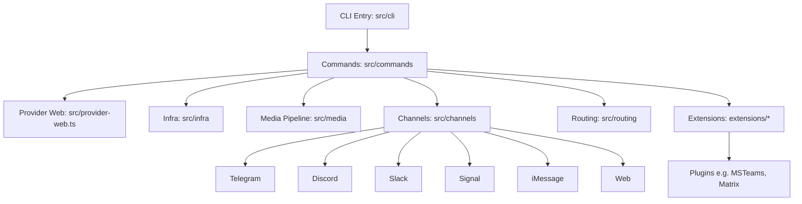

## ClawTeam Architecture Summary

**Overview:** ClawTeam is a multi-agent swarm coordination layer that transforms single AI agents into self-organizing teams. It provides leader-worker orchestration, task dependencies, inter-agent messaging, and git worktree isolation for parallel development.

**Key Principles:**
- Agent self-organization (AI agents orchestrate themselves)
- Zero-config setup with TOML team templates
- File-based state with fcntl locking (no database)
- Git worktree isolation for parallel agents
- Multi-agent support (OpenClaw, Claude Code, Codex, nanobot, Cursor)

**Core Architecture:**
- **Language:** Python 3.10+
- **Entry Point:** `clawteam` CLI commands
- **Modules:**
  - Team lifecycle (`team spawn-team`, `team cleanup`)
  - Agent spawning (`spawn` with tmux backend)
  - Task management (`task create`, `task update`, `task wait`)
  - Inter-agent messaging (`inbox send`, `inbox broadcast`)
  - Monitoring dashboards (`board show`, `board live`, `board serve`)
  - Workspace management (`workspace checkpoint`, `workspace merge`)
  - Team templates (TOML-based team definitions)
- **State Management:** JSON files in `~/.clawteam/`
  - `teams/` (team configuration)
  - `tasks/` (task state and dependencies)
  - `inboxes/` (point-to-point messaging)
  - `workspaces/` (git worktree references)
- **Transport Backends:**
  - File-based (default, local filesystem)
  - ZeroMQ P2P (optional, cross-machine)
  - Redis (planned, cross-machine messaging)
- **Agent Support:**
  - OpenClaw (default, native integration)
  - Claude Code (full support)
  - Codex (full support)
  - nanobot (full support)
  - Cursor (experimental)
  - Custom scripts (full support)
- **Features:**
  - Per-agent git worktrees (no merge conflicts)
  - Task dependency chains with auto-unblock
  - Kanban board with live updates
  - Tiled tmux view of all agents
  - Web UI dashboard
  - One-command team templates
  - Per-agent model assignment (preview)

### Architecture Diagram

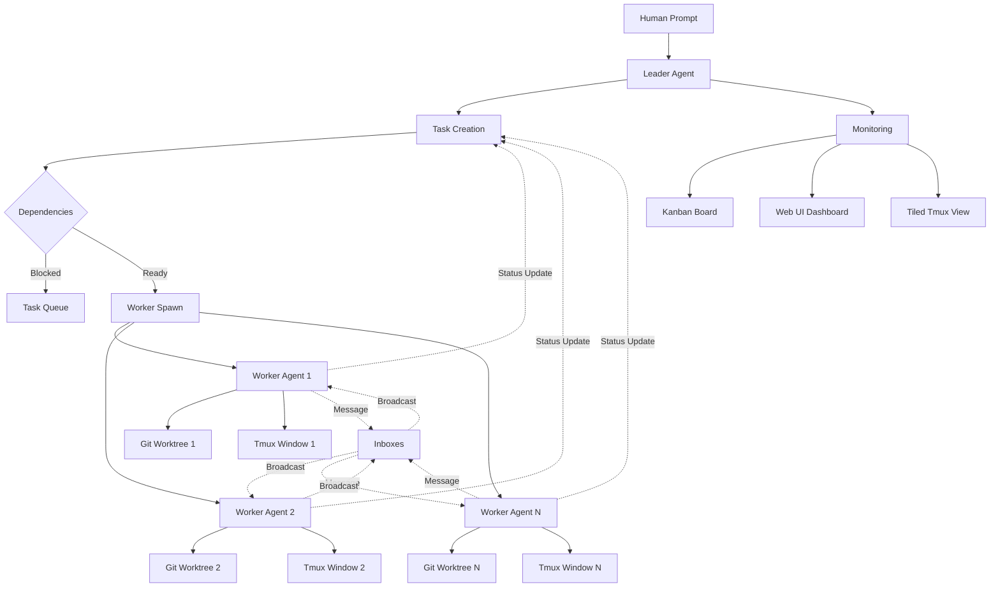

## GoClaw Architecture Summary

**Overview:** GoClaw is a multi-agent AI gateway that connects LLMs to tools, channels, and data — deployed as a single Go binary with zero runtime dependencies. It orchestrates agent teams, inter-agent delegation, and quality-gated workflows across 13+ LLM providers with full multi-tenant PostgreSQL isolation.

**Key Principles:**
- Agent Teams & Orchestration with shared task boards
- Multi-tenant PostgreSQL with per-user workspaces
- Single binary deployment (~25 MB)
- 5-layer production security defense
- 13+ LLM providers with native Anthropic support
- WebSocket RPC + HTTP API

**Core Architecture:**
- **Language:** Go 1.26
- **Entry Point:** `cmd/goclaw/main.go` (CLI entrypoint)
- **Modules:**
  - `cmd/` (CLI commands, gateway startup, onboard wizard, migrations)
  - `internal/gateway/` (WS + HTTP server, client, method router)
  - `internal/gateway/methods/` (RPC handlers: chat, agents, sessions, config, skills, cron, pairing)
  - `internal/agent/` (agent loop: think→act→observe, router, resolver, input guard)
  - `internal/providers/` (LLM providers: Anthropic native HTTP+SSE, OpenAI-compat HTTP+SSE)
  - `internal/tools/` (tool registry: fs, exec, web, memory, delegate, team, MCP, custom)
  - `internal/store/` (store interfaces + pg/ PostgreSQL implementations)
  - `internal/bootstrap/` (system prompt files: SOUL.md, IDENTITY.md + seeding)
  - `internal/config/` (config loading with JSON5 + env var overlay)
  - `internal/channels/` (channel manager: Telegram, Feishu/Lark, Zalo, Discord, WhatsApp)
  - `internal/http/` (HTTP API: /v1/chat/completions, /v1/agents, /v1/skills)
  - `internal/skills/` (SKILL.md loader + BM25 search)
  - `internal/memory/` (memory system with pgvector)
  - `internal/tracing/` (LLM call tracing + optional OTel export)
  - `internal/scheduler/` (lane-based concurrency: main/subagent/delegate/cron)
  - `internal/cron/` (cron scheduling: at/every/cron expressions)
  - `internal/permissions/` (RBAC: admin/operator/viewer)
  - `internal/pairing/` (browser pairing with 8-char codes)
  - `internal/crypto/` (AES-256-GCM encryption for API keys)
  - `internal/sandbox/` (Docker-based code sandbox)
  - `internal/tts/` (Text-to-Speech: OpenAI, ElevenLabs, Edge, MiniMax)
  - `internal/i18n/` (message catalog with T(locale, key, args...))
  - `pkg/protocol/` (wire types: frames, methods, errors, events)
  - `pkg/browser/` (browser automation via Rod + CDP)
  - `ui/web/` (React SPA: pnpm, Vite 6, Tailwind CSS 4, Radix UI, Zustand)
- **Extension Points:**
  - MCP protocol support (stdio/SSE/streamable-http)
  - Custom tools via tool registry
  - Agent evaluators and hooks system
- **Security Layers:**
  - Rate limiting
  - Prompt injection detection
  - SSRF protection
  - Shell deny patterns
  - AES-256-GCM encryption for secrets
  - Per-user isolated sessions
- **Build/Test:**
  - Package Manager: Go modules
  - Runtime: Native Go binary
  - Tests: `go test`, integration tests with race detector
  - Linting/Formatting: `go vet`, `go fix`, `go build`
- **Platforms:** Cross-platform via single binary + Docker (~50 MB Alpine)
- **Channels:** Telegram, Discord, Slack, Zalo OA, Zalo Personal, Feishu/Lark, WhatsApp
- **Memory:** PostgreSQL 15+ with pgvector for hybrid search
- **Database:** PostgreSQL 15+ (required for multi-tenant)
- **Features:** Agent teams, conversation handoff, evaluate-loop quality gates, hooks system, knowledge graph, 13+ LLM providers, 7+ messaging channels, OpenTelemetry observability

### Architecture Diagram

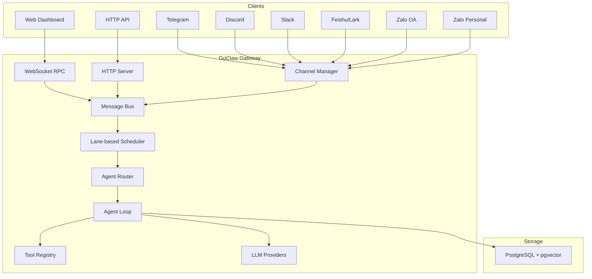

## IronClaw Architecture Summary

**Overview:** IronClaw is a Rust-based secure personal AI assistant that prioritizes data protection, multi-layer security, and self-expanding capabilities. It uses WebAssembly sandboxing for tool execution and PostgreSQL for persistent storage.

**Key Principles:**
- Security first with defense in depth
- Your data stays yours (local storage, encrypted, no telemetry)
- Self-expanding capabilities through dynamic tool building
- Transparency by design (open source, auditable)
- Capability-based permissions for WASM tools

**Core Architecture:**
- **Language:** Rust
- **Entry Point:** `src/main.rs` (CLI entrypoint and application bootstrapping)
- **Modules:**
  - `src/agent/` (agent logic and orchestration)
  - `src/channels/` (channel implementations: REPL, HTTP, WASM-based)
  - `src/config/` (configuration management)
  - `src/context/` (execution context management)
  - `src/db/` (PostgreSQL database operations with pgvector)
  - `src/llm/` (LLM provider abstraction with multi-provider support)
  - `src/orchestrator/` (Docker sandbox and container lifecycle)
  - `src/registry/` (tool and channel registry)
  - `src/sandbox/` (WASM sandbox for untrusted tool execution)
  - `src/safety/` (prompt injection defense and content sanitization)
  - `src/secrets/` (secure secret storage with system keychain integration)
  - `src/bootstrap.rs` (application initialization and onboarding)
  - `src/app.rs` (main application logic)
- **Extension Points:**
  - WASM tools with capability-based permissions
  - MCP (Model Context Protocol) servers
  - Docker-based worker containers
  - WASM-based channels (Telegram, Slack, WhatsApp)
- **Security Layers:**
  - WASM sandbox with endpoint allowlisting
  - Credential injection at host boundary (never exposed to WASM)
  - Prompt injection defense (pattern detection, sanitization)
  - AES-256-GCM encryption for secrets
  - No telemetry or data sharing
- **Build/Test:**
  - Package Manager: Cargo
  - Runtime: Native Rust binary
  - Tests: `cargo test`, integration tests with testcontainers
  - Linting: `cargo clippy`, formatting via `cargo fmt`
- **Platforms:** Mac, Windows, Linux (native binaries, installers available)
- **Channels:** REPL, HTTP webhooks, Web Gateway (SSE/WebSocket), WASM channels (Telegram, Slack, WhatsApp)
- **Memory:** PostgreSQL with pgvector for hybrid search (full-text + vector)
- **Database:** PostgreSQL 15+ (required), with optional libSQL/Turso support
- **Features:** Routines (cron, event triggers, webhooks), parallel job execution, workspace filesystem

### Architecture Diagram

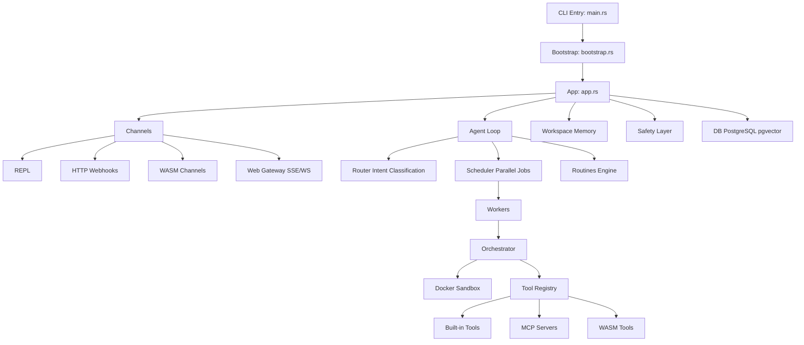

## Maxclaw Architecture Summary

**Overview:** Maxclaw is an OpenClaw-style local-first AI agent written in Go, emphasizing low memory footprint, fully local workflow, and visual interfaces (desktop UI + web UI). It provides autonomous execution, spawn sub-sessions, and monorepo-aware context discovery.

**Key Principles:**
- Go-native resource efficiency
- Fully local execution (sessions, memory, logs)
- Desktop UI + Web UI on same port
- Monorepo context awareness (AGENTS.md, CLAUDE.md)
- Autonomous mode with task scheduling

**Core Architecture:**
- **Language:** Go 1.24+
- **Entry Point:** `cmd/main.go` (CLI entrypoint)
- **Modules:**
  - `cmd/` (CLI commands: onboard, skills, gateway, telegram bind)
  - `internal/agent/` (agent loop and reasoning)
  - `internal/tools/` (tool system and execution)
  - `internal/memory/` (MEMORY.md + HISTORY.md layering)
  - `internal/channels/` (Telegram, WhatsApp Bridge, Discord, WebSocket)
  - `internal/scheduler/` (cron/once/every scheduling)
  - `internal/config/` (config.json management)
  - `internal/context/` (monorepo discovery)
- **Execution Modes:**
  - `safe`: Conservative exploration
  - `ask`: Default interactive mode
  - `auto`: Autonomous continuation (no manual approval)
- **Key Features:**
  - Low memory footprint (Go native)
  - Desktop UI + Web UI (same port)
  - Spawn sub-sessions with independent context
  - Automatic task titles (session summarization)
  - Monorepo-aware recursive context discovery
  - Multi-channel integrations
  - Cron scheduling + daily memory digest
- **Binaries:**
  - `maxclaw`: Full CLI with all commands
  - `maxclaw-gateway`: Standalone backend for headless use
- **Memory Layering:**
  - `MEMORY.md`: Long-term knowledge storage
  - `HISTORY.md`: Session history
  - `memory/heartbeat.md`: Active context tracking
- **Configuration:** `~/.maxclaw/config.json`
  - Provider settings (Anthropic, OpenAI native SDKs)
  - Agent defaults (model, workspace, executionMode)

### Architecture Diagram

```mermaid
graph TB
    A[CLI Entry: cmd/main.go] --> B[Agent Loop]
    B --> C[Reasoning Engine]
    B --> D[Tool Execution]
    B --> E[Session Manager]
    B --> F[Memory Layer]
    B --> G[Scheduler]
    B --> H[Channel Manager]
    C --> C1[Tool Registry]
    D --> D1[Skills]
    D --> D2[MCP Bridge]
    D --> D3[Custom Tools]
    E --> E1[Spawn Sub-Sessions]
    E --> E2[Independent Context]
    F --> F1[MEMORY.md]
    F --> F2[HISTORY.md]
    F --> F3[memory/heartbeat.md]
    G --> G1[Cron Jobs]
    G --> G2[Once Tasks]
    G --> G3[Every Schedules]
    H --> H1[Telegram]
    H --> H2[WhatsApp Bridge]
    H --> H3[Discord]
    H --> H4[WebSocket]
    B --> I[Desktop UI + Web UI]
    I --> I1[Visual Settings]
    I --> I2[Streaming Chat]
    I --> I3[File Preview]
    I --> I4[Terminal Integration]
    B --> J[Monorepo Context Discovery]
    J --> J1[AGENTS.md]
    J --> J2[CLAUDE.md]
    J --> J3[Recursive Search]
```

## NanoClaw Architecture Summary

**Overview:** NanoClaw is a personal Claude assistant implemented as a single Node.js process that connects to WhatsApp and routes messages to Claude Agent SDK running in isolated containers (Linux VMs). It provides per-group isolated filesystem and memory.

**Key Principles:**
- Single process architecture for simplicity
- Containerization for agent isolation
- Per-group memory and filesystem isolation
- WhatsApp as primary channel
- SQLite for database operations

**Core Architecture:**
- **Language:** TypeScript (Node.js)
- **Entry Point:** `src/index.ts` (orchestrator: state, message loop, agent invocation)
- **Modules:**
  - `src/channels/whatsapp.ts` (WhatsApp connection, auth, send/receive)
  - `src/ipc.ts` (IPC watcher and task processing)
  - `src/router.ts` (message formatting and outbound routing)
  - `src/config.ts` (trigger patterns, paths, intervals)
  - `src/container-runner.ts` (spawns agent containers with mounts)
  - `src/task-scheduler.ts` (runs scheduled tasks)
  - `src/db.ts` (SQLite operations)
  - `groups/{name}/CLAUDE.md` (per-group memory, isolated)
  - `container/skills/agent-browser.md` (browser automation tool via Bash)
- **Containerization:** Agents run in Linux VMs/containers with isolated filesystems
- **Channels:** Primarily WhatsApp, with routing and formatting
- **Memory:** Per-group CLAUDE.md files for isolated memory
- **Build/Test:** npm scripts (`npm run dev`, `npm run build`), container build script
- **Service Management:** launchctl for macOS service management
- **Skills:** /setup, /customize, /debug for configuration and troubleshooting

**Workflow:** Direct command execution, container rebuilds as needed.

### Architecture Diagram

```mermaid
graph TD
    A[Orchestrator: src/index.ts] --> B[WhatsApp Channel: src/channels/whatsapp.ts]
    A --> C[IPC Watcher: src/ipc.ts]
    A --> D[Message Router: src/router.ts]
    A --> E[Config: src/config.ts]
    A --> F[Container Runner: src/container-runner.ts]
    A --> G[Task Scheduler: src/task-scheduler.ts]
    A --> H[Database: src/db.ts]
    F --> I[Claude Agent SDK in Containers]
    I --> J[Isolated Filesystem per Group]
    I --> K[Per-Group Memory: groups/{name}/CLAUDE.md]
    I --> L[Browser Automation: container/skills/agent-browser.md]
```

## Nanobot Architecture Summary

**Overview:** Nanobot is an ultra-lightweight personal AI assistant with just ~4,000 lines of core agent code — 99% smaller than OpenClaw. It delivers core agent functionality with minimal footprint for faster startup, lower resource usage, and quicker iterations.

**Key Principles:**
- Ultra-lightweight design (~4,000 LOC core agent code)
- Research-ready with clean, readable code
- Lightning fast with minimal footprint
- Easy-to-use with one-click deployment
- MCP (Model Context Protocol) support
- Multiple LLM providers via LiteLLM

**Core Architecture:**
- **Language:** Python 3.11+
- **Entry Point:** `nanobot/__main__.py` (CLI entrypoint via Typer)
- **Modules:**
  - `nanobot/agent/` (agent orchestration and reasoning)
  - `nanobot/channels/` (channel implementations: Telegram, Discord, Slack, WhatsApp, Feishu, QQ, Email, Matrix)
  - `nanobot/cli/` (CLI commands and interface)
  - `nanobot/config/` (configuration management via Pydantic)
  - `nanobot/providers/` (LLM providers via LiteLLM: Anthropic, OpenAI, DeepSeek, Qwen, Moonshot, VolcEngine, MiniMax, Mistral, etc.)
  - `nanobot/skills/` (skill system with ClawHub integration)
  - `nanobot/cron/` (scheduled task management)
  - `nanobot/session/` (session history management)
  - `nanobot/utils/` (utility functions and helpers)
  - `nanobot/heartbeat/` (heartbeat and health monitoring)
  - `nanobot/bus/` (message bus for agent communication)
  - `nanobot/templates/` (prompt templates)
  - `bridge/` (MCP bridge implementation)
- **Extension Points:**
  - Custom skills via ClawHub integration
  - MCP protocol support (stdio, SSE)
  - Custom channel implementations
  - Custom LLM providers
- **Build/Test:**
  - Package Manager: pip/PyPI (nanobot-ai)
  - Runtime: Python 3.11+ via pip install
  - Tests: Located in `tests/` directory
  - Dependencies: Typer, LiteLLM, Pydantic, websockets, httpx, loguru, rich
- **Platforms:** Cross-platform via Python + Docker
- **Channels:** Telegram, Discord, Slack, WhatsApp, Feishu, QQ, Email, Matrix, CLI
- **Memory:** Session history management with configurable retention
- **Database:** SQLite (for local data persistence)
- **Features:** 24/7 real-time market analysis, full-stack software engineering, smart daily routine management, personal knowledge assistant, multimodal support, scheduled tasks (cron), subagent support, MCP integration, ClawHub skill marketplace

### Architecture Diagram

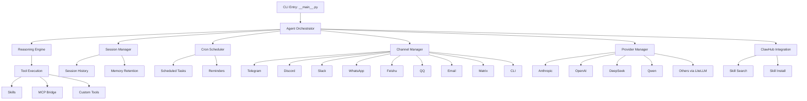

## Zeroclaw Architecture Summary

**Overview:** Zeroclaw is a Rust-first autonomous agent runtime designed for high performance, efficiency, stability, extensibility, sustainability, and security. It uses a trait-driven, modular architecture to enable pluggable components.

**Key Principles:**
- KISS (Keep It Simple, Stupid)
- YAGNI (You Aren't Gonna Need It)
- DRY + Rule of Three
- SRP + ISP (Single Responsibility + Interface Segregation)
- Fail Fast + Explicit Errors
- Secure by Default + Least Privilege
- Determinism + Reproducibility
- Reversibility + Rollback-First Thinking

**Core Architecture:**
- **Language:** Rust
- **Entry Point:** `src/main.rs` (CLI entrypoint and command routing)
- **Modules:**
  - `src/lib.rs` (module exports and shared command enums)
  - `src/config/` (schema + config loading/merging)
  - `src/agent/` (orchestration loop)
  - `src/gateway/` (webhook/gateway server)
  - `src/security/` (policy, pairing, secret store)
  - `src/memory/` (markdown/sqlite memory backends + embeddings/vector merge)
  - `src/providers/` (model providers and resilient wrapper)
  - `src/channels/` (Telegram/Discord/Slack/etc channels)
  - `src/tools/` (tool execution surface: shell, file, memory, browser)
  - `src/peripherals/` (hardware peripherals: STM32, RPi GPIO)
  - `src/runtime/` (runtime adapters, currently native)
  - `src/observability/` (Observer trait)
- **Extension Points (Traits):**
  - `Provider` (src/providers/traits.rs)
  - `Channel` (src/channels/traits.rs)
  - `Tool` (src/tools/traits.rs)
  - `Memory` (src/memory/traits.rs)
  - `Observer` (src/observability/traits.rs)
  - `RuntimeAdapter` (src/runtime/traits.rs)
  - `Peripheral` (src/peripherals/traits.rs)
- **Factory Pattern:** Most extensions registered in factory modules (e.g., `src/providers/mod.rs`)
- **Documentation:** Task-oriented docs in `docs/`, with unified TOC, references, operations, security, hardware guides. Supports i18n (en, zh-CN, ja, ru, fr, vi).
- **Build/Release:** Cargo.toml with performance optimizations, CI via .github/, docs governance.

**Workflow:** Read before write, define scope, implement minimal patch, validate by risk tier, document impact.

## HiClaw Architecture Summary

**Overview:** HiClaw is an enterprise-grade multi-agent runtime that brings Kubernetes-style declarative resources to AI agent orchestration. It provides Manager-Workers architecture with team templates, worker marketplace, and centralized skill registry.

**Key Principles:**
- Kubernetes-style declarative resources (YAML definitions)
- Manager-Workers orchestration pattern
- Enterprise-grade multi-tenant support
- Worker template marketplace
- Nacos-based skill discovery

**Core Architecture:**
- **Language:** Go + Shell scripts
- **Entry Point:** `hiclaw` CLI with Docker Compose
- **Modules:**
  - Worker resources (declarative YAML definitions)
  - Team resources (multi-agent team configuration)
  - Human resources (human-in-the-loop agent definitions)
  - Manager CoPaw runtime (alternative manager implementation)
  - Nacos skills registry (centralized skill discovery)
  - Worker template marketplace (community templates)
- **Deployment:**
  - Docker Compose for local development
  - Kubernetes support for production
  - PostgreSQL for state persistence
  - MinIO for shared filesystem storage
- **Features:**
  - Declarative worker/team/human resources
  - Manager-Workers orchestration pattern
  - Template-based worker creation
  - Centralized credential management
  - Multi-tenant workspace isolation
  - Gateway credential isolation

### Architecture Diagram

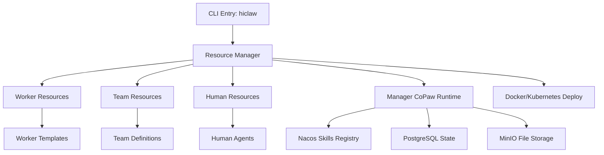

## QuantumClaw Architecture Summary

**Overview:** QuantumClaw is a self-hosted AGEX (Agent Gateway EXchange) protocol implementation focused on agent identity, trust, and cost-aware orchestration. It provides 3-layer memory, 5-tier cost routing, and ClawHub skill marketplace integration.

**Key Principles:**
- AGEX protocol for agent identity and trust
- Cost-aware model routing
- Three-layer memory architecture
- Self-hosted with minimal dependencies
- ClawHub skill marketplace integration

**Core Architecture:**
- **Language:** Node.js (TypeScript)
- **Entry Point:** `quantumclaw` CLI
- **Modules:**
  - AGEX protocol implementation (identity + trust)
  - 3-layer memory (vector search + structured knowledge + optional Cognee knowledge graph)
  - 5-tier cost routing (reflex → simple → standard → complex → expert)
  - Live Canvas (HTML, SVG, Mermaid diagrams in split-pane dashboard)
  - ClawHub integration (3,286+ skills)
  - MCP server support (12 servers)
- **Memory System:**
  - Layer 1: Vector search (semantic retrieval)
  - Layer 2: Structured knowledge (facts, entities)
  - Layer 3: Knowledge graph (Cognee, optional)
- **Cost Routing:**
  - Tier 1 (Reflex): Cheapest models for simple tasks
  - Tier 2 (Simple): Standard models for routine tasks
  - Tier 3 (Standard): Balanced models for normal tasks
  - Tier 4 (Complex): Advanced models for difficult tasks
  - Tier 5 (Expert): Best models for critical tasks
- **Features:**
  - AGEX protocol implementation
  - Multi-agent spawning
  - Trust kernel (VALUES.md)
  - 8+ LLM provider support
  - 5 communication channels (Telegram, Discord, WhatsApp, Slack, Email)
  - Split-pane web dashboard

### Architecture Diagram

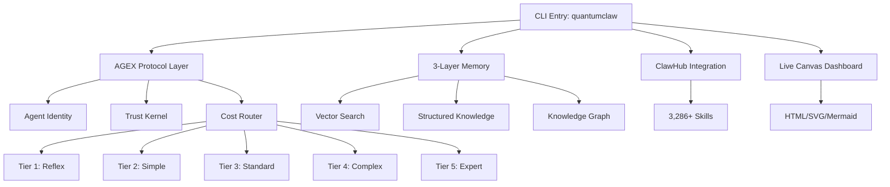

## Hermes-Agent Architecture Summary

**Overview:** Hermes-Agent is a research-backed personal AI agent that implements advanced context management techniques. It focuses on preventing stale answers through context compaction, resolved questions tracking, and clear context separators.

**Key Principles:**
- Research-backed prompt engineering
- Context compaction to prevent stale answers
- Resolved questions tracking
- Clear context separators
- Competitor-inspired techniques (Claude Code, OpenCode, Codex)

**Core Architecture:**
- **Language:** Python
- **Entry Point:** `hermes` CLI
- **Modules:**
  - Context compaction engine (prevents stale answers)
  - Resolved questions tracker (avoids re-answering)
  - Context separator system (distinguishes history from active)
  - Prompt engineering layer (competitor-inspired techniques)
  - Conversation manager (session persistence)
  - Tool executor (MCP + custom tools)
- **Context Management:**
  - Enhanced context compaction (prevents model staleness)
  - Resolved questions tracking (avoids redundant answers)
  - Clear context separators (distinguishes historical from active)
  - Conversation history persistence
- **Features:**
  - Context-aware prompting
  - Multi-channel support (Telegram, Discord)
  - MCP protocol support
  - Session persistence
  - Research-backed safety checks
  - Anthropic, OpenAI, OpenRouter provider support

### Architecture Diagram

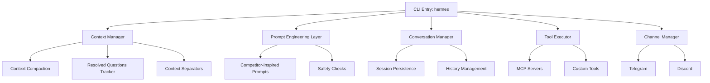

## RTL-CLAW Architecture Summary

**Overview:** RTL-CLAW is an AI-agent-driven framework for automated IC design flow, developed collaboratively by Tongji EDA Lab and The Chinese University of Hong Kong. Built on top of the OpenClaw framework, it demonstrates AI-driven workflows for RTL design automation, verification, and synthesis.

**Key Principles:**
- Research-oriented EDA toolchain on OpenClaw foundation
- Layered design: Interaction → Agent Core → Tool/Data Flow
- Modular plugin architecture for extensibility
- Integration of open-source and commercial EDA tools
- Front-end IC design focus with back-end roadmap

**Core Architecture:**
- **Language:** Python (with Verilog)
- **Entry Point:** Docker Compose (`rtl-claw-cli`, `rtl-claw-gateway`)
- **Modules:**
  - **Interaction Layer:** User instructions and workflow control
  - **Agent Core Layer:** Task planning and execution
  - **Tool and Data Flow Layer:** RTL analysis, verification, optimization, synthesis
- **Key Components:**
  - Verilog partition module
  - Partition-Opt-Merge optimization
  - Testbench generation
  - Yosys synthesis integration
- **Target Technology:** ASAP7nm PDK for research
- **Roadmap Items:**
  - DreamPlace + OpenROAD back-end flow
  - 3D IC-oriented design flows
- **Build/Deploy:** Docker-based, requires `openclaw:local` base image

### Architecture Diagram

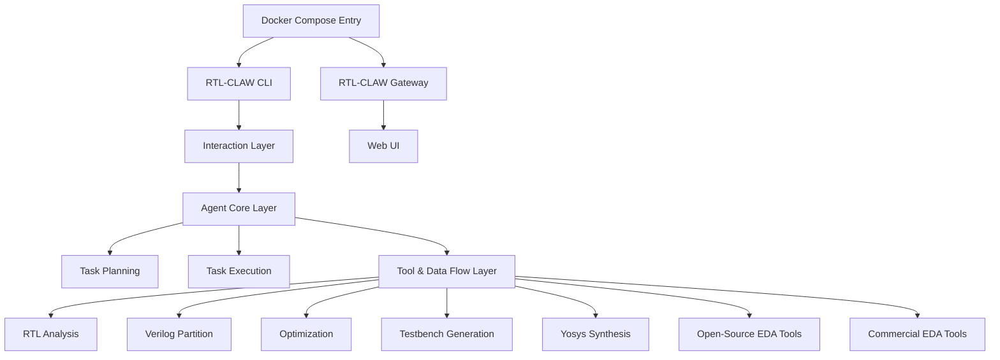

## Claw-AI-Lab Architecture Summary

**Overview:** Claw-AI-Lab is a lab-native multi-agent research platform for interactive and scalable AI-driven science. It enables users to create a full AI research lab from a single prompt, with customizable roles, research directions, and collaborative workflows through FIFO-based scheduling.

**Key Principles:**
- Lab-native multi-agent research platform
- FIFO-based scheduling framework for parallel execution
- Human-in-the-loop with intervention capabilities
- Cross-project knowledge sharing
- Three research modes: Explore, Discussion, Reproduce

**Core Architecture:**
- **Language:** Python 3.11+ (backend), Node.js 18+ (frontend)
- **Entry Point:** `start.sh` script
- **Modules:**
  - **Backend:** `backend/agent/` (multi-agent orchestration)
  - **Frontend:** React-based web dashboard (localhost:5903)
  - **Claw Code Harness:** Reads/writes local codebases and datasets
  - **Sandbox:** Local Python execution environment
  - **Knowledge Base:** Markdown/Obsidian storage
- **Research Modes:**
  - **Explore:** Full autonomous research pipeline
  - **Discussion:** Multi-agent debate and consensus
  - **Reproduce:** Paper reproduction workflow
- **Pipeline Stages:** Topic → Literature Review → Experiment Design → Code Generation → Execution → Paper Writing
- **Features:**
  - Real-time web dashboard with event stream
  - Checkpoint & resume capability
  - Dynamic GPU allocation
  - Multi-model LLM support with fallback chain
  - Auto-generated figures and LaTeX papers

### Architecture Diagram

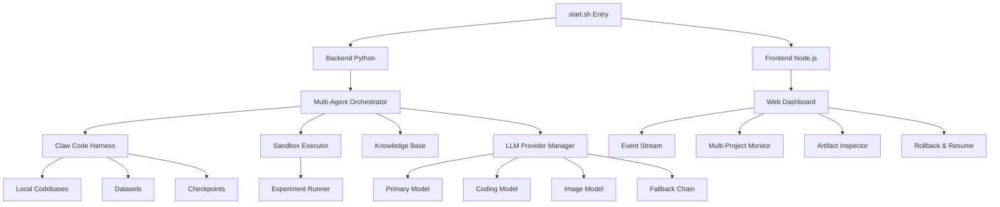

## Comparison

| Aspect | Openclaw | ClawTeam | GoClaw | IronClaw | Maxclaw | NanoClaw | Nanobot | Zeroclaw | HiClaw | QuantumClaw | Hermes-Agent | RTL-CLAW | Claw-AI-Lab |
|--------|----------|----------|---------|-----------|---------|----------|---------|----------|---------|-------------|--------------|
| | Language | TypeScript | Python 3.10+ | Go 1.26 | Rust | Go 1.24+ | TypeScript (Node.js) | Python 3.11+ | Rust | Go + Shell | Node.js | Python | Python + Verilog | Python 3.11+ + Node.js 18+ |
| | Focus | CLI with channels/plugins | Multi-agent swarm coordination | Multi-agent gateway with teams | Secure personal AI assistant | Local-first Go agent | Personal WhatsApp assistant | Ultra-lightweight assistant | High-performance runtime | Enterprise multi-agent runtime | Self-hosted AGEX agent | Research-backed agent | EDA workflow automation | Lab-native research platform |
| | Modularity | Plugin-based extensions | Any CLI agent integration | Tool registry + hooks | WASM tools + MCP + Docker | Agent loop + tool system | Single process + containers | Skill system + MCP | Trait-based extensions | Manager-Workers + Templates | Agent spawning + ClawHub | Open source extension | Layered plugin architecture | Claw Code Harness + modular agents |
| | Security | CLI security, redaction | Agent isolation (git worktrees) | 5-layer defense | WASM sandbox + defense in depth | Local execution only | Container isolation | Security hardening | First-class, internet-adjacent | Gateway credential isolation | Trust kernel (VALUES.md) | Safety checks | Docker-based isolation | HITL gates + sandboxed execution |
| | Platforms | Cross-platform (Mac, Win, Linux, mobile) | Multi-platform agents | Cross-platform (binary + Docker) | Cross-platform (Mac, Win, Linux) | Cross-platform (Mac, Win, Linux) | macOS (launchctl), containerized agents | Cross-platform (Python + Docker) | Native (Linux, etc.) | Docker (all platforms) | Linux, VPS, RPi, Android | Linux, macOS, cloud | Docker-based | Cross-platform (Python + Node.js) |
| | Docs | Mintlify-hosted, i18n | Comprehensive docs | README + docs/ | README + docs/ | README + docs/ (i18n) | README + docs/ | README + docs/ | Local docs/, i18n | README + blog | README | README + docs/ | Technical report PDF | README + showcase examples |
| | Build | pnpm/bun | pip from source | Go modules | Cargo | make build | npm + container build | pip/PyPI | Cargo | Docker compose | npm | pip | Docker build | npm + pip (frontend + backend) |
| | Tests | Vitest | 453 tests pass | go test + race detector | Rust tests + integration | Go tests | Not specified | tests/ directory | Rust tests | Not specified | Not specified | pytest | Not specified | End-to-end pipeline testing |
| | Channels | 37+ (core + extensions) | Agent-dependent | 7+ (Telegram, Discord, Slack, etc.) | REPL, HTTP, WASM, Web Gateway | Telegram, WA Bridge, Discord, WS | WhatsApp only | 8+ (Telegram, Discord, Slack, etc.) | 15+ | Matrix (built-in server) | 5 (Telegram, Discord, WhatsApp, Slack, Email) | Telegram, Discord | Web UI gateway | Web UI (localhost:5903) |
| | Integrations/Extensions | Media pipeline | Multi-agent coordination | MCP, custom tools, hooks | WASM tools, MCP, Docker | MCP, monorepo discovery | Browser automation via Bash | ClawHub skills, MCP | Peripherals (GPIO, etc.) | CoPaw, OpenClaw, custom | 12 MCP servers, 3,286+ skills | MCP, various tools | Yosys, EDA tools | Claw Code Harness, knowledge base |
| | Runtime | Node-based | Agent-specific | Native Go binary | Native with Docker workers | Native Go binary | Node + containerized Claude SDK | Python runtime | Native adapters | Docker + Kubernetes | Node.js | Python | Docker + OpenClaw | Python + Node.js (web UI) |
| | Isolation | Plugin-level | Git worktree per agent | Per-user workspaces (PostgreSQL) | WASM sandbox + per-job containers | Fully local | Per-group containers | Session-level | Module-level | Per-worker containers | Per-agent isolation | Per-session | Docker containers | Per-project sandbox |
| | Memory | Not specified | Inboxes + tasks | PostgreSQL + pgvector | PostgreSQL with pgvector | MEMORY.md + HISTORY.md | Per-group CLAUDE.md | Session history | Markdown/SQLite with embeddings | MinIO shared filesystem | 3-layer (vector + knowledge + graph) | Conversation + file-based | Workspace-based | Knowledge base (Markdown/Obsidian) |
| | Database | Not specified | JSON files (file-based) | PostgreSQL 15+ (required) | PostgreSQL (required) | SQLite (local) | SQLite | SQLite (local) | SQLite | PostgreSQL + MinIO | SQLite | SQLite | Not specified | Project-based storage |
| | LLM Support | Web provider | Agent-dependent | 13+ providers (Anthropic native, OpenAI-compat) | Multi-provider (NEAR AI, OpenAI-compatible) | Anthropic + OpenAI native SDKs | Claude Agent SDK | Multiple via LiteLLM | 8 native + 29 compat | Gateway-managed | 8+ (Anthropic, OpenAI, Groq, etc.) | Anthropic, OpenAI, OpenRouter | OpenClaw provider | Multi-model with fallback chain |
| | Agent Support | Single agent | Multi-agent swarms | Multi-agent teams | Single agent | Spawn sub-sessions | Single agent + Agent Swarms | Single agent + subagent | Single agent | Manager-Workers | Multi-agent spawning | Single agent | Single AI agent | Multi-agent research team |
| | State Management | Gateway-based | File-based JSON | PostgreSQL multi-tenant | PostgreSQL + pgvector | Local filesystem | SQLite | Session-based | Internal structures | PostgreSQL + Nacos | SQLite | Session files | OpenClaw state | FIFO scheduling + checkpoints |

### Additional Platforms

| Platform | Language | Focus | Latest Release | Key Innovation |
|----------|----------|---------|----------------|----------------|
| **Maxclaw** | Go 1.24+ | Local-first agent | v1.6.0 | Native multi-agent spawning + team presets |
| **HiClaw** | Go + Shell | Enterprise multi-agent | v1.0.9 | Kubernetes-style YAML resources |
| **QuantumClaw** | Node.js | Self-hosted AGEX | v1.5.1 | Reference AGEX protocol implementation |
| **Hermes-Agent** | Python | Research-backed | 2026-04 | Context compaction improvements |
| **RTL-CLAW** | Python + Verilog | EDA workflow automation | 2026-03 | AI-driven RTL design on OpenClaw |
| **Claw-AI-Lab** | Python + Node.js | Lab research platform | 2026-04 | FIFO-scheduled multi-agent research |

All platforms are autonomous agent projects with distinct focuses: Openclaw focuses on TypeScript CLI with extensive channel support, ClawTeam provides multi-agent swarm coordination that transforms single agents into self-organizing teams, GoClaw focuses on multi-agent orchestration with multi-tenant PostgreSQL and agent teams, IronClaw prioritizes security through WASM sandboxing and multi-layer defense mechanisms, Maxclaw offers an OpenClaw-style local-first experience in Go with desktop UI and resource efficiency, NanoClaw is a containerized WhatsApp-to-Claude bridge with group isolation, Nanobot prioritizes ultra-lightweight design with minimal footprint and research-ready code, Zeroclaw emphasizes Rust performance and hardware extensibility, HiClaw brings enterprise-grade multi-agent orchestration with Manager-Workers architecture, QuantumClaw implements the AGEX protocol for agent identity and trust, Hermes-Agent provides research-backed context management improvements, RTL-CLAW delivers AI-driven IC design automation on the OpenClaw framework, and Claw-AI-Lab enables lab-native multi-agent research with FIFO scheduling and human-in-the-loop capabilities.


---

## Updated Platform Coverage (May 2026)

AllClaws now tracks **20 platforms** across both claw ecosystem and external frameworks:

**This document** (13 platforms): OpenClaw, ClawTeam, GoClaw, IronClaw, Maxclaw, NanoClaw, Nanobot, ZeroClaw, HiClaw, QuantumClaw, Hermes-Agent, RTL-CLAW, Claw-AI-Lab

**See also:**
- **[external_frameworks.md](external_frameworks.md)** — SmolAgents, LangGraph, mcp-agent, CrewAI, AutoGen, Swarms, OpenAgents

For the latest ecosystem analysis, see the [Monthly Report](../_posts/2026-05-05-ai-agent-ecosystem-report-april-may-2026.md).
