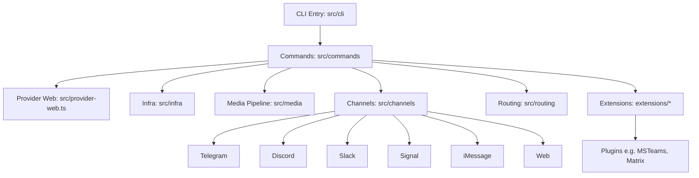
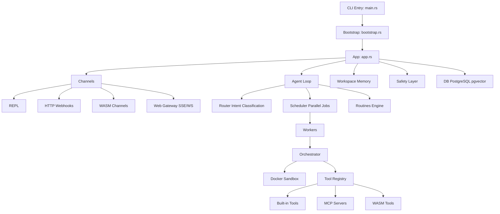

# Architecture Comparison: Zeroclaw vs Openclaw vs NanoClaw vs IronClaw

## Zeroclaw Architecture Summary

**Overview:** Zeroclaw is a Rust-first autonomous agent runtime designed for high performance, efficiency, stability, extensibility, sustainability, and security. It uses a trait-driven, modular architecture to enable pluggable components.

**Key Principles:**
- KISS (Keep It Simple, Stupid)
- YAGNI (You Aren't Gonna Need It)
- DRY + Rule of Three
- SRP + ISP (Single Responsibility + Interface Segregation)
- Fail Fast + Explicit Errors
- Secure by Default + Least Privilege
- Determinism + Reproducibility
- Reversibility + Rollback-First Thinking

**Core Architecture:**
- **Language:** Rust
- **Entry Point:** `src/main.rs` (CLI entrypoint and command routing)
- **Modules:**
  - `src/lib.rs` (module exports and shared command enums)
  - `src/config/` (schema + config loading/merging)
  - `src/agent/` (orchestration loop)
  - `src/gateway/` (webhook/gateway server)
  - `src/security/` (policy, pairing, secret store)
  - `src/memory/` (markdown/sqlite memory backends + embeddings/vector merge)
  - `src/providers/` (model providers and resilient wrapper)
  - `src/channels/` (Telegram/Discord/Slack/etc channels)
  - `src/tools/` (tool execution surface: shell, file, memory, browser)
  - `src/peripherals/` (hardware peripherals: STM32, RPi GPIO)
  - `src/runtime/` (runtime adapters, currently native)
  - `src/observability/` (Observer trait)
- **Extension Points (Traits):**
  - `Provider` (src/providers/traits.rs)
  - `Channel` (src/channels/traits.rs)
  - `Tool` (src/tools/traits.rs)
  - `Memory` (src/memory/traits.rs)
  - `Observer` (src/observability/traits.rs)
  - `RuntimeAdapter` (src/runtime/traits.rs)
  - `Peripheral` (src/peripherals/traits.rs)
- **Factory Pattern:** Most extensions registered in factory modules (e.g., `src/providers/mod.rs`)
- **Documentation:** Task-oriented docs in `docs/`, with unified TOC, references, operations, security, hardware guides. Supports i18n (en, zh-CN, ja, ru, fr, vi).
- **Build/Release:** Cargo.toml with performance optimizations, CI via .github/, docs governance.

**Workflow:** Read before write, define scope, implement minimal patch, validate by risk tier, document impact.

## Openclaw Architecture Summary

**Overview:** Openclaw is a TypeScript-based CLI application for autonomous agents, supporting multiple messaging channels, plugins, and platforms. It emphasizes extensibility through plugins and a modular structure.

**Key Principles:**
- TypeScript (ESM), strict typing, no `any`
- Functional array methods, early returns, const over let
- Formatting via Oxlint/Oxfmt
- No prototype mutation for class behavior
- Concise files (~700 LOC), extract helpers
- Naming: OpenClaw for product, openclaw for CLI/paths

**Core Architecture:**
- **Language:** TypeScript (ESM)
- **Entry Point:** CLI via `src/cli`, commands in `src/commands`
- **Modules:**
  - `src/provider-web.ts` (web provider)
  - `src/infra` (infrastructure)
  - `src/media` (media pipeline)
  - Channel modules: `src/telegram`, `src/discord`, `src/slack`, `src/signal`, `src/imessage`, `src/web`, `src/channels`, `src/routing`
  - Extensions: `extensions/*` (plugins like msteams, matrix, zalo, voice-call)
- **Plugins/Extensions:** Workspace packages under `extensions/`, with own package.json. Install via npm in plugin dir.
- **Build/Test:**
  - Package Manager: pnpm (preferred), bun supported
  - Runtime: Node 22+
  - Tests: Vitest (coverage 70%), e2e, live tests
  - Linting/Formatting: Oxlint/Oxfmt
  - Build: `pnpm build`, `pnpm tsgo`
- **Platforms:** Mac, Windows, Linux, mobile (iOS/Android), with packaging scripts
- **Channels:** Core + extensions, with routing, allowlists, pairing
- **Docs:** Mintlify-hosted (docs.openclaw.ai), i18n (zh-CN), root-relative links
- **Release:** stable (tagged), beta (prerelease), dev (main branch)
- **CI/DevOps:** .github/, scripts for packaging, installers from sibling repo

**Workflow:** Conventional commits, PR templates, small PRs, test before push.

### Architecture Diagram



## NanoClaw Architecture Summary

**Overview:** NanoClaw is a personal Claude assistant implemented as a single Node.js process that connects to WhatsApp and routes messages to Claude Agent SDK running in isolated containers (Linux VMs). It provides per-group isolated filesystem and memory.

**Key Principles:**
- Single process architecture for simplicity
- Containerization for agent isolation
- Per-group memory and filesystem isolation
- WhatsApp as primary channel
- SQLite for database operations

**Core Architecture:**
- **Language:** TypeScript (Node.js)
- **Entry Point:** `src/index.ts` (orchestrator: state, message loop, agent invocation)
- **Modules:**
  - `src/channels/whatsapp.ts` (WhatsApp connection, auth, send/receive)
  - `src/ipc.ts` (IPC watcher and task processing)
  - `src/router.ts` (message formatting and outbound routing)
  - `src/config.ts` (trigger patterns, paths, intervals)
  - `src/container-runner.ts` (spawns agent containers with mounts)
  - `src/task-scheduler.ts` (runs scheduled tasks)
  - `src/db.ts` (SQLite operations)
  - `groups/{name}/CLAUDE.md` (per-group memory, isolated)
  - `container/skills/agent-browser.md` (browser automation tool via Bash)
- **Containerization:** Agents run in Linux VMs/containers with isolated filesystems
- **Channels:** Primarily WhatsApp, with routing and formatting
- **Memory:** Per-group CLAUDE.md files for isolated memory
- **Build/Test:** npm scripts (`npm run dev`, `npm run build`), container build script
- **Service Management:** launchctl for macOS service management
- **Skills:** /setup, /customize, /debug for configuration and troubleshooting

**Workflow:** Direct command execution, container rebuilds as needed.

### Architecture Diagram

```mermaid
graph TD
    A[Orchestrator: src/index.ts] --> B[WhatsApp Channel: src/channels/whatsapp.ts]
    A --> C[IPC Watcher: src/ipc.ts]
    A --> D[Message Router: src/router.ts]
    A --> E[Config: src/config.ts]
    A --> F[Container Runner: src/container-runner.ts]
    A --> G[Task Scheduler: src/task-scheduler.ts]
    A --> H[Database: src/db.ts]
    F --> I[Claude Agent SDK in Containers]
    I --> J[Isolated Filesystem per Group]
    I --> K[Per-Group Memory: groups/{name}/CLAUDE.md]
    I --> L[Browser Automation: container/skills/agent-browser.md]
```

## IronClaw Architecture Summary

**Overview:** IronClaw is a Rust-based secure personal AI assistant that prioritizes data protection, multi-layer security, and self-expanding capabilities. It uses WebAssembly sandboxing for tool execution and PostgreSQL for persistent storage.

**Key Principles:**
- Security first with defense in depth
- Your data stays yours (local storage, encrypted, no telemetry)
- Self-expanding capabilities through dynamic tool building
- Transparency by design (open source, auditable)
- Capability-based permissions for WASM tools

**Core Architecture:**
- **Language:** Rust
- **Entry Point:** `src/main.rs` (CLI entrypoint and application bootstrapping)
- **Modules:**
  - `src/agent/` (agent logic and orchestration)
  - `src/channels/` (channel implementations: REPL, HTTP, WASM-based)
  - `src/config/` (configuration management)
  - `src/context/` (execution context management)
  - `src/db/` (PostgreSQL database operations with pgvector)
  - `src/llm/` (LLM provider abstraction with multi-provider support)
  - `src/orchestrator/` (Docker sandbox and container lifecycle)
  - `src/registry/` (tool and channel registry)
  - `src/sandbox/` (WASM sandbox for untrusted tool execution)
  - `src/safety/` (prompt injection defense and content sanitization)
  - `src/secrets/` (secure secret storage with system keychain integration)
  - `src/bootstrap.rs` (application initialization and onboarding)
  - `src/app.rs` (main application logic)
- **Extension Points:**
  - WASM tools with capability-based permissions
  - MCP (Model Context Protocol) servers
  - Docker-based worker containers
  - WASM-based channels (Telegram, Slack, WhatsApp)
- **Security Layers:**
  - WASM sandbox with endpoint allowlisting
  - Credential injection at host boundary (never exposed to WASM)
  - Prompt injection defense (pattern detection, sanitization)
  - AES-256-GCM encryption for secrets
  - No telemetry or data sharing
- **Build/Test:**
  - Package Manager: Cargo
  - Runtime: Native Rust binary
  - Tests: `cargo test`, integration tests with testcontainers
  - Linting: `cargo clippy`, formatting via `cargo fmt`
- **Platforms:** Mac, Windows, Linux (native binaries, installers available)
- **Channels:** REPL, HTTP webhooks, Web Gateway (SSE/WebSocket), WASM channels (Telegram, Slack, WhatsApp)
- **Memory:** PostgreSQL with pgvector for hybrid search (full-text + vector)
- **Database:** PostgreSQL 15+ (required), with optional libSQL/Turso support
- **Features:** Routines (cron, event triggers, webhooks), parallel job execution, workspace filesystem

### Architecture Diagram



## Comparison

| Aspect | Zeroclaw | Openclaw | NanoClaw | IronClaw |
|--------|----------|----------|----------|-----------|
| Language | Rust | TypeScript | TypeScript (Node.js) | Rust |
| Focus | High-performance runtime | CLI with channels/plugins | Personal WhatsApp assistant | Secure personal AI assistant |
| Modularity | Trait-based extensions | Plugin-based extensions | Single process + containers | WASM tools + MCP + Docker |
| Security | First-class, internet-adjacent | CLI security, redaction | Container isolation | WASM sandbox + defense in depth |
| Platforms | Native (Linux, etc.) | Cross-platform (Mac, Win, Linux, mobile) | macOS (launchctl), containerized agents | Cross-platform (Mac, Win, Linux) |
| Docs | Local docs/, i18n | Mintlify-hosted, i18n | README + docs/ | README + docs/ |
| Build | Cargo | pnpm/bun | npm + container build | Cargo |
| Tests | Rust tests | Vitest | Not specified | Rust tests + integration |
| Channels | Core channels | Core + extensions | WhatsApp only | REPL, HTTP, WASM, Web Gateway |
| Integrations/Extensions | Peripherals (GPIO, etc.) | Media pipeline | Browser automation via Bash | WASM tools, MCP, Docker |
| Runtime | Native adapters | Node-based | Node + containerized Claude SDK | Native with Docker workers |
| Isolation | Module-level | Plugin-level | Per-group containers | WASM sandbox + per-job containers |
| Memory | Markdown/SQLite with embeddings | Not specified | Per-group CLAUDE.md | PostgreSQL with pgvector |
| Database | SQLite | Not specified | SQLite | PostgreSQL (required) |
| LLM Support | Model providers | Web provider | Claude Agent SDK | Multi-provider (NEAR AI, OpenAI-compatible) |

All four are autonomous agent projects with distinct focuses: Zeroclaw emphasizes Rust performance and hardware extensibility, Openclaw focuses on TypeScript CLI with extensive channel support, NanoClaw is a containerized WhatsApp-to-Claude bridge with group isolation, and IronClaw prioritizes security through WASM sandboxing and multi-layer defense mechanisms.

**Overview:** Zeroclaw is a Rust-first autonomous agent runtime designed for high performance, efficiency, stability, extensibility, sustainability, and security. It uses a trait-driven, modular architecture to enable pluggable components.

**Key Principles:**
- KISS (Keep It Simple, Stupid)
- YAGNI (You Aren't Gonna Need It)
- DRY + Rule of Three
- SRP + ISP (Single Responsibility + Interface Segregation)
- Fail Fast + Explicit Errors
- Secure by Default + Least Privilege
- Determinism + Reproducibility
- Reversibility + Rollback-First Thinking

**Core Architecture:**
- **Language:** Rust
- **Entry Point:** `src/main.rs` (CLI entrypoint and command routing)
- **Modules:**
  - `src/lib.rs` (module exports and shared command enums)
  - `src/config/` (schema + config loading/merging)
  - `src/agent/` (orchestration loop)
  - `src/gateway/` (webhook/gateway server)
  - `src/security/` (policy, pairing, secret store)
  - `src/memory/` (markdown/sqlite memory backends + embeddings/vector merge)
  - `src/providers/` (model providers and resilient wrapper)
  - `src/channels/` (Telegram/Discord/Slack/etc channels)
  - `src/tools/` (tool execution surface: shell, file, memory, browser)
  - `src/peripherals/` (hardware peripherals: STM32, RPi GPIO)
  - `src/runtime/` (runtime adapters, currently native)
  - `src/observability/` (Observer trait)
- **Extension Points (Traits):**
  - `Provider` (src/providers/traits.rs)
  - `Channel` (src/channels/traits.rs)
  - `Tool` (src/tools/traits.rs)
  - `Memory` (src/memory/traits.rs)
  - `Observer` (src/observability/traits.rs)
  - `RuntimeAdapter` (src/runtime/traits.rs)
  - `Peripheral` (src/peripherals/traits.rs)
- **Factory Pattern:** Most extensions registered in factory modules (e.g., `src/providers/mod.rs`)
- **Documentation:** Task-oriented docs in `docs/`, with unified TOC, references, operations, security, hardware guides. Supports i18n (en, zh-CN, ja, ru, fr, vi).
- **Build/Release:** Cargo.toml with performance optimizations, CI via .github/, docs governance.

**Workflow:** Read before write, define scope, implement minimal patch, validate by risk tier, document impact.

## Openclaw Architecture Summary

**Overview:** Openclaw is a TypeScript-based CLI application for autonomous agents, supporting multiple messaging channels, plugins, and platforms. It emphasizes extensibility through plugins and a modular structure.

**Key Principles:**
- TypeScript (ESM), strict typing, no `any`
- Functional array methods, early returns, const over let
- Formatting via Oxlint/Oxfmt
- No prototype mutation for class behavior
- Concise files (~700 LOC), extract helpers
- Naming: OpenClaw for product, openclaw for CLI/paths

**Core Architecture:**
- **Language:** TypeScript (ESM)
- **Entry Point:** CLI via `src/cli`, commands in `src/commands`
- **Modules:**
  - `src/provider-web.ts` (web provider)
  - `src/infra` (infrastructure)
  - `src/media` (media pipeline)
  - Channel modules: `src/telegram`, `src/discord`, `src/slack`, `src/signal`, `src/imessage`, `src/web`, `src/channels`, `src/routing`
  - Extensions: `extensions/*` (plugins like msteams, matrix, zalo, voice-call)
- **Plugins/Extensions:** Workspace packages under `extensions/`, with own package.json. Install via npm in plugin dir.
- **Build/Test:**
  - Package Manager: pnpm (preferred), bun supported
  - Runtime: Node 22+
  - Tests: Vitest (coverage 70%), e2e, live tests
  - Linting/Formatting: Oxlint/Oxfmt
  - Build: `pnpm build`, `pnpm tsgo`
- **Platforms:** Mac, Windows, Linux, mobile (iOS/Android), with packaging scripts
- **Channels:** Core + extensions, with routing, allowlists, pairing
- **Docs:** Mintlify-hosted (docs.openclaw.ai), i18n (zh-CN), root-relative links
- **Release:** stable (tagged), beta (prerelease), dev (main branch)
- **CI/DevOps:** .github/, scripts for packaging, installers from sibling repo

**Workflow:** Conventional commits, PR templates, small PRs, test before push.

## Comparison

| Aspect | Zeroclaw | Openclaw |
|--------|----------|----------|
| Language | Rust | TypeScript |
| Focus | High-performance runtime | CLI with channels/plugins |
| Modularity | Trait-based extensions | Plugin-based extensions |
| Security | First-class, internet-adjacent | CLI security, redaction |
| Platforms | Native (Linux, etc.) | Cross-platform (Mac, Win, Linux, mobile) |
| Docs | Local docs/, i18n | Mintlify-hosted, i18n |
| Build | Cargo | pnpm/bun |
| Tests | Rust tests | Vitest |
| Channels | Core channels | Core + extensions |
| Hardware | Peripherals (GPIO, etc.) | Media pipeline |
| Runtime | Native adapters | Node-based |

Both projects are autonomous agent runtimes with modular architectures, but Zeroclaw emphasizes Rust performance and security for runtime execution, while Openclaw focuses on TypeScript CLI with extensive channel support and plugins.