# 架构比较：Openclaw vs ClawTeam vs GoClaw vs IronClaw vs Maxclaw vs NanoClaw vs Nanobot vs Zeroclaw

**[English](architecture_comparison.md)** | 中文

## Openclaw 架构总结

**概述：** Openclaw 是一个基于 TypeScript 的 CLI 应用程序，用于自主代理，支持多个消息频道、插件和平台。它通过插件和模块化结构强调扩展性。

**关键原则：**
- TypeScript (ESM)，严格类型化，无 `any`
- 函数式数组方法，早期返回，const 而非 let
- 通过 Oxlint/Oxfmt 格式化
- 类行为无原型突变
- 简洁文件（~700 LOC），提取助手
- 命名：OpenClaw 用于产品，openclaw 用于 CLI/路径

**核心架构：**
- **语言：** TypeScript (ESM)
- **入口点：** 通过 `src/cli` 的 CLI，命令在 `src/commands`
- **模块：**
  - `src/provider-web.ts`（web 提供者）
  - `src/infra`（基础设施）
  - `src/media`（媒体管道）
  - 频道模块：`src/telegram`、`src/discord`、`src/slack`、`src/signal`、`src/imessage`、`src/web`、`src/channels`、`src/routing`
  - 扩展：`extensions/*`（插件如 msteams、matrix、zalo、voice-call）
- **插件/扩展：** `extensions/` 下的工作区包，具有自己的 package.json。通过插件目录中的 npm 安装。
- **构建/测试：**
  - 包管理器：pnpm（首选），支持 bun
  - 运行时：Node 22+
  - 测试：Vitest（覆盖率 70%），e2e，实时测试
  - 代码检查/格式化：Oxlint/Oxfmt
  - 构建：`pnpm build`、`pnpm tsgo`
- **平台：** Mac、Windows、Linux、移动（iOS/Android），具有打包脚本
- **频道：** 核心 + 扩展，具有路由、允许列表、配对
- **文档：** Mintlify 托管（docs.openclaw.ai），i18n（zh-CN），根相对链接
- **发布：** 稳定（标记）、beta（预发布）、dev（主分支）
- **CI/DevOps：** .github/，打包脚本，来自兄弟仓库的安装程序

**工作流：** 常规提交，PR 模板，小 PR，先推送测试。

### 架构图

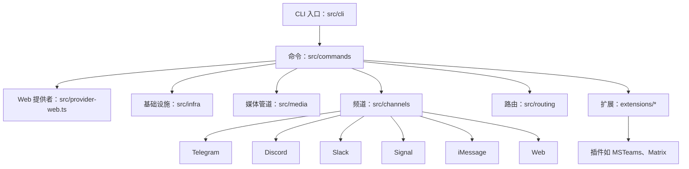
```mermaid
graph TD
    A[CLI 入口：src/cli] --> B[命令：src/commands]
    B --> C[Web 提供者：src/provider-web.ts]
    B --> D[基础设施：src/infra]
    B --> E[媒体管道：src/media]
    B --> F[频道：src/channels]
    F --> G[Telegram]
    F --> H[Discord]
    F --> I[Slack]
    F --> J[Signal]
    F --> K[iMessage]
    F --> L[Web]
    B --> M[路由：src/routing]
    B --> N[扩展：extensions/*]
    N --> O[插件如 MSTeams、Matrix]
```

## ClawTeam 架构总结

**概述：** ClawTeam 是一个多代理群体协调层，将单一 AI 代理转变为自组织团队。提供领导-工人编排、任务依赖、代理间消息传递和 git worktree 隔离等功能，支持并行开发。

**关键原则：**
- 代理自组织（AI 代理自行编排）
- 零配置搭建，基于 TOML 团队模板
- 基于文件的状态管理，使用 fcntl 锁（无数据库依赖）
- 按 git worktree 隔离代理
- 多代理支持（OpenClaw、Claude Code、Codex、nanobot、Cursor）

**核心架构：**
- **语言：** Python 3.10+
- **入口点：** `clawteam` CLI 命令
- **模块：**
  - 团队生命周期（`team spawn-team`、`team cleanup`）
  - 代理派生（`spawn`，使用 tmux 后端）
  - 任务管理（`task create`、`task update`、`task wait`）
  - 代理间消息（`inbox send`、`inbox broadcast`）
  - 监控面板（`board show`、`board live`、`board serve`）
  - 工作空间管理（`workspace checkpoint`、`workspace merge`）
  - 团队模板（基于 TOML 的团队定义）
- **状态管理：** `~/.clawteam/` 下的 JSON 文件
  - `teams/`（团队配置）
  - `tasks/`（任务状态和依赖）
  - `inboxes/`（点对点消息传递）
  - `workspaces/`（git worktree 引用）
- **传输后端：**
  - 基于文件（默认，本地文件系统）
  - ZeroMQ P2P（可选，跨机器）
  - Redis（计划中，跨机器消息传递）
- **代理支持：**
  - OpenClaw（默认，原生集成）
  - Claude Code（完整支持）
  - Codex（完整支持）
  - nanobot（完整支持）
  - Cursor（实验性）
  - 自定义脚本（完整支持）
- **功能：**
  - 每代理 git worktree（无合并冲突）
  - 任务依赖链，支持自动解锁
  - 看板面板，实时更新
  - tmux 分屏查看所有代理
  - Web UI 仪表板
  - 一键团队模板
  - 按代理模型分配（预览功能）

### 架构图

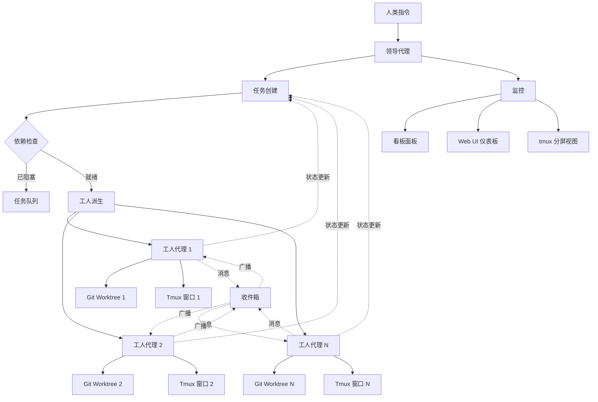
```mermaid
graph TB
    A[人类指令] --> B[领导代理]
    B --> C[任务创建]
    C --> D{依赖检查}
    D -->|已阻塞| E[任务队列]
    D -->|就绪| F[工人派生]
    F --> F1[工人代理 1]
    F --> F2[工人代理 2]
    F --> F3[工人代理 N]
    F1 --> G1[Git Worktree 1]
    F2 --> G2[Git Worktree 2]
    F3 --> G3[Git Worktree N]
    F1 --> H1[Tmux 窗口 1]
    F2 --> H2[Tmux 窗口 2]
    F3 --> H3[Tmux 窗口 N]
    F1 -.->|状态更新| C
    F2 -.->|状态更新| C
    F3 -.->|状态更新| C
    F1 -.->|消息| I[收件箱]
    F2 -.->|消息| I
    F3 -.->|消息| I
    I -.->|广播| F1
    I -.->|广播| F2
    I -.->|广播| F3
    B --> J[监控]
    J --> J1[看板面板]
    J --> J2[Web UI 仪表板]
    J --> J3[tmux 分屏视图]
```

## GoClaw 架构总结

**概述：** GoClaw 是一个多代理 AI 网关，将 LLM 连接到工具、频道和数据——作为单个 Go 二进制文件部署，零运行时依赖。它在 13+ 个 LLM 提供者中编排代理团队、代理间委托和质量门控工作流，并具有完整的 PostgreSQL 多租户隔离。

**关键原则：**
- 代理团队与编排，具有共享任务板
- 多租户 PostgreSQL，每用户工作空间
- 单二进制部署（~25 MB）
- 5 层生产安全防御
- 13+ 个 LLM 提供者，原生 Anthropic 支持
- WebSocket RPC + HTTP API

**核心架构：**
- **语言：** Go 1.26
- **入口点：** `cmd/goclaw/main.go`（CLI 入口点）
- **模块：**
  - `cmd/`（CLI 命令、网关启动、入职向导、迁移）
  - `internal/gateway/`（WS + HTTP 服务器、客户端、方法路由器）
  - `internal/gateway/methods/`（RPC 处理程序：chat、agents、sessions、config、skills、cron、pairing）
  - `internal/agent/`（代理循环：think→act→observe、路由器、解析器、输入守卫）
  - `internal/providers/`（LLM 提供者：Anthropic 原生 HTTP+SSE、OpenAI-compat HTTP+SSE）
  - `internal/tools/`（工具注册表：fs、exec、web、memory、delegate、team、MCP、custom）
  - `internal/store/`（存储接口 + pg/ PostgreSQL 实现）
  - `internal/bootstrap/`（系统提示文件：SOUL.md、IDENTITY.md + seeding）
  - `internal/config/`（配置加载，JSON5 + env 变量覆盖）
  - `internal/channels/`（频道管理器：Telegram、Feishu/Lark、Zalo、Discord、WhatsApp）
  - `internal/http/`（HTTP API：/v1/chat/completions、/v1/agents、/v1/skills）
  - `internal/skills/`（SKILL.md 加载器 + BM25 搜索）
  - `internal/memory/`（内存系统，pgvector）
  - `internal/tracing/`（LLM 调用跟踪 + 可选 OTel 导出）
  - `internal/scheduler/`（基于车道并发：main/subagent/delegate/cron）
  - `internal/cron/`（cron 调度：at/every/cron 表达式）
  - `internal/permissions/`（RBAC：admin/operator/viewer）
  - `internal/pairing/`（浏览器配对，8 字符代码）
  - `internal/crypto/`（API 密钥的 AES-256-GCM 加密）
  - `internal/sandbox/`（基于 Docker 的代码沙箱）
  - `internal/tts/`（文本转语音：OpenAI、ElevenLabs、Edge、MiniMax）
  - `internal/i18n/`（消息目录，T(locale, key, args...)）
  - `pkg/protocol/`（线路类型：frames、methods、errors、events）
  - `pkg/browser/`（浏览器自动化，Rod + CDP）
  - `ui/web/`（React SPA：pnpm、Vite 6、Tailwind CSS 4、Radix UI、Zustand）
- **扩展点：**
  - MCP 协议支持（stdio/SSE/streamable-http）
  - 通过工具注册表自定义工具
  - 代理评估器和钩子系统
- **安全层：**
  - 速率限制
  - 提示注入检测
  - SSRF 保护
  - Shell 拒绝模式
  - 密钥的 AES-256-GCM 加密
  - 每用户隔离会话
- **构建/测试：**
  - 包管理器：Go modules
  - 运行时：原生 Go 二进制文件
  - 测试：`go test`，带 race 检测器的集成测试
  - 代码检查/格式化：`go vet`、`go fix`、`go build`
- **平台：** 通过单个二进制文件 + Docker 跨平台（~50 MB Alpine）
- **频道：** Telegram、Discord、Slack、Zalo OA、Zalo Personal、Feishu/Lark、WhatsApp
- **内存：** PostgreSQL 15+ 带 pgvector 用于混合搜索
- **数据库：** PostgreSQL 15+（多租户必需）
- **功能：** 代理团队、对话转移、评估循环质量门控、钩子系统、知识图谱、13+ 个 LLM 提供者、7+ 个消息频道、OpenTelemetry 可观测性

### 架构图

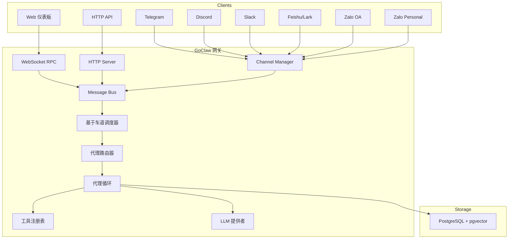
```mermaid
graph TB
    subgraph Clients
        WEB["Web 仪表板"]
        TG["Telegram"]
        DC["Discord"]
        SL["Slack"]
        FS["Feishu/Lark"]
        ZL["Zalo OA"]
        ZLP["Zalo Personal"]
        API["HTTP API"]
    end

    subgraph Gateway["GoClaw 网关"]
        WS["WebSocket RPC"]
        REST["HTTP Server"]
        CM["Channel Manager"]
        BUS["Message Bus"]
        SCHED["基于车道调度器"]
        ROUTER["代理路由器"]
        LOOP["代理循环"]
        TOOLS["工具注册表"]
        LLM["LLM 提供者"]
    end

    subgraph Storage
        PG["PostgreSQL + pgvector"]
    end

    WEB --> WS
    TG & DC & SL & FS & ZL & ZLP --> CM
    API --> REST
    WS & REST & CM --> BUS
    BUS --> SCHED
    SCHED --> ROUTER
    ROUTER --> LOOP
    LOOP --> TOOLS
    LOOP --> LLM
    LOOP --> PG
```

## IronClaw 架构总结

**概述：** IronClaw 是一个基于 Rust 的安全个人 AI 助手，优先考虑数据保护、多层安全和自我扩展能力。它使用 WebAssembly 沙箱进行工具执行，使用 PostgreSQL 进行持久化存储。

**关键原则：**
- 安全优先，纵深防御
- 你的数据属于你（本地存储、加密、无遥测）
- 通过动态工具构建实现自我扩展
- 透明设计（开源、可审计）
- WASM 工具基于能力的权限控制

**核心架构：**
- **语言：** Rust
- **入口点：** `src/main.rs`（CLI 入口点和应用程序引导）
- **模块：**
  - `src/agent/`（代理逻辑和编排）
  - `src/channels/`（频道实现：REPL、HTTP、基于 WASM）
  - `src/config/`（配置管理）
  - `src/context/`（执行上下文管理）
  - `src/db/`（PostgreSQL 数据库操作和 pgvector）
  - `src/llm/`（LLM 提供者抽象和多提供者支持）
  - `src/orchestrator/`（Docker 沙箱和容器生命周期）
  - `src/registry/`（工具和频道注册表）
  - `src/sandbox/`（不受信任工具执行的 WASM 沙箱）
  - `src/safety/`（提示注入防御和内容清理）
  - `src/secrets/`（安全密钥存储和系统钥匙串集成）
  - `src/bootstrap.rs`（应用程序初始化和入职）
  - `src/app.rs`（主要应用程序逻辑）
- **扩展点：**
  - 具有基于能力权限的 WASM 工具
  - MCP（模型上下文协议）服务器
  - 基于 Docker 的 Worker 容器
  - 基于 WASM 的频道（Telegram、Slack、WhatsApp）
- **安全层：**
  - 具有端点白名单的 WASM 沙箱
  - 主机边界的密钥注入（从不暴露给 WASM）
  - 提示注入防御（模式检测、清理）
  - 密钥的 AES-256-GCM 加密
  - 无遥测或数据共享
- **构建/测试：**
  - 包管理器：Cargo
  - 运行时：原生 Rust 二进制文件
  - 测试：`cargo test`，使用 testcontainers 的集成测试
  - 代码检查/格式化：`cargo clippy`，通过 `cargo fmt` 格式化
- **平台：** Mac、Windows、Linux（原生二进制文件，提供安装程序）
- **频道：** REPL、HTTP Webhooks、Web Gateway（SSE/WebSocket）、WASM 频道（Telegram、Slack、WhatsApp）
- **内存：** 具有 pgvector 的 PostgreSQL，用于混合搜索（全文 + 向量）
- **数据库：** PostgreSQL 15+（必需），可选的 libSQL/Turso 支持
- **功能：** 例程（cron、事件触发器、webhooks）、并行作业执行、工作区文件系统

### 架构图

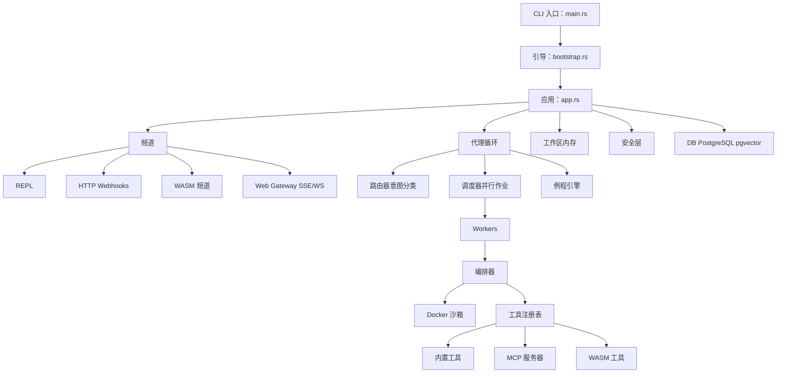
```mermaid
graph TD
    A[CLI 入口：main.rs] --> B[引导：bootstrap.rs]
    B --> C[应用：app.rs]
    C --> D[频道]
    D --> D1[REPL]
    D --> D2[HTTP Webhooks]
    D --> D3[WASM 频道]
    D --> D4[Web Gateway SSE/WS]
    C --> E[代理循环]
    E --> F[路由器意图分类]
    E --> G[调度器并行作业]
    E --> H[例程引擎]
    G --> I[Workers]
    I --> J[编排器]
    J --> K[Docker 沙箱]
    J --> L[工具注册表]
    L --> L1[内置工具]
    L --> L2[MCP 服务器]
    L --> L3[WASM 工具]
    C --> M[工作区内存]
    C --> N[安全层]
    C --> O[DB PostgreSQL pgvector]
```

## Maxclaw 架构总结

**概述：** Maxclaw 是一个 OpenClaw 风格的本地优先 AI 代理，使用 Go 编写，强调低内存占用、完全本地化工作流和可视化界面（桌面 UI + Web UI）。提供自主执行、子会话派生和 monorepo 感知上下文发现。

**关键原则：**
- Go 原生资源效率
- 完全本地执行（会话、记忆、日志）
- 桌面 UI + Web UI 同端口运行
- Monorepo 上下文感知（AGENTS.md、CLAUDE.md）
- 自主模式，支持任务调度

**核心架构：**
- **语言：** Go 1.24+
- **入口点：** `cmd/main.go`（CLI 入口点）
- **模块：**
  - `cmd/`（CLI 命令：onboard、skills、gateway、telegram bind）
  - `internal/agent/`（代理循环和推理）
  - `internal/tools/`（工具系统和执行）
  - `internal/memory/`（MEMORY.md + HISTORY.md 分层记忆）
  - `internal/channels/`（Telegram、WhatsApp Bridge、Discord、WebSocket）
  - `internal/scheduler/`（cron/once/every 调度）
  - `internal/config/`（config.json 配置管理）
  - `internal/context/`（monorepo 上下文发现）
- **执行模式：**
  - `safe`：保守探索模式
  - `ask`：默认交互模式
  - `auto`：自主继续（无需手动审批）
- **核心功能：**
  - 低内存占用（Go 原生）
  - 桌面 UI + Web UI（同端口）
  - 派生子会话，独立上下文
  - 自动任务标题（会话摘要，不覆盖内容）
  - Monorepo 感知递归上下文发现
  - 多渠道集成
  - Cron 调度 + 每日记忆摘要
- **二进制文件：**
  - `maxclaw`：完整 CLI，包含所有命令
  - `maxclaw-gateway`：独立后端，用于无头运行
- **记忆分层：**
  - `MEMORY.md`：长期知识存储
  - `HISTORY.md`：会话历史
  - `memory/heartbeat.md`：活跃上下文跟踪
- **配置：** `~/.maxclaw/config.json`
  - 提供商设置（Anthropic、OpenAI 原生 SDK）
  - 代理默认配置（模型、工作空间、executionMode）

### 架构图

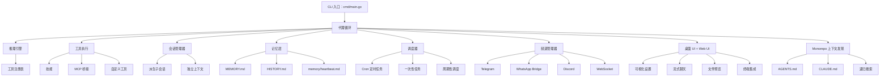
```mermaid
graph TB
    A[CLI 入口：cmd/main.go] --> B[代理循环]
    B --> C[推理引擎]
    B --> D[工具执行]
    B --> E[会话管理器]
    B --> F[记忆层]
    B --> G[调度器]
    B --> H[频道管理器]
    C --> C1[工具注册表]
    D --> D1[技能]
    D --> D2[MCP 桥接]
    D --> D3[自定义工具]
    E --> E1[派生子会话]
    E --> E2[独立上下文]
    F --> F1[MEMORY.md]
    F --> F2[HISTORY.md]
    F --> F3[memory/heartbeat.md]
    G --> G1[Cron 定时任务]
    G --> G2[一次性任务]
    G --> G3[周期性调度]
    H --> H1[Telegram]
    H --> H2[WhatsApp Bridge]
    H --> H3[Discord]
    H --> H4[WebSocket]
    B --> I[桌面 UI + Web UI]
    I --> I1[可视化设置]
    I --> I2[流式聊天]
    I --> I3[文件预览]
    I --> I4[终端集成]
    B --> J[Monorepo 上下文发现]
    J --> J1[AGENTS.md]
    J --> J2[CLAUDE.md]
    J --> J3[递归搜索]
```

## NanoClaw 架构总结

**概述：** NanoClaw 是一个个人 Claude 助手，作为单个 Node.js 进程实现，连接 WhatsApp 并将消息路由到在隔离容器（Linux VM）中运行的 Claude Agent SDK。每个组具有隔离的文件系统和内存。

**关键原则：**
- 单进程架构以简化
- 容器化以代理隔离
- 每组内存和文件系统隔离
- WhatsApp 作为主要频道
- SQLite 用于数据库操作

**核心架构：**
- **语言：** TypeScript (Node.js)
- **入口点：** `src/index.ts`（编排器：状态、消息循环、代理调用）
- **模块：**
  - `src/channels/whatsapp.ts`（WhatsApp 连接、认证、发送/接收）
  - `src/ipc.ts`（IPC 观察者和任务处理）
  - `src/router.ts`（消息格式化和出站路由）
  - `src/config.ts`（触发模式、路径、间隔）
  - `src/container-runner.ts`（使用挂载生成代理容器）
  - `src/task-scheduler.ts`（运行调度任务）
  - `src/db.ts`（SQLite 操作）
  - `groups/{name}/CLAUDE.md`（每组内存，隔离）
  - `container/skills/agent-browser.md`（浏览器自动化工具通过 Bash）
- **容器化：** 代理在具有隔离文件系统的 Linux VM/容器中运行
- **频道：** 主要 WhatsApp，具有路由和格式化
- **内存：** 通过 `groups/{name}/CLAUDE.md` 每组隔离
- **构建/测试：** npm 脚本（`npm run dev`、`npm run build`），容器构建脚本
- **服务管理：** macOS 的 launchctl 服务管理
- **技能：** /setup（首次安装、认证）、/customize（添加集成）、/debug（容器问题、日志）

**工作流：** 直接命令执行，根据需要重建容器。

### 架构图

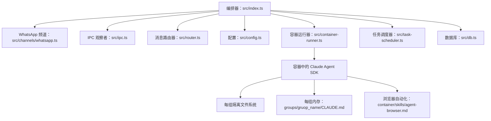
```mermaid
graph TD
    A[编排器：src/index.ts] --> B[WhatsApp 频道：src/channels/whatsapp.ts]
    A --> C[IPC 观察者：src/ipc.ts]
    A --> D[消息路由器：src/router.ts]
    A --> E[配置：src/config.ts]
    A --> F[容器运行器：src/container-runner.ts]
    A --> G[任务调度器：src/task-scheduler.ts]
    A --> H[数据库：src/db.ts]
    F --> I[容器中的 Claude Agent SDK]
    I --> J[每组隔离文件系统]
    I --> K[每组内存：groups/gruop_name/CLAUDE.md]
    I --> L[浏览器自动化：container/skills/agent-browser.md]
```

## Nanobot 架构总结

**概述：** Nanobot 是一个超轻量级个人 AI 助手，只有约 4,000 行核心代理代码——比 OpenClaw 小 99%。它以最小的资源占用提供核心代理功能，实现更快的启动、更低的资源使用和更快的迭代。

**关键原则：**
- 超轻量级设计（~4,000 LOC 核心代理代码）
- 研究就绪，代码清晰易读
- 极速，最小资源占用
- 易于使用，一键部署
- MCP（模型上下文协议）支持
- 通过 LiteLLM 支持多个 LLM 提供者

**核心架构：**
- **语言：** Python 3.11+
- **入口点：** `nanobot/__main__.py`（通过 Typer 的 CLI 入口点）
- **模块：**
  - `nanobot/agent/`（代理编排和推理）
  - `nanobot/channels/`（频道实现：Telegram、Discord、Slack、WhatsApp、Feishu、QQ、Email、Matrix）
  - `nanobot/cli/`（CLI 命令和界面）
  - `nanobot/config/`（通过 Pydantic 的配置管理）
  - `nanobot/providers/`（通过 LiteLLM 的 LLM 提供者：Anthropic、OpenAI、DeepSeek、Qwen、Moonshot、VolcEngine、MiniMax、Mistral 等）
  - `nanobot/skills/`（具有 ClawHub 集成的技能系统）
  - `nanobot/cron/`（计划任务管理）
  - `nanobot/session/`（会话历史管理）
  - `nanobot/utils/`（实用函数和辅助工具）
  - `nanobot/heartbeat/`（心跳和健康监控）
  - `nanobot/bus/`（用于代理通信的消息总线）
  - `nanobot/templates/`（提示模板）
  - `bridge/`（MCP 桥接实现）
- **扩展点：**
  - 通过 ClawHub 集成自定义技能
  - MCP 协议支持（stdio、SSE）
  - 自定义频道实现
  - 自定义 LLM 提供者
- **构建/测试：**
  - 包管理器：pip/PyPI (nanobot-ai)
  - 运行时：Python 3.11+ 通过 pip install
  - 测试：位于 `tests/` 目录
  - 依赖项：Typer、LiteLLM、Pydantic、websockets、httpx、loguru、rich
- **平台：** 通过 Python + Docker 跨平台
- **频道：** Telegram、Discord、Slack、WhatsApp、Feishu、QQ、Email、Matrix、CLI
- **内存：** 带有可配置保留的会话历史管理
- **数据库：** SQLite（用于本地数据持久化）
- **功能：** 24/7 实时市场分析、全栈软件工程、智能日常例程管理、个人知识助手、多模态支持、计划任务（cron）、子代理支持、MCP 集成、ClawHub 技能市场

### 架构图

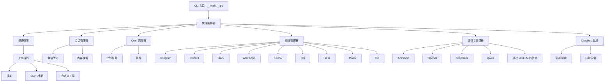
```mermaid
graph TB
    A[CLI 入口：__main__.py] --> B[代理编排器]
    B --> C[推理引擎]
    C --> D[工具执行]
    D --> D1[技能]
    D --> D2[MCP 桥接]
    D --> D3[自定义工具]
    B --> E[会话管理器]
    E --> E1[会话历史]
    E --> E2[内存保留]
    B --> F[Cron 调度器]
    F --> F1[计划任务]
    F --> F2[提醒]
    B --> G[频道管理器]
    G --> G1[Telegram]
    G --> G2[Discord]
    G --> G3[Slack]
    G --> G4[WhatsApp]
    G --> G5[Feishu]
    G --> G6[QQ]
    G --> G7[Email]
    G --> G8[Matrix]
    G --> G9[CLI]
    B --> H[提供者管理器]
    H --> H1[Anthropic]
    H --> H2[OpenAI]
    H --> H3[DeepSeek]
    H --> H4[Qwen]
    H --> H5[通过 LiteLLM 的其他]
    B --> I[ClawHub 集成]
    I --> I1[技能搜索]
    I --> I2[技能安装]
```

## Zeroclaw 架构总结

**概述：** Zeroclaw 是一个 Rust 优先的自主代理运行时，专为高性能、高效率、高稳定性、高扩展性、高可持续性和高安全性而设计。它使用 trait 驱动的模块化架构来启用可插拔组件。

**关键原则：**
- KISS（保持简单愚蠢）
- YAGNI（你不会需要它）
- DRY + 三法则
- SRP + ISP（单一责任 + 接口隔离）
- 快速失败 + 显式错误
- 默认安全 + 最小权限
- 确定性 + 可重现性
- 可逆性 + 回滚优先思维

**核心架构：**
- **语言：** Rust
- **入口点：** `src/main.rs`（CLI 入口点和命令路由）
- **模块：**
  - `src/lib.rs`（模块导出和共享命令枚举）
  - `src/config/`（schema + 配置加载/合并）
  - `src/agent/`（编排循环）
  - `src/gateway/`（webhook/网关服务器）
  - `src/security/`（策略、配对、秘密存储）
  - `src/memory/`（markdown/sqlite 内存后端 + 嵌入/向量合并）
  - `src/providers/`（模型提供者和弹性包装器）
  - `src/channels/`（Telegram/Discord/Slack/等频道）
  - `src/tools/`（工具执行表面：shell、文件、内存、浏览器）
  - `src/peripherals/`（硬件外围设备：STM32、RPi GPIO）
  - `src/runtime/`（运行时适配器，目前为原生）
  - `src/observability/`（Observer trait）
- **扩展点（Traits）：**
  - `Provider` (src/providers/traits.rs)
  - `Channel` (src/channels/traits.rs)
  - `Tool` (src/tools/traits.rs)
  - `Memory` (src/memory/traits.rs)
  - `Observer` (src/observability/traits.rs)
  - `RuntimeAdapter` (src/runtime/traits.rs)
  - `Peripheral` (src/peripherals/traits.rs)
- **工厂模式：** 大多数扩展在工厂模块中注册（例如 `src/providers/mod.rs`）
- **文档：** `docs/` 中的任务导向文档，具有统一 TOC、参考、操作、安全、硬件指南。支持 i18n（en、zh-CN、ja、ru、fr、vi）。
- **构建/发布：** Cargo.toml 具有性能优化，CI 通过 .github/，文档治理。

**工作流：** 先读后写，定义范围，实现最小补丁，按风险层验证，记录影响。

### 架构图

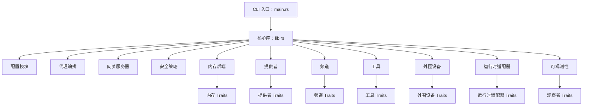
```mermaid
graph TD
    A[CLI 入口：main.rs] --> B[核心库：lib.rs]
    B --> C[配置模块]
    B --> D[代理编排]
    B --> E[网关服务器]
    B --> F[安全策略]
    B --> G[内存后端]
    B --> H[提供者]
    B --> I[频道]
    B --> J[工具]
    B --> K[外围设备]
    B --> L[运行时适配器]
    B --> M[可观测性]
    H --> N[提供者 Traits]
    I --> O[频道 Traits]
    J --> P[工具 Traits]
    K --> Q[外围设备 Traits]
    G --> R[内存 Traits]
    M --> S[观察者 Traits]
    L --> T[运行时适配器 Traits]
```

## HiClaw 架构总结

**概述：** HiClaw 是一个企业级多代理运行时，将 Kubernetes 风格的声明式资源引入 AI 代理编排。它提供管理-工人架构、团队模板、Worker 市场和集中式技能注册中心。

**关键原则：**
- Kubernetes 风格声明式资源（YAML 定义）
- 管理-工人编排模式
- 企业级多租户支持
- Worker 模板市场
- 基于 Nacos 的技能发现

**核心架构：**
- **语言：** Go + Shell 脚本
- **入口点：** `hiclaw` CLI，使用 Docker Compose
- **模块：**
  - Worker 资源（声明式 YAML 定义）
  - 团队资源（多代理团队配置）
  - 人类资源（人在环路代理定义）
  - Manager CoPaw 运行时（备选管理器实现）
  - Nacos 技能注册中心（集中式技能发现）
  - Worker 模板市场（社区模板）
- **部署：**
  - Docker Compose 用于本地开发
  - Kubernetes 支持生产部署
  - PostgreSQL 用于状态持久化
  - MinIO 用于共享文件存储
- **功能：**
  - 声明式 Worker/团队/人类资源
  - 管理-工人编排模式
  - 基于模板的 Worker 创建
  - 集中式凭证管理
  - 多租户工作空间隔离
  - 网关凭证隔离

### 架构图

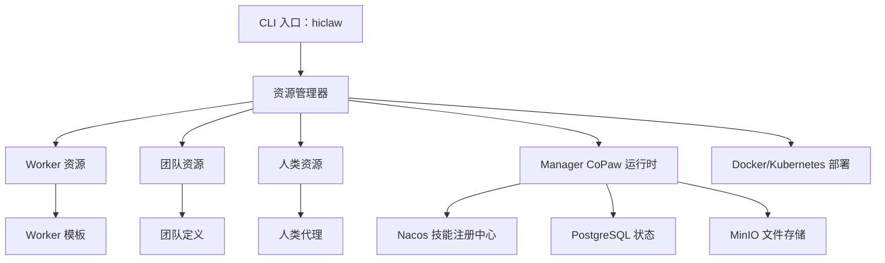
```mermaid
graph TB
    A[CLI 入口：hiclaw] --> B[资源管理器]
    B --> C[Worker 资源]
    B --> D[团队资源]
    B --> E[人类资源]
    C --> F[Worker 模板]
    D --> G[团队定义]
    E --> H[人类代理]
    B --> I[Manager CoPaw 运行时]
    I --> J[Nacos 技能注册中心]
    I --> K[PostgreSQL 状态]
    I --> L[MinIO 文件存储]
    B --> M[Docker/Kubernetes 部署]
```

## QuantumClaw 架构总结

**概述：** QuantumClaw 是一个自托管的 AGEX（代理网关交换）协议实现，专注于代理身份、信任和成本感知编排。它提供三层记忆、五层成本路由和 ClawHub 技能市场集成。

**关键原则：**
- AGEX 协议用于代理身份和信任
- 成本感知模型路由
- 三层记忆架构
- 自托管，最小依赖
- ClawHub 技能市场集成

**核心架构：**
- **语言：** Node.js (TypeScript)
- **入口点：** `quantumclaw` CLI
- **模块：**
  - AGEX 协议实现（身份 + 信任）
  - 三层记忆（向量搜索 + 结构化知识 + 可选 Cognee 知识图谱）
  - 五层成本路由（反射 → 简单 → 标准 → 复杂 → 专家）
  - 实时画布（分屏面板中的 HTML、SVG、Mermaid 图表）
  - ClawHub 集成（3286+ 技能）
  - MCP 服务器支持（12 个服务器）
- **记忆系统：**
  - 第一层：向量搜索（语义检索）
  - 第二层：结构化知识（事实、实体）
  - 第三层：知识图谱（Cognee，可选）
- **成本路由：**
  - 第一层（反射）：最便宜的模型用于简单任务
  - 第二层（简单）：标准模型用于常规任务
  - 第三层（标准）：均衡模型用于普通任务
  - 第四层（复杂）：高级模型用于困难任务
  - 第五层（专家）：最佳模型用于关键任务
- **功能：**
  - AGEX 协议实现
  - 多代理派生
  - 信任内核（VALUES.md）
  - 8+ LLM 提供商支持
  - 5 个通信频道（Telegram、Discord、WhatsApp、Slack、Email）
  - 分屏 Web 面板

### 架构图

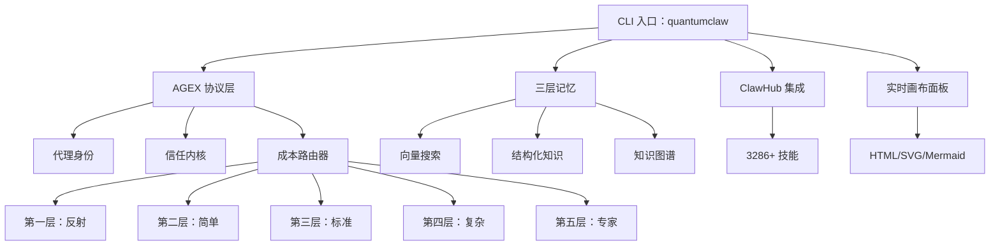
```mermaid
graph TB
    A[CLI 入口：quantumclaw] --> B[AGEX 协议层]
    B --> C[代理身份]
    B --> D[信任内核]
    B --> E[成本路由器]
    E --> F[第一层：反射]
    E --> G[第二层：简单]
    E --> H[第三层：标准]
    E --> I[第四层：复杂]
    E --> J[第五层：专家]
    A --> K[三层记忆]
    K --> K1[向量搜索]
    K --> K2[结构化知识]
    K --> K3[知识图谱]
    A --> L[ClawHub 集成]
    L --> M[3286+ 技能]
    A --> N[实时画布面板]
    N --> O[HTML/SVG/Mermaid]
```

## Hermes-Agent 架构总结

**概述：** Hermes-Agent 是一个研究驱动的个人 AI 代理，实现了先进的上下文管理技术。它专注于通过上下文压缩、已解决问题追踪和清晰上下文分隔符来防止过时答案。

**关键原则：**
- 研究驱动的提示词工程
- 上下文压缩以防止过时答案
- 已解决问题追踪
- 清晰上下文分隔符
- 竞争对手启发技术（Claude Code、OpenCode、Codex）

**核心架构：**
- **语言：** Python
- **入口点：** `hermes` CLI
- **模块：**
  - 上下文压缩引擎（防止过时答案）
  - 已解决问题追踪器（避免重复回答）
  - 上下文分隔符系统（区分历史与活跃）
  - 提示词工程层（竞争对手启发技术）
  - 会话管理器（会话持久化）
  - 工具执行器（MCP + 自定义工具）
- **上下文管理：**
  - 增强上下文压缩（防止模型陈旧）
  - 已解决问题追踪（避免冗余回答）
  - 清晰上下文分隔符（区分历史与活跃）
  - 会话历史持久化
- **功能：**
  - 上下文感知提示词
  - 多频道支持（Telegram、Discord）
  - MCP 协议支持
  - 会话持久化
  - 研究驱动的安全检查
  - Anthropic、OpenAI、OpenRouter 提供商支持

### 架构图

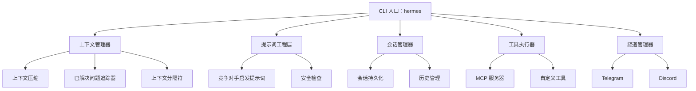
```mermaid
graph TD
    A[CLI 入口：hermes] --> B[上下文管理器]
    B --> C[上下文压缩]
    B --> D[已解决问题追踪器]
    B --> E[上下文分隔符]
    A --> F[提示词工程层]
    F --> G[竞争对手启发提示词]
    F --> H[安全检查]
    A --> I[会话管理器]
    I --> J[会话持久化]
    I --> K[历史管理]
    A --> L[工具执行器]
    L --> M[MCP 服务器]
    L --> N[自定义工具]
    A --> O[频道管理器]
    O --> P[Telegram]
    O --> Q[Discord]
```

## 比较

| 方面 | Openclaw | ClawTeam | GoClaw | IronClaw | Maxclaw | NanoClaw | Nanobot | Zeroclaw | HiClaw | QuantumClaw | Hermes-Agent |
|------|----------|----------|---------|-----------|---------|----------|---------|----------|---------|-------------|--------------|
| | 语言 | TypeScript | Python 3.10+ | Go 1.26 | Rust | Go 1.24+ | TypeScript (Node.js) | Python 3.11+ | Rust | Go + Shell | Node.js | Python |
| | 重点 | 具有频道/插件的 CLI | 多代理群体协调 | 多代理网关与团队 | 安全个人 AI 助手 | 本地优先 Go 代理 | 个人 WhatsApp 助手 | 超轻量级助手 | 高性能运行时 | 企业级多代理运行时 | 自托管 AGEX 代理 | 研究驱动代理 |
| | 模块化 | 插件基础扩展 | 任意 CLI 代理集成 | 工具注册表 + 钩子 | WASM 工具 + MCP + Docker | 代理循环 + 工具系统 | 单进程 + 容器 | 技能系统 + MCP | Trait 基础扩展 | 管理-工人 + 模板 | 代理派生 + ClawHub | 开源扩展 |
| | 安全性 | CLI 安全性，编辑 | 代理隔离（git worktree） | 5 层防御 | WASM 沙箱 + 纵深防御 | 仅本地执行 | 容器隔离 | 安全加固 | 首要，互联网邻接 | 网关凭证隔离 | 信任内核（VALUES.md） | 安全检查 |
| | 平台 | 跨平台（Mac、Win、Linux、移动） | 多平台代理 | 跨平台（二进制 + Docker） | 跨平台（Mac、Win、Linux） | 跨平台（Mac、Win、Linux） | macOS (launchctl)，容器化代理 | 跨平台（Python + Docker） | 原生（Linux 等） | Docker（所有平台） | Linux、VPS、RPi、Android | Linux、macOS、云 |
| | 文档 | Mintlify 托管，i18n | 完整文档 | README + docs/ | README + docs/ | README + docs/ (i18n) | README + docs/ | README + docs/ | 本地 docs/，i18n | README + blog | README | README + docs/ |
| | 构建 | pnpm/bun | pip 从源码安装 | Go modules | Cargo | make build | npm + 容器构建 | pip/PyPI | Cargo | Docker compose | npm | pip |
| | 测试 | Vitest | 453 测试通过 | go test + race 检测 | Rust 测试 + 集成 | Go 测试 | 未指定 | tests/ 目录 | Rust 测试 | 未指定 | 未指定 | pytest |
| | 频道 | 37+（核心 + 扩展） | 依赖代理 | 7+（Telegram、Discord、Slack 等） | REPL、HTTP、WASM、Web Gateway | Telegram、WA Bridge、Discord、WS | 仅 WhatsApp | 8+（Telegram、Discord、Slack 等） | 15+ | Matrix（内置服务器） | 5（Telegram、Discord、WhatsApp、Slack、Email） | Telegram、Discord |
| | 集成/扩展 | 媒体管道 | 多代理协调 | MCP、自定义工具、钩子 | WASM 工具、MCP、Docker | MCP、monorepo 发现 | 通过 Bash 的浏览器自动化 | ClawHub 技能、MCP | 外围设备（GPIO 等） | CoPaw、OpenClaw、自定义 | 12 MCP 服务器、3286+ 技能 | MCP、各种工具 |
| | 运行时 | 基于 Node | 依赖具体代理 | 原生 Go 二进制文件 | 原生 + Docker Workers | 原生 Go 二进制文件 | Node + 容器化 Claude SDK | Python 运行时 | 原生适配器 | Docker + Kubernetes | Node.js | Python |
| | 隔离 | 插件级 | 按代理 git worktree | 每用户工作空间（PostgreSQL） | WASM 沙箱 + 每作业容器 | 完全本地 | 每组容器 | 会话级别 | 模块级 | 按 Worker 容器 | 按代理隔离 | 按会话 |
| | 内存 | 未指定 | 收件箱 + 任务 | PostgreSQL + pgvector | PostgreSQL + pgvector | MEMORY.md + HISTORY.md | 每组 CLAUDE.md | 会话历史 | 具有嵌入的 Markdown/SQLite | MinIO 共享文件系统 | 三层（向量 + 知识 + 图谱） | 会话 + 基于文件 |
| | 数据库 | 未指定 | JSON 文件（基于文件） | PostgreSQL 15+（必需） | PostgreSQL（必需） | SQLite（本地） | SQLite | SQLite（本地） | SQLite | PostgreSQL + MinIO | SQLite | SQLite |
| | LLM 支持 | Web 提供者 | 依赖具体代理 | 13+ 提供者（Anthropic 原生、OpenAI-compat） | 多提供者（NEAR AI、OpenAI 兼容） | Anthropic + OpenAI 原生 SDK | Claude Agent SDK | 通过 LiteLLM 多提供者 | 8 原生 + 29 兼容 | 网关管理 | 8+（Anthropic、OpenAI、Groq 等） | Anthropic、OpenAI、OpenRouter |
| | 代理支持 | 单代理 | 多代理群体 | 多代理团队 | 单代理 | 派生子会话 | 单代理 + 代理群体 | 单代理 + 子代理 | 单代理 | 管理-工人 | 多代理派生 | 单代理 |
| | 状态管理 | 基于网关 | 基于文件的 JSON | PostgreSQL 多租户 | PostgreSQL + pgvector | 本地文件系统 | SQLite | 基于会话 | 内部结构 | PostgreSQL + Nacos | SQLite | 会话文件 |

### 其他平台

| 平台 | 语言 | 重点 | 最新版本 | 核心创新 |
|------|------|------|---------|---------|
| **RTL-CLAW** | Python | EDA 工作流自动化 | 2026-03 | LLM 辅助 RTL 设计 |
| **Claw-AI-Lab** | Python | 研究与实验 | 2026-04 | 学术 AI 代理研究 |
| **Maxclaw** | Go 1.24+ | 本地优先代理 | v1.6.0 | 原生多代理派生 + 团队预设 |
| **HiClaw** | Go + Shell | 企业级多代理 | v1.0.9 | Kubernetes 风格 YAML 资源 |
| **QuantumClaw** | Node.js | 自托管 AGEX | v1.5.1 | 参考 AGEX 协议实现 |
| **Hermes-Agent** | Python | 研究驱动 | 2026-04 | 上下文压缩改进 |

所有平台都是自主代理项目，各有侧重：Openclaw 专注于具有广泛频道支持的 TypeScript CLI，ClawTeam 提供将单一代理转变为自组织团队的多代理群体协调，GoClaw 专注于具有多租户 PostgreSQL 和代理团队的多代理编排，IronClaw 通过 WASM 沙箱和多层防御机制优先考虑安全性，Maxclaw 以 Go 实现本地优先体验并配有桌面 UI 和资源效率，NanoClaw 是具有组隔离的容器化 WhatsApp 到 Claude 桥接，Nanobot 优先考虑超轻量级设计、最小资源占用和研究就绪的代码，Zeroclaw 强调 Rust 性能和硬件扩展性，HiClaw 提供企业级多代理编排和管理-工人架构，QuantumClaw 实现 AGEX 协议用于代理身份和信任，Hermes-Agent 提供研究驱动的上下文管理改进。
