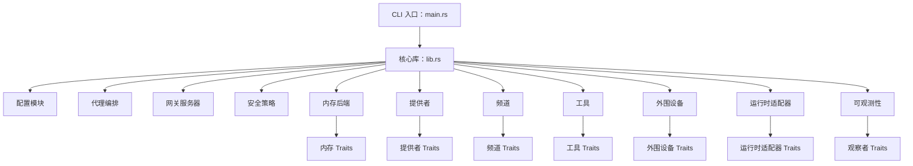
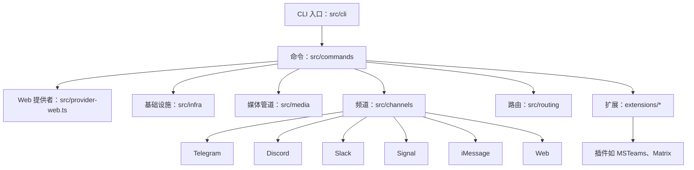

# 架构比较：Zeroclaw vs Openclaw vs NanoClaw

## Zeroclaw 架构总结

**概述：** Zeroclaw 是一个 Rust 优先的自主代理运行时，专为高性能、高效率、高稳定性、高扩展性、高可持续性和高安全性而设计。它使用 trait 驱动的模块化架构来启用可插拔组件。

**关键原则：**
- KISS（保持简单愚蠢）
- YAGNI（你不会需要它）
- DRY + 三法则
- SRP + ISP（单一责任 + 接口隔离）
- 快速失败 + 显式错误
- 默认安全 + 最小权限
- 确定性 + 可重现性
- 可逆性 + 回滚优先思维

**核心架构：**
- **语言：** Rust
- **入口点：** `src/main.rs`（CLI 入口点和命令路由）
- **模块：**
  - `src/lib.rs`（模块导出和共享命令枚举）
  - `src/config/`（schema + 配置加载/合并）
  - `src/agent/`（编排循环）
  - `src/gateway/`（webhook/网关服务器）
  - `src/security/`（策略、配对、秘密存储）
  - `src/memory/`（markdown/sqlite 内存后端 + 嵌入/向量合并）
  - `src/providers/`（模型提供者和弹性包装器）
  - `src/channels/`（Telegram/Discord/Slack/等频道）
  - `src/tools/`（工具执行表面：shell、文件、内存、浏览器）
  - `src/peripherals/`（硬件外围设备：STM32、RPi GPIO）
  - `src/runtime/`（运行时适配器，目前为原生）
  - `src/observability/`（Observer trait）
- **扩展点（Traits）：**
  - `Provider` (src/providers/traits.rs)
  - `Channel` (src/channels/traits.rs)
  - `Tool` (src/tools/traits.rs)
  - `Memory` (src/memory/traits.rs)
  - `Observer` (src/observability/traits.rs)
  - `RuntimeAdapter` (src/runtime/traits.rs)
  - `Peripheral` (src/peripherals/traits.rs)
- **工厂模式：** 大多数扩展在工厂模块中注册（例如 `src/providers/mod.rs`）
- **文档：** `docs/` 中的任务导向文档，具有统一 TOC、参考、操作、安全、硬件指南。支持 i18n（en、zh-CN、ja、ru、fr、vi）。
- **构建/发布：** Cargo.toml 具有性能优化，CI 通过 .github/，文档治理。

**工作流：** 先读后写，定义范围，实现最小补丁，按风险层验证，记录影响。

### 架构图



## Openclaw 架构总结

**概述：** Openclaw 是一个基于 TypeScript 的 CLI 应用程序，用于自主代理，支持多个消息频道、插件和平台。它通过插件和模块化结构强调扩展性。

**关键原则：**
- TypeScript (ESM)，严格类型化，无 `any`
- 函数式数组方法，早期返回，const 而非 let
- 通过 Oxlint/Oxfmt 格式化
- 类行为无原型突变
- 简洁文件（~700 LOC），提取助手
- 命名：OpenClaw 用于产品，openclaw 用于 CLI/路径

**核心架构：**
- **语言：** TypeScript (ESM)
- **入口点：** 通过 `src/cli` 的 CLI，命令在 `src/commands`
- **模块：**
  - `src/provider-web.ts`（web 提供者）
  - `src/infra`（基础设施）
  - `src/media`（媒体管道）
  - 频道模块：`src/telegram`、`src/discord`、`src/slack`、`src/signal`、`src/imessage`、`src/web`、`src/channels`、`src/routing`
  - 扩展：`extensions/*`（插件如 msteams、matrix、zalo、voice-call）
- **插件/扩展：** `extensions/` 下的工作区包，具有自己的 package.json。通过插件目录中的 npm 安装。
- **构建/测试：**
  - 包管理器：pnpm（首选），支持 bun
  - 运行时：Node 22+
  - 测试：Vitest（覆盖率 70%），e2e，实时测试
  - 代码检查/格式化：Oxlint/Oxfmt
  - 构建：`pnpm build`、`pnpm tsgo`
- **平台：** Mac、Windows、Linux、移动（iOS/Android），具有打包脚本
- **频道：** 核心 + 扩展，具有路由、允许列表、配对
- **文档：** Mintlify 托管（docs.openclaw.ai），i18n（zh-CN），根相对链接
- **发布：** 稳定（标记）、beta（预发布）、dev（主分支）
- **CI/DevOps：** .github/，打包脚本，来自兄弟仓库的安装程序

**工作流：** 常规提交，PR 模板，小 PR，先推送测试。

### 架构图



## NanoClaw 架构总结

**概述：** NanoClaw 是一个个人 Claude 助手，作为单个 Node.js 进程实现，连接 WhatsApp 并将消息路由到在隔离容器（Linux VM）中运行的 Claude Agent SDK。每个组具有隔离的文件系统和内存。

**关键原则：**
- 单进程架构以简化
- 容器化以代理隔离
- 每组内存和文件系统隔离
- WhatsApp 作为主要频道
- SQLite 用于数据库操作

**核心架构：**
- **语言：** TypeScript (Node.js)
- **入口点：** `src/index.ts`（编排器：状态、消息循环、代理调用）
- **模块：**
  - `src/channels/whatsapp.ts`（WhatsApp 连接、认证、发送/接收）
  - `src/ipc.ts`（IPC 观察者和任务处理）
  - `src/router.ts`（消息格式化和出站路由）
  - `src/config.ts`（触发模式、路径、间隔）
  - `src/container-runner.ts`（使用挂载生成代理容器）
  - `src/task-scheduler.ts`（运行调度任务）
  - `src/db.ts`（SQLite 操作）
  - `groups/{name}/CLAUDE.md`（每组内存，隔离）
  - `container/skills/agent-browser.md`（浏览器自动化工具通过 Bash）
- **容器化：** 代理在具有隔离文件系统的 Linux VM/容器中运行
- **频道：** 主要 WhatsApp，具有路由和格式化
- **内存：** 通过 `groups/{name}/CLAUDE.md` 每组隔离
- **构建/测试：** npm 脚本（`npm run dev`、`npm run build`），容器构建脚本
- **服务管理：** macOS 的 launchctl 服务管理
- **技能：** /setup（首次安装、认证）、/customize（添加集成）、/debug（容器问题、日志）

**工作流：** 直接命令执行，根据需要重建容器。

### 架构图

```mermaid
graph TD
    A[编排器：src/index.ts] --> B[WhatsApp 频道：src/channels/whatsapp.ts]
    A --> C[IPC 观察者：src/ipc.ts]
    A --> D[消息路由器：src/router.ts]
    A --> E[配置：src/config.ts]
    A --> F[容器运行器：src/container-runner.ts]
    A --> G[任务调度器：src/task-scheduler.ts]
    A --> H[数据库：src/db.ts]
    F --> I[容器中的 Claude Agent SDK]
    I --> J[每组隔离文件系统]
    I --> K[每组内存：groups/{name}/CLAUDE.md]
    I --> L[浏览器自动化：container/skills/agent-browser.md]
```

## 比较

| 方面 | Zeroclaw | Openclaw | NanoClaw |
|------|----------|----------|----------|
| 语言 | Rust | TypeScript | TypeScript (Node.js) |
| 重点 | 高性能运行时 | 具有频道/插件的 CLI | 个人 WhatsApp 助手 |
| 模块化 | Trait 基础扩展 | 插件基础扩展 | 单进程 + 容器 |
| 安全性 | 首要，互联网邻接 | CLI 安全性，编辑 | 容器隔离 |
| 平台 | 原生（Linux 等） | 跨平台（Mac、Win、Linux、移动） | macOS (launchctl)，容器化代理 |
| 文档 | 本地 docs/，i18n | Mintlify 托管，i18n | README + docs/ |
| 构建 | Cargo | pnpm/bun | npm + 容器构建 |
| 测试 | Rust 测试 | Vitest | 未指定 |
| 频道 | 核心频道 | 核心 + 扩展 | 仅 WhatsApp |
| 集成/扩展 | 外围设备（GPIO 等） | 媒体管道 | 通过 Bash 的浏览器自动化 |
| 运行时 | 原生适配器 | 基于 Node | Node + 容器化 Claude SDK |
| 隔离 | 模块级 | 插件级 | 每组容器 |
| 内存 | 具有嵌入的 Markdown/SQLite | 未指定 | 每组 CLAUDE.md |

所有三个都是自主代理项目，但 Zeroclaw 强调 Rust 性能和扩展性，Openclaw 专注于具有广泛频道支持的 TypeScript CLI，而 NanoClaw 是更简单的容器化 WhatsApp 到 Claude 桥接，具有组隔离。