# Unified Platform Comparison: All 26 AI Agent Platforms

**[中文](platform_comparison.zh-CN.md)** | English

> Standardized architecture comparison across all 26 platforms tracked by AllClaws — 11 claw ecosystem platforms, 9 external frameworks, 5 CLI coding agents, and 1 human digital twin platform. Updated June 2026.

---

## Overview

This document provides a standardized, side-by-side architecture comparison of all 25 AI agent platforms tracked by the AllClaws research project. Each platform entry follows a uniform format covering classification, design principles, core architecture, and an architecture diagram (where available).

The 25 platforms divide into four groups:

- **Claw Ecosystem (11):** Platforms originating within or closely associated with the Claw/OpenClaw ecosystem.
- **External Frameworks (8):** Industry-reference frameworks tracked for ecosystem comparison.
- **CLI Coding Agents (5):** AI-powered terminal-based coding assistants (aider, reasonix, copilot-cli, kimi-cli, codex).
- **Human Digital Twin (1):** Academic/research platform (openhuman).

### Key Cross-Cutting Patterns (May 2026)

**Convergence — what all platforms agree on:**
1. Streaming responses are table stakes
2. Multi-LLM provider support is the norm
3. Security sandboxing is essential (containers, WASM, or isolation layers)
4. Cross-session memory/persistence is universal

**Divergence — where the ecosystem is splitting:**
1. **MCP** — Native vs. Adapter vs. Resistant
2. **Deployment** — Local-first vs. Cloud
3. **Use case** — Personal-Force-Multiplier vs. Enterprise-Automation
4. **Architecture** — Single-agent vs. Multi-agent

**The defining trend of 2026:** The fork between personal-force-multiplier and enterprise-automation paradigms.

---

## Taxonomy

### By Field (Use Case)

| Field | Description | Examples |
|-------|-------------|----------|
| **Personal-Force-Multiplier** | Single user or small team; CLI-first; local deployment | OpenClaw, Nanobot, SmolAgents, Maxclaw, ZeroClaw, NanoClaw, aider, copilot-cli, kimi-cli, codex |
| **Enterprise-Automation** | Multi-user; cloud-deployed; governance focus | GoClaw, LangGraph, Swarms, HiClaw, CrewAI, AutoGen |
| **Personal/Enterprise (Hybrid)** | Spans both paradigms | IronClaw |
| **Academic** | Research and education focused | Claw-AI-Lab, openhuman |

### By MCP Relationship

| Status | Meaning | Examples |
|--------|---------|----------|
| **Native** | Framework built around MCP protocol | Hermes-Agent |
| **Adapter** | MCP supported as integration layer | IronClaw, GoClaw, ZeroClaw, OpenClaw, HiClaw |
| **Resistant** | Explicitly avoids MCP overhead | NanoClaw |
| **None** | No MCP integration | ClawTeam, Maxclaw, Nanobot |
| **N/A** | Domain-specific; MCP not relevant | Claw-AI-Lab |

---

## Part 1: Claw Ecosystem (11 Platforms)

---

## OpenClaw

**Classification:** TypeScript | ~340K stars | Personal-Force-Multiplier
**Repository:** [github.com/openclaw/openclaw](https://github.com/openclaw/openclaw)
**Status:** Active

### Overview

OpenClaw is the foundational TypeScript CLI application for autonomous AI agents. It supports 37+ messaging channels, an extensive plugin ecosystem, and cross-platform deployment including mobile (iOS/Android). Foundation governance transition is ongoing following the creator's move to OpenAI.

### Key Principles

- TypeScript (ESM), strict typing, no `any`
- Functional array methods, early returns, `const` over `let`
- Formatting via Oxlint/Oxfmt
- No prototype mutation for class behavior
- Concise files (~700 LOC), extract helpers

### Core Architecture

- **Language:** TypeScript (ESM)
- **Entry Point:** CLI via `src/cli`
- **Architecture Pattern:** Single-agent with channel/plugin extensions
- **Key Modules:** `src/provider-web.ts`, `src/infra`, `src/media`, channel modules (Telegram, Discord, Slack, Signal, iMessage, Web), extensions (MSTeams, Matrix, Zalo)
- **MCP Status:** Adapter — via plugin extension, not native
- **Deployment:** Cross-platform (Mac, Windows, Linux, iOS, Android)
- **LLM Support:** Web provider
- **Memory:** Not specified
- **Database:** Not specified
- **Security:** CLI security, redaction
- **Testing:** Vitest (coverage 70%), e2e, live tests

### Architecture Diagram

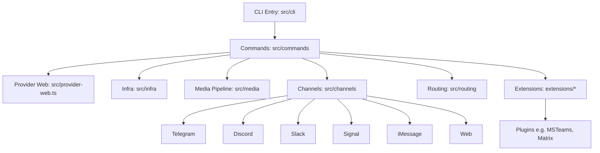

---

## ClawTeam

**Classification:** Python 3.10+ | ~884 stars | Personal-Force-Multiplier
**Repository:** [github.com/win4r/ClawTeam-OpenClaw](https://github.com/win4r/ClawTeam-OpenClaw)
**Status:** Active

### Overview

ClawTeam is a multi-agent swarm coordination layer that transforms single AI agents into self-organizing teams with leader-worker orchestration, task dependencies, inter-agent messaging, and git worktree isolation for parallel development.

### Key Principles

- Agent self-organization (AI agents orchestrate themselves)
- Zero-config setup with TOML team templates
- File-based state with fcntl locking (no database)
- Git worktree isolation for parallel agents
- Multi-agent support (OpenClaw, Claude Code, Codex, Nanobot, Cursor)

### Core Architecture

- **Language:** Python 3.10+
- **Entry Point:** `clawteam` CLI
- **Architecture Pattern:** Multi-agent (Leader-Worker)
- **Key Modules:** Team lifecycle, agent spawning (tmux), task management, inter-agent messaging (inbox), monitoring dashboards, workspace management
- **MCP Status:** None
- **Deployment:** Local; optional ZeroMQ P2P for cross-machine
- **LLM Support:** Agent-dependent (OpenClaw, Claude Code, Codex, Nanobot, Cursor)
- **Memory:** JSON files under `~/.clawteam/`
- **Database:** JSON files (file-based)
- **Security:** Agent isolation via git worktrees
- **Testing:** 453 tests pass

### Architecture Diagram

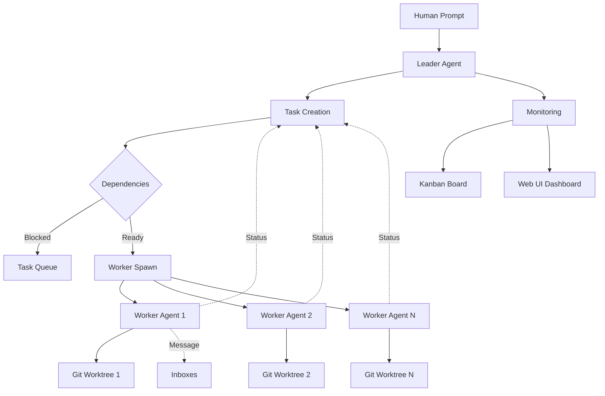

---

## GoClaw

**Classification:** Go 1.26 | ~1.3K stars | Enterprise-Automation
**Repository:** [github.com/nextlevelbuilder/goclaw](https://github.com/nextlevelbuilder/goclaw)
**Status:** Active

### Overview

GoClaw is a multi-agent AI gateway deployed as a single Go binary (~25 MB) with zero runtime dependencies. It orchestrates agent teams, inter-agent delegation, and quality-gated workflows across 13+ LLM providers with full multi-tenant PostgreSQL isolation.

### Key Principles

- Agent Teams & Orchestration with shared task boards
- Multi-tenant PostgreSQL with per-user workspaces
- Single binary deployment (~25 MB)
- 5-layer production security defense
- 13+ LLM providers with native Anthropic support

### Core Architecture

- **Language:** Go 1.26
- **Entry Point:** `cmd/goclaw/main.go`
- **Architecture Pattern:** Multi-agent gateway with lane-based scheduler
- **Key Modules:** gateway (WS + HTTP), agent loop (think-act-observe), providers (Anthropic native, OpenAI-compat), tool registry (fs, exec, web, memory, MCP), store (PostgreSQL), channels (Telegram, Feishu, Zalo, Discord, WhatsApp), scheduler (lane-based), skills (SKILL.md + BM25), memory (pgvector)
- **MCP Status:** Adapter — stdio/SSE/streamable-http
- **Deployment:** Binary + Docker (~50 MB Alpine)
- **LLM Support:** 13+ providers
- **Memory:** PostgreSQL + pgvector (hybrid search)
- **Database:** PostgreSQL 15+ (required)
- **Security:** 5-layer defense — rate limiting, prompt injection, SSRF protection, shell deny, AES-256-GCM
- **Testing:** `go test`, integration tests with race detector

### Architecture Diagram

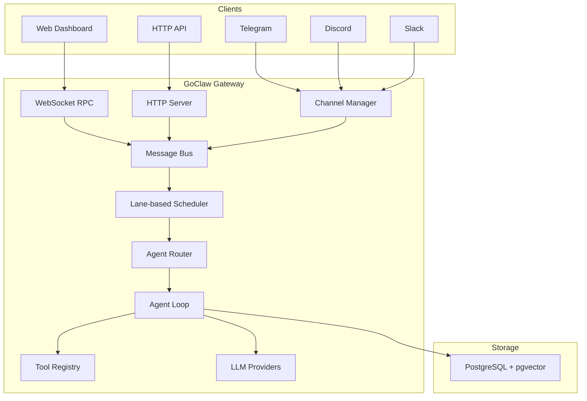

---

## IronClaw

**Classification:** Rust | Rapid growth | Personal/Enterprise (Hybrid)
**Repository:** [github.com/nearai/ironclaw](https://github.com/nearai/ironclaw)
**Status:** Active

### Overview

IronClaw is a Rust-based secure personal AI assistant with WASM sandboxing for tool execution and PostgreSQL for persistence. It is the most active claw platform with 8 releases in a single month, prioritizing data protection and self-expanding capabilities.

### Key Principles

- Security first with defense in depth
- Your data stays yours (local, encrypted, no telemetry)
- Self-expanding capabilities through dynamic tool building
- Transparency by design (open source, auditable)
- Capability-based permissions for WASM tools

### Core Architecture

- **Language:** Rust
- **Entry Point:** `src/main.rs`
- **Architecture Pattern:** Single-agent with WASM sandboxing
- **Key Modules:** agent orchestration, channels (REPL, HTTP, WASM), sandbox (WASM), orchestrator (Docker), safety (prompt injection defense), secrets (AES-256-GCM), database (PostgreSQL + pgvector)
- **MCP Status:** Adapter — MCP servers alongside WASM tools
- **Deployment:** Cross-platform (Mac, Win, Linux)
- **LLM Support:** Multi-provider (NEAR AI, OpenAI-compatible)
- **Memory:** PostgreSQL with pgvector (full-text + vector)
- **Database:** PostgreSQL 15+ (required)
- **Security:** WASM sandbox with endpoint allowlisting, credential injection at host boundary, prompt injection defense, no telemetry
- **Testing:** `cargo test`, integration tests with testcontainers

### Architecture Diagram

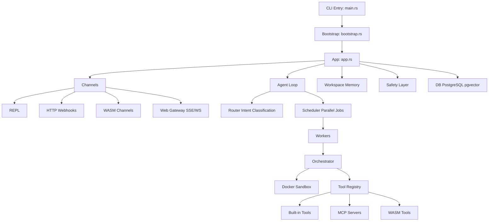

---

## Maxclaw

**Classification:** Go 1.24+ | ~189 stars | Personal-Force-Multiplier
**Repository:** [github.com/Lichas/maxclaw](https://github.com/Lichas/maxclaw)
**Status:** Active

### Overview

Maxclaw is an OpenClaw-style local-first AI agent written in Go, emphasizing low memory footprint, fully local workflow, and visual interfaces (desktop UI + web UI). It provides autonomous execution, spawnable sub-sessions, and monorepo-aware context discovery.

### Key Principles

- Go-native resource efficiency
- Fully local execution (sessions, memory, logs)
- Desktop UI + Web UI on same port
- Monorepo context awareness (AGENTS.md, CLAUDE.md)
- Autonomous mode with task scheduling

### Core Architecture

- **Language:** Go 1.24+
- **Entry Point:** `cmd/main.go`
- **Architecture Pattern:** Single-agent with sub-session spawning
- **Key Modules:** agent loop, tool system, memory (MEMORY.md + HISTORY.md), channels (Telegram, WhatsApp, Discord, WebSocket), scheduler (cron/once/every), monorepo context discovery
- **MCP Status:** None
- **Deployment:** Local (cross-platform); binaries: `maxclaw` and `maxclaw-gateway`
- **LLM Support:** Anthropic + OpenAI native SDKs
- **Memory:** Layered — MEMORY.md (long-term), HISTORY.md (session), heartbeat.md (active)
- **Database:** SQLite
- **Security:** Fully local execution only
- **Testing:** Go tests

### Architecture Diagram

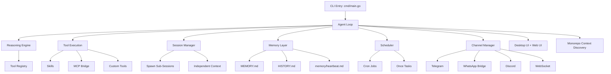

---

## NanoClaw

**Classification:** TypeScript (Node.js) | Docker Partnership | Personal-Force-Multiplier
**Status:** Active

### Overview

NanoClaw is a personal Claude assistant as a single Node.js process connecting WhatsApp to Claude Agent SDK running in isolated containers. It provides per-group isolated filesystem and memory — the most prominent MCP resister in the ecosystem.

### Key Principles

- Single process architecture for simplicity
- Containerization for agent isolation
- Per-group memory and filesystem isolation
- WhatsApp as primary channel
- Explicitly avoiding MCP overhead

### Core Architecture

- **Language:** TypeScript (Node.js)
- **Entry Point:** `src/index.ts`
- **Architecture Pattern:** Single-agent with container isolation
- **Key Modules:** WhatsApp channel, IPC watcher, message router, container runner, task scheduler, SQLite database
- **MCP Status:** Resistant — CLI-first, container-based, direct tool execution preferred
- **Deployment:** macOS (launchctl) + containerized agents
- **LLM Support:** Claude Agent SDK
- **Memory:** Per-group CLAUDE.md files
- **Database:** SQLite
- **Security:** Container isolation per group
- **Testing:** Not specified

### Architecture Diagram

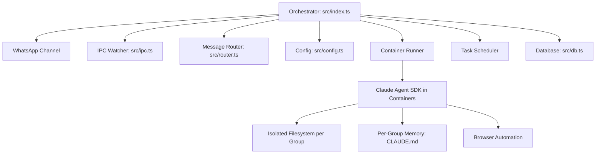

---

## Nanobot

**Classification:** Python 3.11+ | ~37K stars | Personal-Force-Multiplier
**Status:** Active

### Overview

Nanobot is an ultra-lightweight personal AI assistant with ~4,000 lines of core agent code — 99% smaller than OpenClaw. Delivers core agent functionality with minimal footprint. Installed via `pip install nanobot-ai`.

### Key Principles

- Ultra-lightweight (~4,000 LOC core)
- Research-ready with clean, readable code
- Easy one-click deployment
- MCP protocol support
- Multiple LLM providers via LiteLLM

### Core Architecture

- **Language:** Python 3.11+
- **Entry Point:** `nanobot/__main__.py` (CLI via Typer)
- **Architecture Pattern:** Single-agent with subagent support
- **Key Modules:** agent orchestrator, channels (8+: Telegram, Discord, Slack, WhatsApp, Feishu, QQ, Email, Matrix), providers (LiteLLM), skills (ClawHub), session manager, MCP bridge
- **MCP Status:** None — MCP bridge available but not core
- **Deployment:** Cross-platform (Python + Docker)
- **LLM Support:** Multiple via LiteLLM (Anthropic, OpenAI, DeepSeek, Qwen, Moonshot, etc.)
- **Memory:** Session history with configurable retention
- **Database:** SQLite
- **Security:** Security hardening
- **Testing:** tests/ directory

### Architecture Diagram

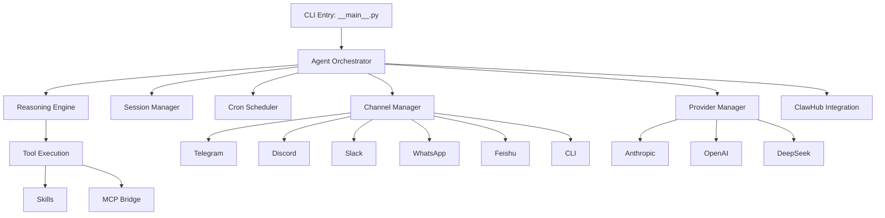

---

## ZeroClaw

**Classification:** Rust | ~29K stars | Personal-Force-Multiplier
**Status:** Active

### Overview

ZeroClaw is a Rust-first autonomous agent runtime designed for high performance and efficiency — <5MB RAM, <10ms cold start. Uses trait-driven, modular architecture for pluggable components. Current performance leader in the ecosystem.

### Key Principles

- KISS (Keep It Simple, Stupid)
- YAGNI + DRY + Rule of Three
- SRP + ISP (Single Responsibility + Interface Segregation)
- Fail Fast + Explicit Errors
- Secure by Default + Least Privilege
- Determinism + Reproducibility

### Core Architecture

- **Language:** Rust
- **Entry Point:** `src/main.rs`
- **Architecture Pattern:** Single-agent with trait-based extensions
- **Key Modules:** config, agent orchestration, gateway (webhook server), security (policy, pairing, secrets), memory (markdown/sqlite + embeddings), providers, channels (15+), tools (shell, file, memory, browser), peripherals (STM32, RPi GPIO)
- **MCP Status:** Adapter — stdio/SSE
- **Deployment:** Native (Linux, etc.); cross-platform
- **LLM Support:** 8 native + 29 compatible providers
- **Memory:** Markdown/SQLite with embeddings and vector merge
- **Database:** SQLite
- **Security:** First-class, internet-adjacent; policy-based
- **Testing:** Rust tests

### Architecture Diagram

*No diagram available in source.*

---

## HiClaw

**Classification:** Go + Shell | Active development | Enterprise-Automation
**Status:** Active

### Overview

HiClaw is an enterprise-grade multi-agent runtime bringing Kubernetes-style declarative resources to AI agent orchestration. Manager-Workers architecture with team templates, worker marketplace, and Nacos-based skill registry.

### Key Principles

- Kubernetes-style declarative resources (YAML)
- Manager-Workers orchestration pattern
- Enterprise-grade multi-tenant support
- Worker template marketplace
- Nacos-based skill discovery

### Core Architecture

- **Language:** Go + Shell scripts
- **Entry Point:** `hiclaw` CLI with Docker Compose
- **Architecture Pattern:** Manager-Workers
- **Key Modules:** Worker resources (YAML), Team resources, Human resources (HITL), Manager CoPaw runtime, Nacos skills registry, Worker template marketplace
- **MCP Status:** Adapter
- **Deployment:** Docker Compose (dev), Kubernetes (production)
- **LLM Support:** Gateway-managed
- **Memory:** MinIO shared filesystem
- **Database:** PostgreSQL + MinIO
- **Security:** Gateway credential isolation; multi-tenant workspace isolation
- **Testing:** Not specified

### Architecture Diagram

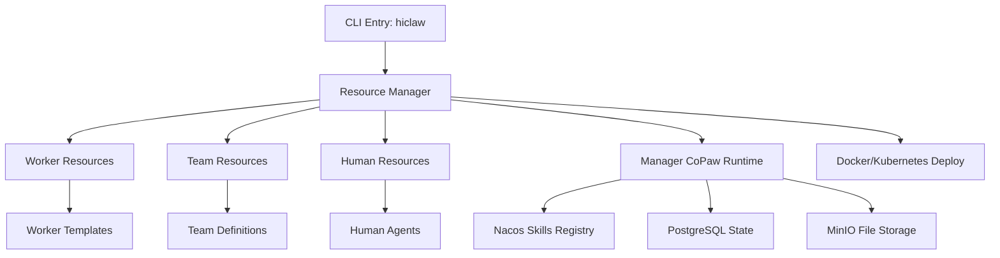

---

## Hermes-Agent

**Classification:** Python | Research-backed | Personal-Force-Multiplier
**Status:** Active

### Overview

Hermes-Agent is a research-backed personal AI agent implementing advanced context management — context compaction, resolved questions tracking, and context separators. AllClaws verification (May 2026) found it delivers on infrastructure but overstates "self-improving" claims.

### Key Principles

- Research-backed prompt engineering
- Context compaction to prevent stale answers
- Resolved questions tracking
- Clear context separators
- Competitor-inspired techniques

### Core Architecture

- **Language:** Python
- **Entry Point:** `hermes` CLI
- **Architecture Pattern:** Single-agent with context management
- **Key Modules:** Context compaction engine, resolved questions tracker, context separator system, prompt engineering layer, conversation manager, tool executor (MCP + custom tools)
- **MCP Status:** Native — MCP integration for tool execution
- **Deployment:** Linux, macOS, cloud
- **LLM Support:** Anthropic, OpenAI, OpenRouter
- **Memory:** Conversation history + file-based persistence
- **Database:** SQLite
- **Security:** Research-backed safety checks
- **Testing:** pytest

### Architecture Diagram

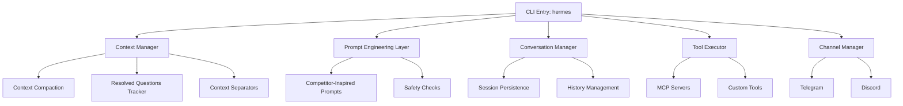

---

## Claw-AI-Lab

**Classification:** Python 3.11+ + Node.js 18+ | Academic | Academic
**Status:** Active

### Overview

Claw-AI-Lab is a lab-native multi-agent research platform for interactive, scalable AI-driven science. Create a full AI research lab from a single prompt with customizable roles and FIFO-based scheduling across three research modes: Explore, Discussion, Reproduce.

### Key Principles

- Lab-native multi-agent research platform
- FIFO-based scheduling for parallel execution
- Human-in-the-loop with intervention capabilities
- Cross-project knowledge sharing
- Three research modes: Explore, Discussion, Reproduce

### Core Architecture

- **Language:** Python 3.11+ (backend), Node.js 18+ (frontend)
- **Entry Point:** `start.sh`
- **Architecture Pattern:** Multi-agent research pipeline (FIFO-scheduled)
- **Key Modules:** multi-agent orchestrator, Claw Code Harness, sandbox executor, knowledge base (Markdown/Obsidian), React web dashboard, LLM provider manager with fallback chain
- **MCP Status:** N/A
- **Deployment:** Cross-platform (Python + Node.js)
- **LLM Support:** Multi-model with fallback chain
- **Memory:** Knowledge base (Markdown/Obsidian)
- **Database:** Project-based storage
- **Security:** HITL gates + sandboxed execution
- **Testing:** End-to-end pipeline testing

### Architecture Diagram

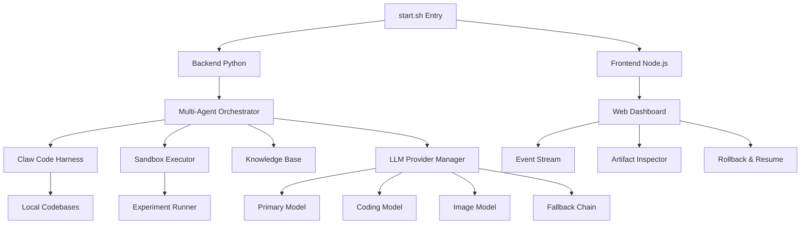

---

## Part 2: External Frameworks (9 Platforms)

---

## SmolAgents

**Classification:** Python | ~26.7K stars | Personal-Force-Multiplier
**Repository:** [github.com/huggingface/smolagents](https://github.com/huggingface/smolagents)
**Status:** Active

### Overview

Hugging Face's ultra-lightweight AI agent library (~1,000 LOC core). Its defining characteristic is the code-first paradigm — agents express actions as executable Python code rather than abstract tool calls. Demonstrates how minimal an agent framework can be.

### Key Principles

- Minimal core (~1,000 lines)
- Code-first paradigm — agents write and execute Python
- Zero-to-hero simplicity
- Hugging Face ecosystem integration
- E2B sandbox execution

### Core Architecture

- **Language:** Python
- **Entry Point:** Library import (`from smolagents import CodeAgent`)
- **Architecture Pattern:** Single-agent (code generation)
- **Key Modules:** CodeAgent, HfApiModel, sandboxed tool execution, memory system
- **MCP Status:** N/A
- **Deployment:** Hybrid
- **LLM Support:** Hugging Face inference API (free tier)
- **Memory:** Conversation context and results tracking
- **Database:** Not specified
- **Security:** E2B sandbox
- **Testing:** Not specified

### Claw Ecosystem Comparison

| Aspect | SmolAgents | Nanobot | NanoClaw |
|--------|------------|---------|----------|
| **Core LOC** | ~1,000 | ~4,000 | ~10,600 |
| **Paradigm** | Code generation | Tool calling | Container-first |
| **Sandbox** | E2B | Native | Docker |
| **Ecosystem** | Hugging Face Hub | Custom | Custom |

---

## LangGraph

**Classification:** Python, TypeScript | Enterprise adoption | Enterprise-Automation
**Repository:** [github.com/langchain-ai/langgraph](https://github.com/langchain-ai/langgraph)
**Status:** Active

### Overview

Graph-based orchestration framework for stateful, multi-agent AI applications. Built on LangChain, it models AI workflows as directed graphs with checkpointing for persistence. Enterprise leader via LangChain ecosystem.

### Key Principles

- Graph-based workflows
- Stateful execution with checkpointing
- Human-in-the-loop patterns
- Parallel execution support
- Enterprise-ready production patterns

### Core Architecture

- **Language:** Python, TypeScript
- **Entry Point:** Library import
- **Architecture Pattern:** Graph-orchestration
- **Key Modules:** StateGraph (typed state), Nodes (agents/tools), Edges (conditional routing), Checkpointing, Subgraphs
- **MCP Status:** N/A
- **Deployment:** Cloud
- **LLM Support:** Via LangChain ecosystem
- **Memory:** Built-in checkpointing
- **Database:** Not specified
- **Security:** Not specified
- **Testing:** Not specified

### Claw Ecosystem Comparison

| Aspect | LangGraph | ClawTeam | GoClaw |
|--------|-----------|----------|--------|
| **Orchestration** | Graph-based | Leader-worker | Team-based |
| **State** | Checkpointed | Git worktrees | PostgreSQL |
| **Type Safety** | Typed state | Untyped | Go types |

---

## CrewAI

**Classification:** Python | Active development | Enterprise-Automation
**Repository:** [github.com/crewaiinc/crewai](https://github.com/crewaiinc/crewai)
**Status:** Active

### Overview

Python framework for orchestrating role-playing autonomous AI agents. Each agent has a defined role, goal, and backstory. Pioneered the role-based approach to multi-agent systems.

### Key Principles

- Role-based agents (role, goal, backstory)
- Automatic task delegation
- Sequential/parallel workflows
- External tool usage
- Human-in-the-loop approval

### Core Architecture

- **Language:** Python
- **Entry Point:** Library import (`from crewai import Agent, Task, Crew`)
- **Architecture Pattern:** Multi-agent (Role-based)
- **Key Modules:** Agent (role-based entity), Task (work unit), Crew (agent collection), Process (sequential/parallel/hierarchical)
- **MCP Status:** N/A
- **Deployment:** Hybrid
- **LLM Support:** Not specified
- **Memory:** In-memory state
- **Database:** Not specified
- **Security:** HITL approval gates
- **Testing:** Not specified

### Claw Ecosystem Comparison

| Aspect | CrewAI | ClawTeam |
|--------|--------|----------|
| **Coordination** | Role-based stories | Leader-worker |
| **State** | In-memory | Git worktrees |
| **Communication** | Direct messages | Inbox system |
| **Isolation** | Process-level | Filesystem (worktrees) |

---

## AutoGen

**Classification:** Python | Microsoft Research | Enterprise-Automation
**Repository:** [github.com/microsoft/autogen](https://github.com/microsoft/autogen)
**Status:** Active

### Overview

Microsoft Research's multi-agent conversation framework. Agents communicate through messages to solve tasks, with human-in-the-loop, Docker code execution, and multi-modal support.

### Key Principles

- Conversation-based agent communication
- Human-in-the-loop via UserProxy agent
- Docker-based safe code execution
- Multi-modal (text, images, code)
- LLM flexibility

### Core Architecture

- **Language:** Python
- **Entry Point:** Library import
- **Architecture Pattern:** Multi-agent (Conversational)
- **Key Modules:** Agent, Conversation, UserProxyAgent, CodeExecutor (Docker)
- **MCP Status:** N/A
- **Deployment:** Cloud
- **LLM Support:** Various providers
- **Memory:** Conversation-based state
- **Database:** Not specified
- **Security:** Docker code execution sandbox
- **Testing:** Not specified

### Claw Ecosystem Comparison

| Aspect | AutoGen | ClawTeam | CrewAI |
|--------|---------|----------|--------|
| **Communication** | Conversational messages | Inbox system | Direct calls |
| **Human role** | UserProxy agent | Separate from agents | Optional approval |
| **Code execution** | Built-in Docker | Via agent tools | Via agent tools |

---

## Swarms

**Classification:** Python | ~5K stars | Enterprise-Automation
**Repository:** [github.com/kyegomez/swarms](https://github.com/kyegomez/swarms)
**Status:** Active

### Overview

Enterprise-grade, production-ready multi-agent orchestration framework. Focuses on scalability and reliability for large-scale deployments. Describes itself as "the most reliable, scalable, and flexible multi-agent orchestration framework."

### Key Principles

- Enterprise-grade reliability
- Large-scale agent deployments
- Async sub-agents (v10+)
- SkillOrchestra for capabilities
- "Agentic economy" vision

### Core Architecture

- **Language:** Python
- **Entry Point:** Library import
- **Architecture Pattern:** Multi-agent (Async orchestration)
- **Key Modules:** Swarm (agent collection), Orchestrator (lifecycle), Skills (reusable capabilities), Tools (external integrations)
- **MCP Status:** N/A
- **Deployment:** Cloud
- **LLM Support:** Not specified
- **Memory:** Not specified
- **Database:** Not specified
- **Security:** Not specified
- **Testing:** Not specified

### Claw Ecosystem Comparison

| Aspect | Swarms | GoClaw | HiClaw |
|--------|--------|--------|--------|
| **Target** | Enterprise orchestration | Multi-agent gateway | Multi-agent runtime |
| **Language** | Python | Go | Go + Shell |
| **Architecture** | Async skills | Lane-based scheduler | Manager-workers |

---

## OpenAgents

**Classification:** TypeScript | Active development | Enterprise-Automation
**Repository:** [github.com/openagents-org/openagents](https://github.com/openagents-org/openagents)
**Status:** Active

### Overview

TypeScript-based framework for distributed AI agent networks. Philosophy: "Your agents are everywhere" — agents across distributed infrastructure handle databases, marketing, and user replies. Demonstrates TypeScript as a first-class agent framework language.

### Key Principles

- Distributed agents on different servers
- TypeScript-first implementation
- Cloud-native design
- Multi-location deployment

### Core Architecture

- **Language:** TypeScript
- **Entry Point:** Library import
- **Architecture Pattern:** Multi-agent (Distributed network)
- **Key Modules:** Agent workspace, network coordination, cloud integration
- **MCP Status:** N/A
- **Deployment:** Cloud (distributed)
- **LLM Support:** Not specified
- **Memory:** Not specified
- **Database:** Not specified
- **Security:** Not specified
- **Testing:** Not specified

---

## OpenFang

**Classification:** Rust | ~17.6K stars | Personal-Force-Multiplier
**Repository:** [github.com/RightNow-AI/openfang](https://github.com/RightNow-AI/openfang)
**Status:** Active

### Overview

OpenFang is a Rust-based personal AI agent platform that emphasizes hands-on tool execution and a lightweight operating system abstraction for AI agents. Built for speed and safety, it compiles to a single binary and supports multi-provider LLM integration with an extensible hand/tool system.

### Key Principles

- Rust-native performance and memory safety
- Single-binary deployment with zero runtime dependencies
- Hands-first architecture — agents act through structured tool calls
- Extensible provider support via trait-based abstraction
- Local-first with optional remote configuration

### Core Architecture

- **Language:** Rust
- **Entry Point:** CLI via `src/main.rs`
- **Architecture Pattern:** Agent OS (Hands) — agent loop dispatches structured hand/tool calls
- **Key Modules:** agent core, hand registry, provider abstraction (OpenAI, Anthropic, local), session management, config loader
- **MCP Status:** Adapter — MCP servers supported via integration adapter
- **Deployment:** Cross-platform (single binary, zero dependencies)
- **LLM Support:** Multi-provider (OpenAI, Anthropic, Ollama, OpenRouter, custom endpoints)
- **Memory:** SQLite-backed session persistence
- **Database:** SQLite
- **Security:** Local-first execution, no telemetry, sandboxed tool execution
- **Testing:** `cargo test`, integration tests

### Architecture Diagram

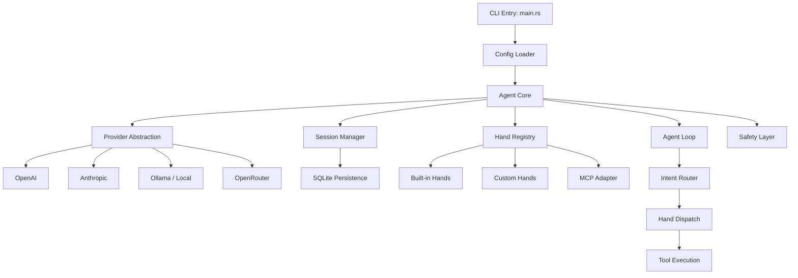

---

## kimi-code

**Classification:** TypeScript | ~1.4K stars | Personal-Force-Multiplier
**Repository:** [github.com/MoonshotAI/kimi-code](https://github.com/MoonshotAI/kimi-code)
**Status:** Active

### Overview

MoonshotAI's next-generation agent framework built as a monorepo with plugin architecture and MCP support. Provides extensible tooling and agent orchestration capabilities for building custom AI agents.

### Key Principles

- Monorepo architecture for cohesive development
- Plugin architecture for extensibility
- MCP (Model Context Protocol) support
- MIT open source license

### Core Architecture

- **Language:** TypeScript
- **Entry Point:** Library/CLI
- **Architecture Pattern:** Plugin-based agent framework (monorepo)
- **Key Modules:** Agent core, plugin registry, MCP integration, tool system
- **MCP Status:** Adapter — MCP support via plugin architecture
- **Deployment:** Cross-platform
- **LLM Support:** MoonshotAI (Kimi)
- **Memory:** Not specified
- **Database:** Not specified
- **Security:** Not specified
- **Testing:** Not specified

### Architecture Diagram

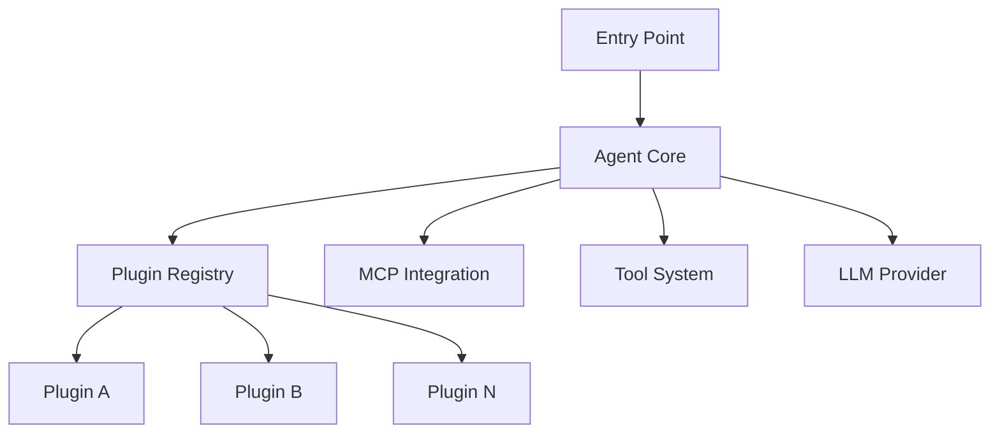

---

## AgentScope

**Classification:** Python 3.11+ | ~25.8K stars | Personal/Enterprise (Hybrid)
**Repository:** [github.com/agentscope-ai/agentscope](https://github.com/agentscope-ai/agentscope)
**Status:** Active

### Overview

Alibaba's production-ready multi-agent framework with event-driven streaming, native MCP support, fine-grained permission control, and multi-tenant FastAPI serving. Designed to leverage rising model capability with minimal orchestration overhead.

### Key Principles

- Event-driven streaming architecture
- Minimal orchestration — leverage model reasoning, don't constrain it
- Multi-tenancy & multi-session isolation
- Fine-grained permission system for tool/resource control
- Extensible middleware composable into the agent loop

### Core Architecture

- **Language:** Python 3.11+
- **Entry Point:** Library import (`from agentscope.agent import Agent`) or FastAPI service
- **Architecture Pattern:** Multi-agent (event-driven, streaming)
- **Key Modules:** Agent (ReAct loop), Model (8+ providers), Tool/Toolkit (built-in + MCP), Workspace (local/Docker/E2B), Permission engine, Event bus, Middleware (tracing, memory, budget, TTS), App (FastAPI service with storage/sessions/teams)
- **MCP Status:** Native — built-in MCP client (stdio + HTTP/SSE/streamable)
- **Deployment:** Hybrid — local library + FastAPI production service
- **LLM Support:** DashScope (Qwen), OpenAI, Anthropic, DeepSeek, Gemini, Moonshot, Ollama, xAI
- **Memory:** In-conversation state + long-term memory via mem0 middleware
- **Database:** Redis (optional, for service storage); in-memory otherwise
- **Security:** Permission engine (bypass/ask modes, rule-based), workspace sandboxes (local/Docker/E2B)
- **Testing:** ~42,800+ lines of tests

### Architecture Diagram

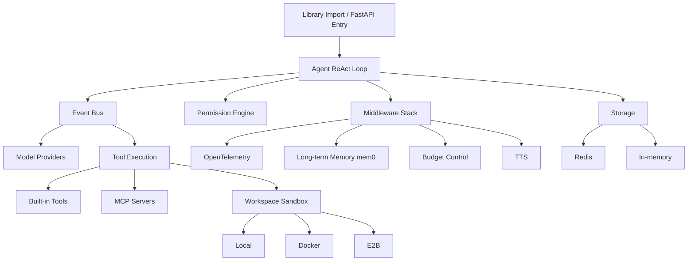

### Claw Ecosystem Comparison

| Aspect | AgentScope | LangGraph | AutoGen |
|--------|-----------|-----------|---------|
| **Architecture** | Event-driven streaming | Graph-orchestration | Conversational messages |
| **MCP** | Native | N/A | N/A |
| **Sandbox** | Local/Docker/E2B | Not specified | Docker |
| **Multi-tenancy** | Built-in (FastAPI + Redis) | Not specified | Not specified |
| **LLM Providers** | 8+ | Via LangChain | Various |

---

## Part 3: CLI Coding Agents (5 Platforms)

---

## aider

**Classification:** Python | ~68K stars | Personal-Force-Multiplier
**Repository:** [github.com/paul-gauthier/aider](https://github.com/paul-gauthier/aider)
**Status:** Active (v0.86.3.dev)

### Overview

aider is an AI pair programming tool that works in your terminal, enabling developers to pair-program with LLMs to edit code in local git repositories. The most popular open-source AI coding assistant with ~68K GitHub stars.

### Key Principles

- Git-aware — automatically creates commits with sensible messages
- Multi-model — supports Claude, GPT-4, DeepSeek, and 20+ LLMs
- Code-gen paradigm — AI edits code directly in your repo
- Whole-repo context — map mode for large codebases
- Cost-effective architecture strategies (map, architect modes)

### Core Architecture

- **Language:** Python
- **Entry Point:** `aider` CLI
- **Architecture Pattern:** REPL pair-programming with git integration
- **Key Modules:** LLM client, repo map, git integration, chat session, edit modes (whole, diff, architect)
- **MCP Status:** None
- **Deployment:** Local (pip install)
- **LLM Support:** 20+ providers (Anthropic, OpenAI, OpenRouter, local via ollama)
- **Memory:** Session-based (git history as context)
- **Database:** None (filesystem)
- **Security:** Local-only execution
- **Testing:** pytest

### Architecture Diagram

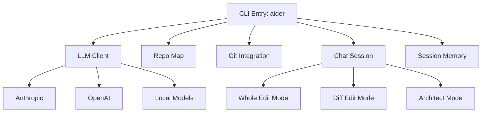

---

## copilot-cli

**Classification:** TypeScript | GitHub-native | Personal-Force-Multiplier
**Repository:** [github.com/githubnext/copilot-cli](https://github.com/githubnext/copilot-cli)
**Status:** Active (v1.0.49)

### Overview

copilot-cli is GitHub's Copilot-powered terminal agent that brings AI assistance directly to the command line. Built with ACP (Agent Communication Protocol) for structured interactions within the GitHub ecosystem.

### Key Principles

- GitHub-native — deep integration with GitHub workflows
- ACP protocol — Agent Communication Protocol for structured terminal interactions
- Terminal-first — works natively in shell environments
- GitHub Copilot infrastructure — leverages existing Copilot AI models

### Core Architecture

- **Language:** TypeScript
- **Entry Point:** CLI
- **Architecture Pattern:** Terminal agent with ACP protocol
- **Key Modules:** ACP client, GitHub integration, terminal UI, command parser
- **MCP Status:** GitHub-native (ACP protocol)
- **Deployment:** npm install
- **LLM Support:** GitHub Copilot (OpenAI-based)
- **Memory:** Session-based
- **Database:** None
- **Security:** GitHub auth
- **Testing:** Not specified

### Architecture Diagram

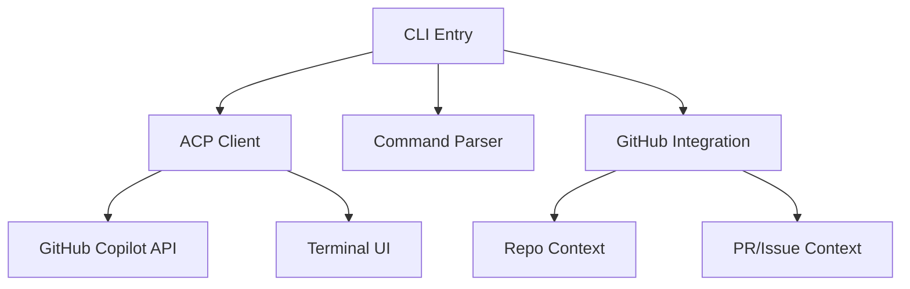

---

## reasonix

**Classification:** TypeScript | ~11.3K stars | Personal-Force-Multiplier
**Repository:** [github.com/esengine/DeepSeek-Reasonix](https://github.com/esengine/DeepSeek-Reasonix)
**Status:** Active

### Overview

Reasonix is an AI-powered CLI coding agent built on DeepSeek's reasoning capabilities. It provides terminal-based code generation, editing, and explanation with a focus on chain-of-thought reasoning for complex coding tasks. Licensed under MIT.

### Key Principles

- Reasoning-first — leverages DeepSeek's chain-of-thought for complex problem decomposition
- CLI-native — designed for terminal workflows
- TypeScript — modern, type-safe implementation
- Open source — MIT license

### Core Architecture

- **Language:** TypeScript
- **Entry Point:** CLI
- **Architecture Pattern:** Terminal coding agent with reasoning pipeline
- **Key Modules:** Reasoning engine, CLI interface, code editor, file system access
- **MCP Status:** N/A
- **Deployment:** Local (npm install)
- **LLM Support:** DeepSeek
- **Memory:** Session-based
- **Database:** None
- **Security:** Local-only execution
- **Testing:** Not specified

### Architecture Diagram

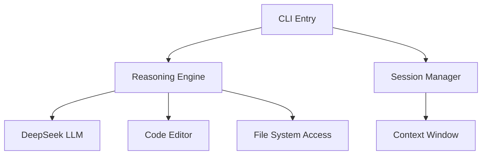

---

## kimi-cli

**Classification:** Python | ~8.8K stars | Personal-Force-Multiplier
**Repository:** [github.com/MoonshotAI/kimi-cli](https://github.com/MoonshotAI/kimi-cli)
**Status:** Active

### Overview

MoonshotAI's CLI coding agent featuring ACP (Agent Communication Protocol) support and a terminal TUI interface. Brings Moonshot's Kimi AI capabilities directly to the command line for AI-assisted coding workflows.

### Key Principles

- ACP protocol support for structured terminal interactions
- Terminal TUI for rich in-terminal experience
- MoonshotAI ecosystem integration
- Apache-2.0 open source license

### Core Architecture

- **Language:** Python
- **Entry Point:** CLI
- **Architecture Pattern:** Terminal coding agent with TUI
- **Key Modules:** ACP client, TUI renderer, code editor, file system access
- **MCP Status:** N/A
- **Deployment:** Local CLI
- **LLM Support:** MoonshotAI (Kimi)
- **Memory:** Session-based
- **Database:** None
- **Security:** Local-only execution
- **Testing:** Not specified

### Architecture Diagram

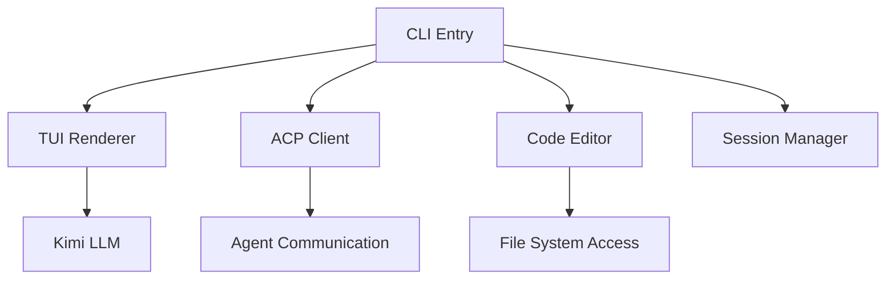

---

## codex

**Classification:** Rust | ~86.9K stars | Personal-Force-Multiplier
**Repository:** [github.com/openai/codex](https://github.com/openai/codex)
**Status:** Active

### Overview

OpenAI's lightweight coding agent built in Rust. A terminal-based tool with sandboxed execution that supports GPT-4o, o3, and o4-mini models. Designed for fast iteration with minimal dependencies. Licensed under Apache-2.0.

### Key Principles

- Sandboxed execution — all code runs in isolated environments
- Minimal dependencies — single binary, zero runtime overhead
- Fast iteration — optimized for rapid code-edit-test cycles
- Rust-native — performance and memory safety

### Core Architecture

- **Language:** Rust
- **Entry Point:** `codex` CLI
- **Architecture Pattern:** Simple CLI → LLM → Shell execution loop
- **MCP Status:** N/A
- **Deployment:** Local (single binary)
- **LLM Support:** GPT-4o, o3, o4-mini
- **Memory:** Session-based
- **Database:** None
- **Security:** Sandboxed execution
- **Testing:** Not specified

---

## Part 4: Human Digital Twin (1 Platform)

---

## openhuman

**Classification:** Rust | Academic | Academic
**Status:** Active (v0.53.49-staging)

### Overview

openhuman is a Rust-based Human Digital Twin platform (人类数字孪生) designed for creating digital representations of humans for research and simulation purposes. An academic/research platform exploring the intersection of AI and human modeling.

### Key Principles

- Human Digital Twin paradigm — digital representation of humans
- Rust-native — high performance and memory safety
- Academic/research focus — scientific simulation and modeling
- Interdisciplinary — bridges AI, biology, and social sciences

### Core Architecture

- **Language:** Rust
- **Entry Point:** Application binary
- **Architecture Pattern:** Digital twin simulation platform
- **Key Modules:** Twin model engine, simulation core, data ingestion, visualization
- **MCP Status:** N/A
- **Deployment:** Local
- **LLM Support:** Not specified
- **Memory:** Twin state persistence
- **Database:** Not specified
- **Security:** Not specified
- **Testing:** Not specified

### Architecture Diagram

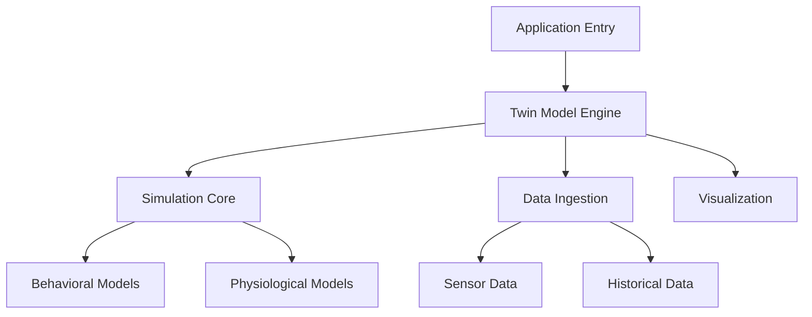

---

## Part 5: Cross-Platform Comparison Matrices

### Language & Field Matrix

| Platform | Language | Field | Stars |
|----------|----------|-------|-------|
| OpenClaw | TypeScript | Personal-Force-Multiplier | ~340K |
| ClawTeam | Python 3.10+ | Personal-Force-Multiplier | ~884 |
| GoClaw | Go 1.26 | Enterprise-Automation | ~1.3K |
| IronClaw | Rust | Personal/Enterprise (Hybrid) | Growing |
| Maxclaw | Go 1.24+ | Personal-Force-Multiplier | ~189 |
| NanoClaw | TypeScript (Node.js) | Personal-Force-Multiplier | N/A |
| Nanobot | Python 3.11+ | Personal-Force-Multiplier | ~37K |
| ZeroClaw | Rust | Personal-Force-Multiplier | ~29K |
| HiClaw | Go + Shell | Enterprise-Automation | N/A |
| Hermes-Agent | Python | Personal-Force-Multiplier | N/A |
| Claw-AI-Lab | Python 3.11+ + Node.js 18+ | Academic | N/A |
| SmolAgents | Python | Personal-Force-Multiplier | ~26.7K |
| LangGraph | Python/TypeScript | Enterprise-Automation | N/A |
| CrewAI | Python | Enterprise-Automation | N/A |
| AutoGen | Python | Enterprise-Automation | N/A |
| Swarms | Python | Enterprise-Automation | ~5K |
| OpenAgents | TypeScript | Enterprise-Automation | N/A |
| aider | Python | Personal-Force-Multiplier | ~68K |
| reasonix | TypeScript | Personal-Force-Multiplier | ~11.3K |
| copilot-cli | TypeScript | Personal-Force-Multiplier | N/A |
| openhuman | Rust | Academic | N/A |
| OpenFang | Rust | Personal-Force-Multiplier | ~17.6K |
| kimi-code | TypeScript | Personal-Force-Multiplier | ~1.4K |
| kimi-cli | Python | Personal-Force-Multiplier | ~8.8K |
| codex | Rust | Personal-Force-Multiplier | ~86.9K |

### MCP Adoption Matrix

| MCP Status | Platforms |
|------------|-----------|
| **Native** | Hermes-Agent |
| **Adapter** | OpenClaw, GoClaw, IronClaw, ZeroClaw, HiClaw, OpenFang, kimi-code |
| **Resistant** | NanoClaw |
| **None** | ClawTeam, Maxclaw, Nanobot |
| **N/A** | Claw-AI-Lab, SmolAgents, LangGraph, CrewAI, AutoGen, Swarms, OpenAgents, aider, reasonix, openhuman, kimi-cli, codex |

### Architecture Pattern Matrix

| Pattern | Platforms |
|---------|-----------|
| **Single-agent** | OpenClaw, IronClaw, Maxclaw, NanoClaw, Nanobot, ZeroClaw, Hermes-Agent |
| **Leader-Worker** | ClawTeam |
| **Gateway/Teams** | GoClaw |
| **Manager-Workers** | HiClaw |
| **Role-based multi-agent** | CrewAI |
| **Conversational multi-agent** | AutoGen |
| **Async orchestration** | Swarms |
| **Distributed network** | OpenAgents |
| **Graph-orchestration** | LangGraph |
| **Code generation** | SmolAgents |
| **Research pipeline** | Claw-AI-Lab |
| **Pair-programming (REPL)** | aider |
| **Terminal agent (reasoning)** | reasonix |
| **Terminal agent (ACP)** | copilot-cli |
| **Agent OS (Hands)** | OpenFang |
| **Plugin-based framework** | kimi-code |
| **Terminal agent (TUI + ACP)** | kimi-cli |
| **Terminal agent (sandboxed)** | codex |

### Deployment & Database Matrix

| Platform | Deployment | Database | Containerization |
|----------|------------|----------|------------------|
| OpenClaw | Cross-platform (Mac, Win, Linux, mobile) | Not specified | Not specified |
| ClawTeam | Local + optional ZeroMQ P2P | JSON files | None (git worktrees) |
| GoClaw | Binary + Docker | PostgreSQL 15+ | Docker sandbox |
| IronClaw | Cross-platform | PostgreSQL 15+ | Docker + WASM |
| Maxclaw | Local (cross-platform) | SQLite | None |
| NanoClaw | macOS + containers | SQLite | Linux VMs/containers |
| Nanobot | Cross-platform (Python + Docker) | SQLite | Docker |
| ZeroClaw | Native (Linux, etc.) | SQLite | None |
| HiClaw | Docker + Kubernetes | PostgreSQL + MinIO | Docker/K8s |
| Hermes-Agent | Linux, macOS, cloud | SQLite | None |
| Claw-AI-Lab | Cross-platform | Project-based | Sandbox executor |
| SmolAgents | Hybrid | Not specified | E2B sandbox |
| LangGraph | Cloud | Not specified | Not specified |
| CrewAI | Hybrid | Not specified | Not specified |
| AutoGen | Cloud | Not specified | Docker |
| Swarms | Cloud | Not specified | Not specified |
| OpenAgents | Cloud (distributed) | Not specified | Not specified |
| aider | Local CLI | SQLite | None |
| reasonix | Local CLI | None | None |
| copilot-cli | Local CLI | GitHub API | None |
| openhuman | Local / Self-hosted | SQLite | Docker |
| OpenFang | Cross-platform (single binary) | SQLite | None |
| kimi-code | Cross-platform | Not specified | Not specified |
| kimi-cli | Local CLI | None | None |
| codex | Local (single binary) | None | Sandboxed execution |

### Full 25-Platform Comparison Table

| Platform | Language | Stars | MCP | Architecture | Deployment | Field |
|----------|----------|-------|-----|-------------|------------|-------|
| OpenClaw | TypeScript | ~340K | Adapter | Single + plugins | Cross-platform | Personal |
| ClawTeam | Python | ~884 | None | Leader-Worker | Local | Personal |
| GoClaw | Go | ~1.3K | Adapter | Gateway + Teams | Binary + Docker | Enterprise |
| IronClaw | Rust | Growing | Adapter | Single + WASM | Cross-platform | Hybrid |
| Maxclaw | Go | ~189 | None | Single + sub-sessions | Local | Personal |
| NanoClaw | TypeScript | N/A | Resistant | Single + containers | macOS + containers | Personal |
| Nanobot | Python | ~37K | None | Single + subagent | Cross-platform | Personal |
| ZeroClaw | Rust | ~29K | Adapter | Single + traits | Native | Personal |
| HiClaw | Go+Shell | N/A | Adapter | Manager-Workers | Docker/K8s | Enterprise |
| Hermes-Agent | Python | N/A | Native | Single + context | Linux/macOS/cloud | Personal |
| Claw-AI-Lab | Py+Node.js | N/A | N/A | Research pipeline | Cross-platform | Academic |
| SmolAgents | Python | ~26.7K | N/A | Code generation | Hybrid | Personal |
| LangGraph | Py/TS | N/A | N/A | Graph-orchestration | Cloud | Enterprise |
| CrewAI | Python | N/A | N/A | Role-based | Hybrid | Enterprise |
| AutoGen | Python | N/A | N/A | Conversational | Cloud | Enterprise |
| Swarms | Python | ~5K | N/A | Async orchestration | Cloud | Enterprise |
| OpenAgents | TypeScript | N/A | N/A | Distributed | Cloud | Enterprise |
| OpenFang | Rust | ~17.6K | Adapter | Agent OS | Single binary | Personal |
| aider | Python | ~68K | N/A | Pair-programming (REPL) | Local CLI | Personal |
| reasonix | TypeScript | ~11.3K | N/A | Terminal agent (reasoning) | Local CLI | Personal |
| copilot-cli | TypeScript | N/A | N/A | Terminal agent (ACP) | Local CLI | Personal |
| openhuman | Rust | N/A | N/A | Digital twin simulation | Local | Academic |
| kimi-code | TypeScript | ~1.4K | Adapter | Plugin-based framework | Cross-platform | Personal |
| kimi-cli | Python | ~8.8K | N/A | Terminal agent (TUI + ACP) | Local CLI | Personal |
| codex | Rust | ~86.9K | N/A | Terminal agent (sandboxed) | Local binary | Personal |

---

## See Also

- **Monthly Ecosystem Reports:** [_posts/](../_posts/) — Cross-cutting trends and platform updates
- **Latest Updates:** [docs/LATEST_UPDATES.md](../docs/LATEST_UPDATES.md) — Per-platform change tracking
- **Multi-Agent Coordination Research:** [multi_agent_coordination_research.md](multi_agent_coordination_research.md) — Deep-dive on coordination patterns
- **Research Roadmap:** [docs/ROADMAP.md](../docs/ROADMAP.md) — H2 2026 priorities
- **Original architecture docs (now superseded):** [architecture_comparison.md](architecture_comparison.md), [external_frameworks.md](external_frameworks.md)

---

*Last updated: May 2026*
*Platforms tracked: 25 (11 claw ecosystem + 8 external frameworks + 5 CLI coding agents + 1 human digital twin)*
*Part of: AllClaws Personal AI Agent Ecosystem Research*
