# 统一平台比较：全部 20 个 AI 代理平台

**[English](platform_comparison.md)** | 中文

> AllClaws 跟踪的全部 20 个平台的标准化架构比较 — 13 个 claw 生态平台和 7 个外部框架。2026 年 5 月更新。

---

## 概述

本文档以标准化格式并排比较 AllClaws 研究项目跟踪的全部 20 个 AI 代理平台的架构。每个平台条目遵循统一格式，涵盖分类、设计原则、核心架构和架构图。

20 个平台分为两组：

- **Claw 生态（13 个）：** 起源于 Claw/OpenClaw 生态或与之紧密关联的平台——从个人 CLI 助手到企业多代理运行时。
- **外部框架（7 个）：** 用于生态比较的行业参考框架——Hugging Face、LangChain、Microsoft 等主要参与者。

### 关键跨平台模式（2026 年 5 月）

**趋同 — 所有平台的共识：**
1. 流式响应已成为基本要求
2. 多 LLM 提供商支持是常态（单一提供商时代正在终结）
3. 安全沙箱是必需品（容器、WASM 或隔离层）
4. 跨会话记忆/持久化是通用的

**分歧 — 生态系统的分裂点：**
1. **MCP** — 原生 vs. 适配器 vs. 抵制
2. **部署** — 本地优先 vs. 云端
3. **用例** — 个人力量倍增器 vs. 企业自动化
4. **架构** — 单代理 vs. 多代理

**2026 年的决定性趋势：** 个人力量倍增器与企业自动化范式之间的分叉。

---

## 分类法

### 按领域（用例）

| 领域 | 描述 | 示例 |
|------|------|------|
| **个人力量倍增器** | 单用户或小团队；CLI 优先；本地部署；速度优先于治理 | OpenClaw、Nanobot、SmolAgents、Maxclaw、ZeroClaw、NanoClaw |
| **企业自动化** | 多用户；云端部署；治理和合规；基于协议的工具访问 | GoClaw、LangGraph、Swarms、HiClaw、CrewAI、AutoGen |
| **个人/企业（混合）** | 跨越两种范式 | IronClaw |
| **学术** | 研究和教育重点 | RTL-CLAW、Claw-AI-Lab |

### 按 MCP 关系

| 状态 | 含义 | 示例 |
|------|------|------|
| **原生** | 围绕 MCP 协议构建的框架 | mcp-agent、Hermes-Agent |
| **适配器** | MCP 作为集成层支持 | IronClaw、GoClaw、ZeroClaw、OpenClaw、HiClaw |
| **抵制** | 明确避免 MCP 开销 | NanoClaw |
| **无** | 无 MCP 集成 | ClawTeam、Maxclaw、Nanobot、QuantumClaw |
| **N/A** | 领域特定；MCP 不相关 | RTL-CLAW、Claw-AI-Lab |

---

## 第一部分：Claw 生态（13 个平台）

---

## OpenClaw

**分类：** TypeScript | ~340K stars | 个人力量倍增器
**仓库：** [github.com/openclaw/openclaw](https://github.com/openclaw/openclaw)
**状态：** 活跃

### 概述

OpenClaw 是自主 AI 代理的基础 TypeScript CLI 应用程序。支持 37+ 个消息频道、广泛的插件生态和跨平台部署（包括 iOS/Android 移动端）。随着创始人加入 OpenAI，基金会治理转型正在进行中。

### 关键原则

- TypeScript (ESM)，严格类型化，无 `any`
- 函数式数组方法，早期返回，`const` 优于 `let`
- 通过 Oxlint/Oxfmt 格式化
- 类行为无原型突变
- 简洁文件（~700 LOC），提取助手函数

### 核心架构

- **语言：** TypeScript (ESM)
- **入口点：** CLI 通过 `src/cli`
- **架构模式：** 单代理 + 频道/插件扩展
- **关键模块：** `src/provider-web.ts`、`src/infra`、`src/media`、频道模块（Telegram、Discord、Slack、Signal、iMessage、Web）、扩展（MSTeams、Matrix、Zalo）
- **MCP 状态：** 适配器 — 通过插件扩展，非原生
- **部署：** 跨平台（Mac、Windows、Linux、iOS、Android）
- **LLM 支持：** Web 提供者
- **内存：** 未指定
- **数据库：** 未指定
- **安全性：** CLI 安全性，内容编辑
- **测试：** Vitest（覆盖率 70%），e2e 测试，实时测试

### 架构图

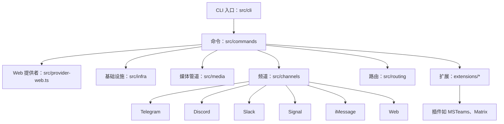

---

## ClawTeam

**分类：** Python 3.10+ | ~884 stars | 个人力量倍增器
**仓库：** [github.com/win4r/ClawTeam-OpenClaw](https://github.com/win4r/ClawTeam-OpenClaw)
**状态：** 活跃

### 概述

ClawTeam 是一个多代理群体协调层，将单一 AI 代理转变为自组织团队。提供领导-工作者编排、任务依赖、代理间消息传递和 git worktree 隔离，支持并行开发，使代理能无合并冲突地协作。

### 关键原则

- 代理自组织（AI 代理自行编排）
- 零配置搭建，基于 TOML 团队模板
- 基于文件的状态管理，使用 fcntl 锁（无数据库依赖）
- Git worktree 隔离并行代理
- 多代理支持（OpenClaw、Claude Code、Codex、Nanobot、Cursor）

### 核心架构

- **语言：** Python 3.10+
- **入口点：** `clawteam` CLI 命令
- **架构模式：** 多代理（领导-工作者）— 领导分解任务，工作者在隔离的 git worktree 中执行
- **关键模块：** 团队生命周期、代理派生（tmux 后端）、任务管理、代理间消息（收件箱）、监控面板、工作空间管理、TOML 团队模板
- **MCP 状态：** 无
- **部署：** 本地；可选 ZeroMQ P2P 跨机器
- **LLM 支持：** 依赖具体代理（OpenClaw、Claude Code、Codex、Nanobot、Cursor）
- **内存：** `~/.clawteam/` 下的 JSON 文件
- **数据库：** JSON 文件（基于文件）
- **安全性：** 通过 git worktree 隔离代理
- **测试：** 453 测试通过

### 架构图

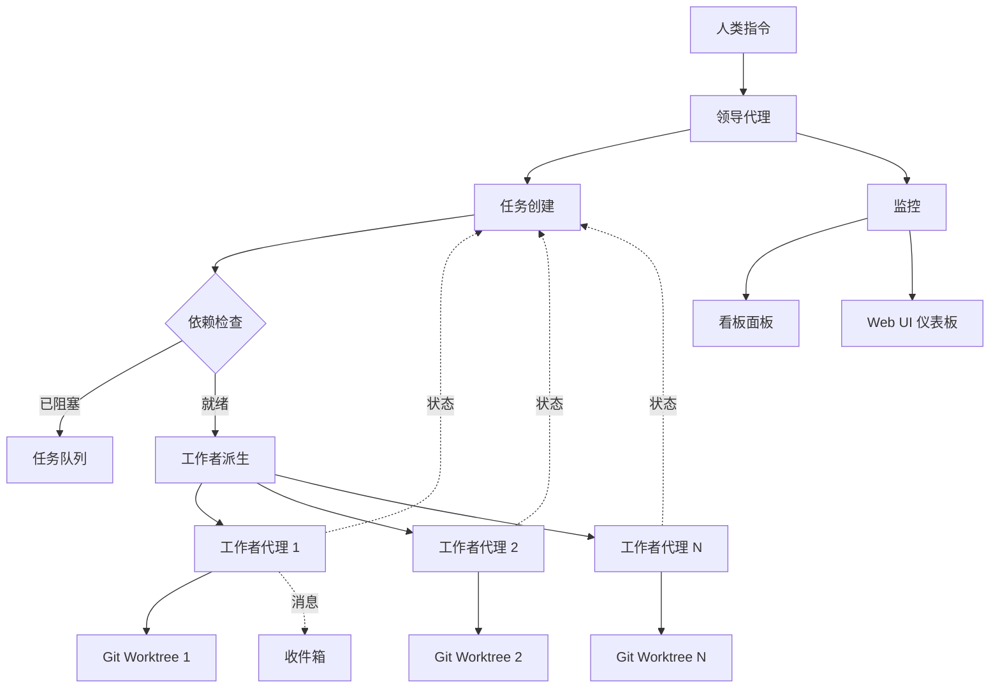

---

## GoClaw

**分类：** Go 1.26 | ~1.3K stars | 企业自动化
**仓库：** [github.com/nextlevelbuilder/goclaw](https://github.com/nextlevelbuilder/goclaw)
**状态：** 活跃

### 概述

GoClaw 是一个多代理 AI 网关，作为单个 Go 二进制文件（~25 MB）部署，零运行时依赖。通过完整的多租户 PostgreSQL 隔离，在 13+ 个 LLM 提供商之间编排代理团队、代理间委托和质量门控工作流。

### 关键原则

- 代理团队与编排，共享任务板
- 多租户 PostgreSQL，每用户工作空间
- 单二进制部署（~25 MB）
- 5 层生产安全防御
- 13+ 个 LLM 提供商，原生 Anthropic 支持

### 核心架构

- **语言：** Go 1.26
- **入口点：** `cmd/goclaw/main.go`
- **架构模式：** 多代理网关 + 车道调度器 — 代理团队、委托和质量门控
- **关键模块：** 网关（WS + HTTP）、代理循环（think→act→observe）、提供商（Anthropic 原生、OpenAI 兼容）、工具注册表（fs、exec、web、memory、MCP）、存储（PostgreSQL）、频道（Telegram、Feishu、Zalo、Discord、WhatsApp）、调度器（车道并发）、技能（SKILL.md + BM25）、记忆（pgvector）
- **MCP 状态：** 适配器 — stdio/SSE/streamable-http
- **部署：** 二进制 + Docker（~50 MB Alpine）
- **LLM 支持：** 13+ 提供商
- **内存：** PostgreSQL + pgvector（混合搜索）
- **数据库：** PostgreSQL 15+（必需）
- **安全性：** 5 层防御 — 速率限制、提示注入检测、SSRF 保护、Shell 拒绝模式、AES-256-GCM
- **测试：** `go test`，含 race 检测器的集成测试

### 架构图

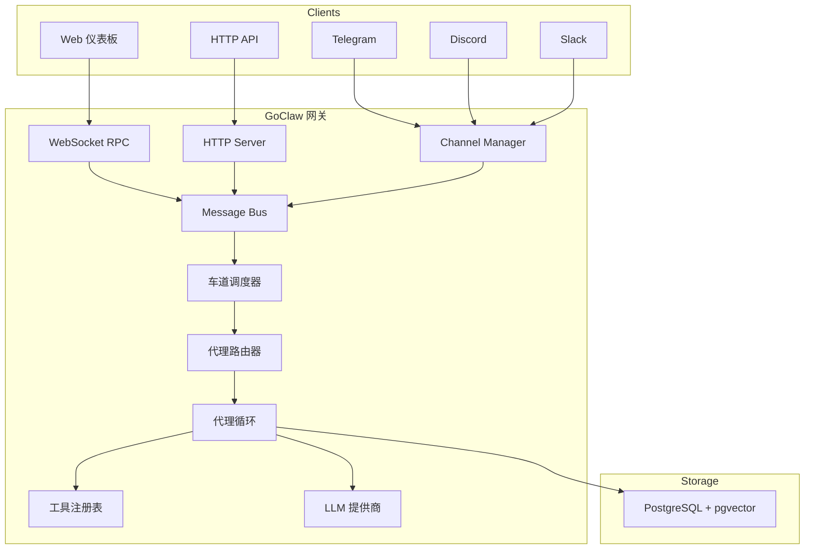

---

## IronClaw

**分类：** Rust | 快速增长 | 个人/企业（混合）
**仓库：** [github.com/nearai/ironclaw](https://github.com/nearai/ironclaw)
**状态：** 活跃

### 概述

IronClaw 是一个基于 Rust 的安全个人 AI 助手，优先考虑数据保护、多层安全和自我扩展能力。使用 WebAssembly 沙箱进行工具执行，PostgreSQL 进行持久化存储。最活跃的 claw 平台，单月 8 次发布。

### 关键原则

- 安全优先，纵深防御
- 你的数据属于你（本地、加密、无遥测）
- 通过动态工具构建实现自我扩展
- 透明设计（开源、可审计）
- WASM 工具基于能力的权限控制

### 核心架构

- **语言：** Rust
- **入口点：** `src/main.rs`
- **架构模式：** 单代理 + WASM 沙箱 — 基于能力的工具执行，在隔离沙箱中
- **关键模块：** 代理编排、频道（REPL、HTTP、WASM）、沙箱（WASM）、编排器（Docker）、安全（提示注入防御）、密钥（AES-256-GCM）、数据库（PostgreSQL + pgvector）
- **MCP 状态：** 适配器 — MCP 服务器与 WASM 工具并列
- **部署：** 跨平台（Mac、Win、Linux）
- **LLM 支持：** 多提供商（NEAR AI、OpenAI 兼容）
- **内存：** PostgreSQL + pgvector（全文 + 向量）
- **数据库：** PostgreSQL 15+（必需）
- **安全性：** WASM 沙箱端点白名单、主机边界凭证注入、提示注入防御、无遥测
- **测试：** `cargo test`，含 testcontainers 的集成测试

### 架构图

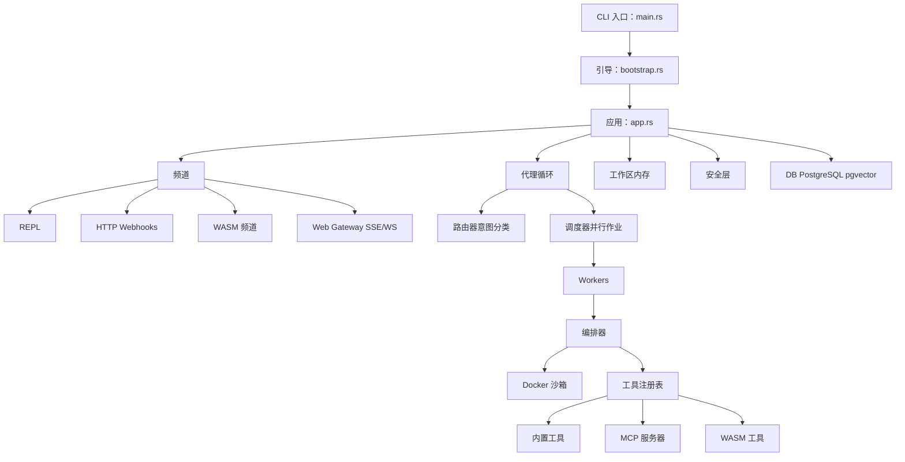

---

## Maxclaw

**分类：** Go 1.24+ | ~189 stars | 个人力量倍增器
**仓库：** [github.com/Lichas/maxclaw](https://github.com/Lichas/maxclaw)
**状态：** 活跃

### 概述

Maxclaw 是一个 OpenClaw 风格的本地优先 Go AI 代理，强调低内存占用、完全本地化工作流和可视化界面（桌面 UI + Web UI 同端口）。提供自主执行、可派生子会话和 monorepo 感知上下文发现。

### 关键原则

- Go 原生资源效率
- 完全本地执行（会话、记忆、日志）
- 桌面 UI + Web UI 同端口
- Monorepo 上下文感知（AGENTS.md、CLAUDE.md）
- 自主模式与任务调度

### 核心架构

- **语言：** Go 1.24+
- **入口点：** `cmd/main.go`
- **架构模式：** 单代理 + 子会话派生
- **关键模块：** 代理循环、工具系统、记忆（MEMORY.md + HISTORY.md）、频道（Telegram、WhatsApp、Discord、WebSocket）、调度器（cron/once/every）、monorepo 上下文发现
- **MCP 状态：** 无
- **部署：** 本地（跨平台）；二进制文件：`maxclaw` 和 `maxclaw-gateway`
- **LLM 支持：** Anthropic + OpenAI 原生 SDK
- **内存：** 分层 — MEMORY.md（长期）、HISTORY.md（会话）、heartbeat.md（活跃）
- **数据库：** SQLite
- **安全性：** 仅本地执行
- **测试：** Go 测试

### 架构图

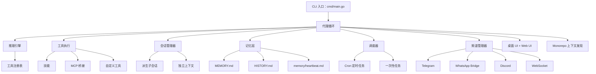

---

## NanoClaw

**分类：** TypeScript（Node.js） | Docker 合作伙伴 | 个人力量倍增器
**状态：** 活跃

### 概述

NanoClaw 是一个个人 Claude 助手，作为单个 Node.js 进程连接 WhatsApp 并将消息路由到在隔离容器中运行的 Claude Agent SDK。提供每组隔离的文件系统和记忆——生态中最突出的 MCP 抵制者。

### 关键原则

- 单进程架构，追求简约
- 容器化代理隔离
- 每组记忆和文件系统隔离
- WhatsApp 作为主要频道
- 明确避免 MCP 开销

### 核心架构

- **语言：** TypeScript（Node.js）
- **入口点：** `src/index.ts`
- **架构模式：** 单代理 + 容器隔离
- **关键模块：** WhatsApp 频道、IPC 观察者、消息路由器、容器运行器、任务调度器、SQLite 数据库
- **MCP 状态：** 抵制 — CLI 优先，基于容器，偏好直接工具执行
- **部署：** macOS（launchctl）+ 容器化代理
- **LLM 支持：** Claude Agent SDK
- **内存：** 每组 CLAUDE.md 文件
- **数据库：** SQLite
- **安全性：** 每组容器隔离
- **测试：** 未指定

### 架构图

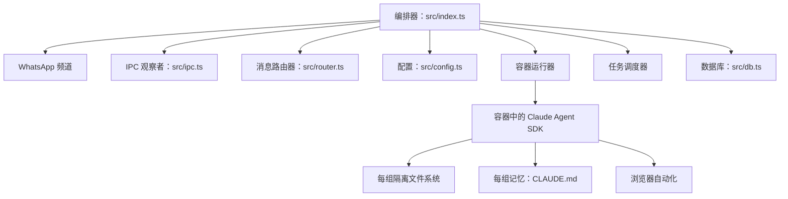

---

## Nanobot

**分类：** Python 3.11+ | ~37K stars | 个人力量倍增器
**状态：** 活跃

### 概述

Nanobot 是一个超轻量级个人 AI 助手，核心代理代码仅约 4,000 行——比 OpenClaw 小 99%。以最小资源占用提供核心代理功能。通过 `pip install nanobot-ai` 安装。

### 关键原则

- 超轻量级设计（~4,000 LOC 核心）
- 研究就绪，代码清晰易读
- 一键部署，简单易用
- MCP 协议支持
- 通过 LiteLLM 支持多个 LLM 提供商

### 核心架构

- **语言：** Python 3.11+
- **入口点：** `nanobot/__main__.py`（CLI 通过 Typer）
- **架构模式：** 单代理 + 子代理支持
- **关键模块：** 代理编排器、频道（8+：Telegram、Discord、Slack、WhatsApp、Feishu、QQ、Email、Matrix）、提供商（LiteLLM）、技能（ClawHub）、会话管理器、MCP 桥接
- **MCP 状态：** 无 — MCP 桥接可用但非核心
- **部署：** 跨平台（Python + Docker）
- **LLM 支持：** 通过 LiteLLM 多提供商（Anthropic、OpenAI、DeepSeek、Qwen、Moonshot 等）
- **内存：** 会话历史，可配置保留策略
- **数据库：** SQLite
- **安全性：** 安全加固
- **测试：** tests/ 目录

### 架构图

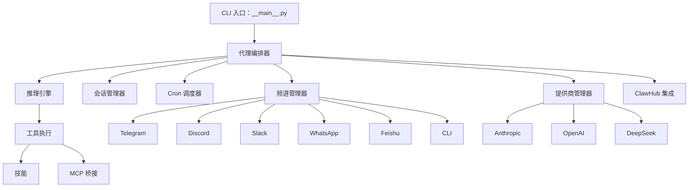

---

## ZeroClaw

**分类：** Rust | ~29K stars | 个人力量倍增器
**状态：** 活跃

### 概述

ZeroClaw 是一个 Rust 优先的自主代理运行时，为高性能和效率设计——<5MB RAM，<10ms 冷启动。使用 trait 驱动的模块化架构实现可插拔组件。生态系统中当前的性能领先者。

### 关键原则

- KISS（保持简单）
- YAGNI + DRY + 三法则
- SRP + ISP（单一责任 + 接口隔离）
- 快速失败 + 显式错误
- 默认安全 + 最小权限
- 确定性 + 可重现性

### 核心架构

- **语言：** Rust
- **入口点：** `src/main.rs`
- **架构模式：** 单代理 + trait 扩展
- **关键模块：** 配置、代理编排、网关（webhook 服务器）、安全（策略、配对、密钥）、内存（markdown/sqlite + 嵌入向量）、提供商、频道（15+）、工具（shell、file、memory、browser）、外设（STM32、RPi GPIO）
- **MCP 状态：** 适配器 — stdio/SSE
- **部署：** 原生（Linux 等）；跨平台
- **LLM 支持：** 8 原生 + 29 兼容提供商
- **内存：** Markdown/SQLite 配合嵌入向量和向量合并
- **数据库：** SQLite
- **安全性：** 首要安全，互联网邻接；基于策略
- **测试：** Rust 测试

### 架构图

*源文档中无可用图表。*

---

## HiClaw

**分类：** Go + Shell | 活跃开发 | 企业自动化
**状态：** 活跃

### 概述

HiClaw 是一个企业级多代理运行时，将 Kubernetes 风格的声明式资源引入 AI 代理编排。管理-工作者架构，配备团队模板、工作者市场和基于 Nacos 的技能注册中心。

### 关键原则

- Kubernetes 风格声明式资源（YAML）
- 管理-工作者编排模式
- 企业级多租户支持
- 工作者模板市场
- 基于 Nacos 的技能发现

### 核心架构

- **语言：** Go + Shell 脚本
- **入口点：** `hiclaw` CLI + Docker Compose
- **架构模式：** 管理-工作者
- **关键模块：** 工作者资源（YAML）、团队资源、人力资源（HITL）、Manager CoPaw 运行时、Nacos 技能注册中心、工作者模板市场
- **MCP 状态：** 适配器
- **部署：** Docker Compose（开发），Kubernetes（生产）
- **LLM 支持：** 网关管理
- **内存：** MinIO 共享文件系统
- **数据库：** PostgreSQL + MinIO
- **安全性：** 网关凭证隔离；多租户工作空间隔离
- **测试：** 未指定

### 架构图

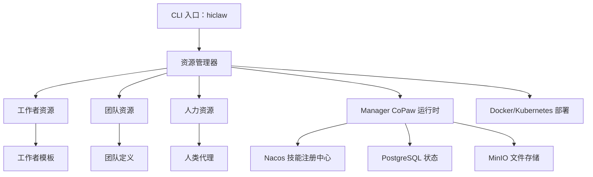

---

## QuantumClaw

**分类：** Node.js（TypeScript） | 活跃开发 | 个人力量倍增器
**状态：** 活跃

### 概述

QuantumClaw 是一个自托管的 AGEX（代理网关交换）协议实现，专注于代理身份、信任和成本感知编排。提供 3 层记忆、5 级成本路由和 ClawHub 集成（3,286+ 技能）。

### 关键原则

- AGEX 协议用于代理身份和信任
- 成本感知模型路由
- 三层记忆架构
- 自托管，最小依赖
- ClawHub 技能市场集成

### 核心架构

- **语言：** Node.js（TypeScript）
- **入口点：** `quantumclaw` CLI
- **架构模式：** 多代理派生 + AGEX 协议
- **关键模块：** AGEX 协议（身份 + 信任）、3 层记忆（向量 + 结构化 + 知识图谱）、5 级成本路由（反射 → 简单 → 标准 → 复杂 → 专家）、Live Canvas 仪表板、ClawHub 集成、12 个 MCP 服务器
- **MCP 状态：** 无 — AGEX 协议，非 MCP
- **部署：** 自托管（Linux、VPS、树莓派、Android）
- **LLM 支持：** 8+ 提供商
- **内存：** 3 层（向量搜索、结构化知识、知识图谱）
- **数据库：** SQLite
- **安全性：** 信任内核（VALUES.md）
- **测试：** 未指定

### 架构图

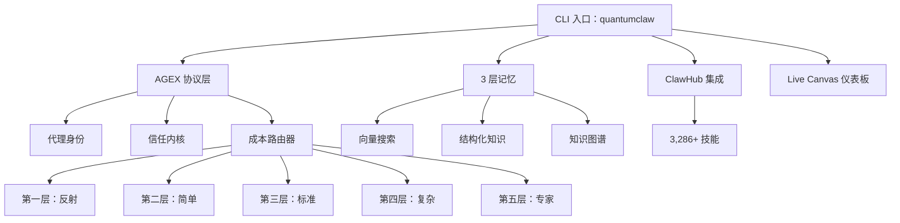

---

## Hermes-Agent

**分类：** Python | 研究驱动 | 个人力量倍增器
**状态：** 活跃

### 概述

Hermes-Agent 是一个研究驱动的个人 AI 代理，实现了先进的上下文管理技术——上下文压缩、已解决问题追踪和上下文分隔符。AllClaws 验证（2026 年 5 月）发现其基础设施良好，但夸大了"自我改进"声明。

### 关键原则

- 研究驱动的提示词工程
- 上下文压缩防止过时答案
- 已解决问题追踪
- 清晰上下文分隔符
- 竞争对手启发技术

### 核心架构

- **语言：** Python
- **入口点：** `hermes` CLI
- **架构模式：** 单代理 + 上下文管理
- **关键模块：** 上下文压缩引擎、已解决问题追踪器、上下文分隔符系统、提示词工程层、会话管理器、工具执行器（MCP + 自定义工具）
- **MCP 状态：** 原生 — MCP 集成用于工具执行
- **部署：** Linux、macOS、云端
- **LLM 支持：** Anthropic、OpenAI、OpenRouter
- **内存：** 会话历史 + 基于文件的持久化
- **数据库：** SQLite
- **安全性：** 研究驱动的安全检查
- **测试：** pytest

### 架构图

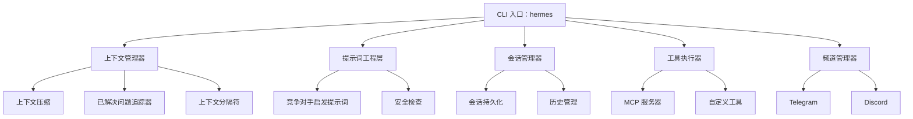

---

## RTL-CLAW

**分类：** Python + Verilog | 学术 | 学术
**状态：** 活跃

### 概述

RTL-CLAW 是一个 AI 代理驱动的 IC 设计流程自动化框架，由同济大学 EDA 实验室和香港中文大学合作开发。基于 OpenClaw 构建，展示 AI 驱动的 RTL 设计自动化、验证和综合工作流，面向 ASAP7nm PDK。

### 关键原则

- 基于 OpenClaw 的研究导向 EDA 工具链
- 分层设计：交互层 → 代理核心层 → 工具/数据流层
- 模块化插件架构
- 集成开源和商业 EDA 工具

### 核心架构

- **语言：** Python + Verilog
- **入口点：** Docker Compose
- **架构模式：** 分层管道（交互 → 代理核心 → 工具/数据流）
- **关键模块：** 交互层、代理核心层（任务规划/执行）、工具和数据流层（RTL 分析、Verilog 分区、优化、测试台生成、Yosys 综合）
- **MCP 状态：** N/A
- **部署：** 基于 Docker
- **LLM 支持：** OpenClaw 提供者
- **内存：** 基于工作区
- **数据库：** 未指定
- **安全性：** 基于 Docker 的隔离
- **测试：** 未指定

### 架构图

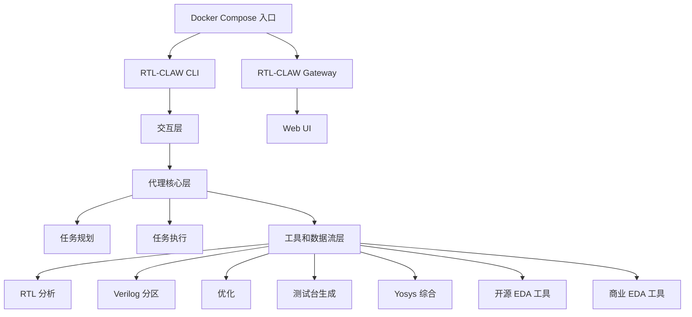

---

## Claw-AI-Lab

**分类：** Python 3.11+ + Node.js 18+ | 学术 | 学术
**状态：** 活跃

### 概述

Claw-AI-Lab 是一个实验室原生多代理研究平台，用于交互式和可扩展的 AI 驱动科学研究。从单个提示创建完整的 AI 研究实验室，具有可定制角色和基于 FIFO 的调度，支持三种研究模式：探索、讨论、复现。

### 关键原则

- 实验室原生多代理研究平台
- 基于 FIFO 的调度框架，支持并行执行
- 人在环路，具有干预能力
- 跨项目知识共享
- 三种研究模式：探索、讨论、复现

### 核心架构

- **语言：** Python 3.11+（后端）、Node.js 18+（前端）
- **入口点：** `start.sh`
- **架构模式：** 多代理研究管道（FIFO 调度）
- **关键模块：** 多代理编排器、Claw Code Harness、沙箱执行器、知识库（Markdown/Obsidian）、React Web 仪表板、LLM 提供商管理器（含回退链）
- **MCP 状态：** N/A
- **部署：** 跨平台（Python + Node.js）
- **LLM 支持：** 多模型 + 回退链
- **内存：** 知识库（Markdown/Obsidian）
- **数据库：** 基于项目的存储
- **安全性：** HITL 门控 + 沙箱执行
- **测试：** 端到端管道测试

### 架构图

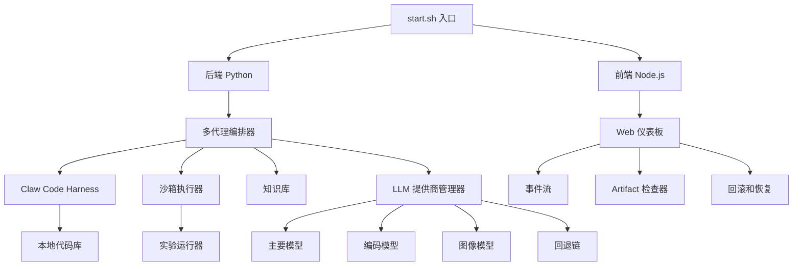

---

## 第二部分：外部框架（7 个平台）

---

## SmolAgents

**分类：** Python | ~26.7K stars | 个人力量倍增器
**仓库：** [github.com/huggingface/smolagents](https://github.com/huggingface/smolagents)
**状态：** 活跃

### 概述

Hugging Face 的超轻量级 AI 代理库（~1,000 LOC 核心）。其根本特征是代码优先范式——代理将操作表达为可执行的 Python 代码，而非抽象工具调用。展示了代理框架可以做到多么精简。

### 关键原则

- 最小核心（~1,000 行）
- 代码优先范式——代理编写并执行 Python
- 极简入门
- Hugging Face 生态集成
- E2B 沙箱执行

### 核心架构

- **语言：** Python
- **入口点：** 库导入（`from smolagents import CodeAgent`）
- **架构模式：** 单代理（代码生成）
- **关键模块：** CodeAgent、HfApiModel、沙箱工具执行、记忆系统
- **MCP 状态：** N/A
- **部署：** 混合
- **LLM 支持：** Hugging Face 推理 API（免费层级）
- **内存：** 对话上下文和结果追踪
- **数据库：** 未指定
- **安全性：** E2B 沙箱
- **测试：** 未指定

### Claw 生态比较

| 方面 | SmolAgents | Nanobot | NanoClaw |
|------|------------|---------|----------|
| **核心 LOC** | ~1,000 | ~4,000 | ~10,600 |
| **范式** | 代码生成 | 工具调用 | 容器优先 |
| **沙箱** | E2B | 原生 | Docker |
| **生态** | Hugging Face Hub | 自定义 | 自定义 |

---

## LangGraph

**分类：** Python、TypeScript | 企业采用 | 企业自动化
**仓库：** [github.com/langchain-ai/langgraph](https://github.com/langchain-ai/langgraph)
**状态：** 活跃

### 概述

基于图的编排框架，用于构建有状态的多代理 AI 应用程序。基于 LangChain 构建，将 AI 工作流建模为有向图，具有检查点持久化。通过 LangChain 生态系统成为企业领导者。

### 关键原则

- 基于图的工作流
- 有状态执行，含检查点
- 人在环路模式
- 并行执行支持
- 企业就绪的生产模式

### 核心架构

- **语言：** Python、TypeScript
- **入口点：** 库导入
- **架构模式：** 图编排
- **关键模块：** StateGraph（类型化状态）、节点（代理/工具）、边（条件路由）、检查点、子图
- **MCP 状态：** N/A
- **部署：** 云端
- **LLM 支持：** 通过 LangChain 生态
- **内存：** 内置检查点
- **数据库：** 未指定
- **安全性：** 未指定
- **测试：** 未指定

### Claw 生态比较

| 方面 | LangGraph | ClawTeam | GoClaw |
|------|-----------|----------|--------|
| **编排** | 基于图 | 领导-工作者 | 基于团队 |
| **状态** | 检查点 | Git worktrees | PostgreSQL |
| **类型安全** | 类型化状态 | 无类型 | Go 类型 |

---

## mcp-agent

**分类：** Python | ~8.2K stars | 企业自动化
**仓库：** [github.com/lastmile-ai/mcp-agent](https://github.com/lastmile-ai/mcp-agent)
**状态：** 活跃

### 概述

MCP 原生 AI 代理的参考实现。由 LastMile AI 构建，采用规划器-执行器模型、内置记忆和简单组合。愿景："MCP is all you need."

### 关键原则

- MCP 原生设计
- 规划器-执行器模型
- 内置记忆系统
- 从 MCP 服务器简单组合

### 核心架构

- **语言：** Python
- **入口点：** 库导入
- **架构模式：** 规划器-执行器（单代理）
- **关键模块：** MCP 客户端、规划器（任务分解）、执行器（MCP 工具调用）、记忆
- **MCP 状态：** 原生 — 参考实现
- **部署：** 云端
- **LLM 支持：** 未指定
- **内存：** 集成记忆系统
- **数据库：** 未指定
- **安全性：** 未指定
- **测试：** 未指定

### Claw 生态比较

| 平台 | MCP 支持 | 类型 |
|------|----------|------|
| **mcp-agent** | 原生（参考） | 围绕 MCP 构建的框架 |
| **IronClaw** | 适配器 | stdio/SSE/streamable-http |
| **GoClaw** | 适配器 | stdio/SSE/streamable-http |
| **ZeroClaw** | 适配器 | stdio/SSE/streamable-http |
| **OpenClaw** | 插件 | 通过扩展 |
| **NanoClaw** | 无 | CLI 优先，抵制 |

---

## CrewAI

**分类：** Python | 活跃开发 | 企业自动化
**仓库：** [github.com/crewaiinc/crewai](https://github.com/crewaiinc/crewai)
**状态：** 活跃

### 概述

编排角色扮演自主 AI 代理的 Python 框架。每个代理有定义的角色、目标和背景故事。开创了基于角色的多代理系统方法。

### 关键原则

- 基于角色的代理（角色、目标、背景故事）
- 自动任务委派
- 顺序/并行工作流
- 外部工具使用
- 人在环路批准

### 核心架构

- **语言：** Python
- **入口点：** 库导入（`from crewai import Agent, Task, Crew`）
- **架构模式：** 多代理（基于角色）
- **关键模块：** Agent（基于角色的实体）、Task（工作单元）、Crew（代理集合）、Process（顺序/并行/分层）
- **MCP 状态：** N/A
- **部署：** 混合
- **LLM 支持：** 未指定
- **内存：** 内存状态
- **数据库：** 未指定
- **安全性：** HITL 批准门控
- **测试：** 未指定

### Claw 生态比较

| 方面 | CrewAI | ClawTeam |
|------|--------|----------|
| **协调** | 基于角色的故事 | 领导-工作者 |
| **状态** | 内存中 | Git worktrees |
| **沟通** | 直接消息 | 收件箱系统 |
| **隔离** | 进程级 | 文件系统（worktrees） |

---

## AutoGen

**分类：** Python | 微软研究院 | 企业自动化
**仓库：** [github.com/microsoft/autogen](https://github.com/microsoft/autogen)
**状态：** 活跃

### 概述

微软研究院的多代理对话框架。代理通过消息沟通解决问题，支持人在环路、Docker 代码执行和多模态内容。

### 关键原则

- 基于对话的代理沟通
- 人在环路（UserProxy 代理）
- Docker 安全代码执行
- 多模态（文本、图像、代码）
- LLM 灵活性

### 核心架构

- **语言：** Python
- **入口点：** 库导入
- **架构模式：** 多代理（对话式）
- **关键模块：** Agent、Conversation、UserProxyAgent、CodeExecutor（Docker）
- **MCP 状态：** N/A
- **部署：** 云端
- **LLM 支持：** 各种提供商
- **内存：** 基于对话的状态
- **数据库：** 未指定
- **安全性：** Docker 代码执行沙箱
- **测试：** 未指定

### Claw 生态比较

| 方面 | AutoGen | ClawTeam | CrewAI |
|------|---------|----------|--------|
| **沟通** | 对话消息 | 收件箱系统 | 直接调用 |
| **人类角色** | UserProxy 代理 | 与代理分离 | 可选批准 |
| **代码执行** | 内置 Docker | 通过代理工具 | 通过代理工具 |

---

## Swarms

**分类：** Python | ~5K stars | 企业自动化
**仓库：** [github.com/kyegomez/swarms](https://github.com/kyegomez/swarms)
**状态：** 活跃

### 概述

企业级、生产就绪的多代理编排框架。专注于大规模部署的可扩展性和可靠性。自称"最可靠、可扩展和灵活的多代理编排框架"。

### 关键原则

- 企业级可靠性
- 大规模代理部署
- 异步子代理（v10+）
- SkillOrchestra 能力管理
- "代理经济"愿景

### 核心架构

- **语言：** Python
- **入口点：** 库导入
- **架构模式：** 多代理（异步编排）
- **关键模块：** Swarm（代理集合）、Orchestrator（生命周期）、Skills（可重用能力）、Tools（外部集成）
- **MCP 状态：** N/A
- **部署：** 云端
- **LLM 支持：** 未指定
- **内存：** 未指定
- **数据库：** 未指定
- **安全性：** 未指定
- **测试：** 未指定

### Claw 生态比较

| 方面 | Swarms | GoClaw | HiClaw |
|------|--------|--------|--------|
| **目标** | 企业编排 | 多代理网关 | 多代理运行时 |
| **语言** | Python | Go | Go + Shell |
| **架构** | 异步技能 | 车道调度器 | 管理-工作者 |

---

## OpenAgents

**分类：** TypeScript | 活跃开发 | 企业自动化
**仓库：** [github.com/openagents-org/openagents](https://github.com/openagents-org/openagents)
**状态：** 活跃

### 概述

分布式 AI 代理网络的 TypeScript 框架。哲学："Your agents are everywhere"——跨分布式基础设施的代理处理数据库、营销和用户回复。展示了 TypeScript 作为代理框架一流语言。

### 关键原则

- 分布式代理，位于不同服务器
- TypeScript 优先实现
- 云原生设计
- 多位置部署

### 核心架构

- **语言：** TypeScript
- **入口点：** 库导入
- **架构模式：** 多代理（分布式网络）
- **关键模块：** 代理工作区、网络协调、云集成
- **MCP 状态：** N/A
- **部署：** 云端（分布式）
- **LLM 支持：** 未指定
- **内存：** 未指定
- **数据库：** 未指定
- **安全性：** 未指定
- **测试：** 未指定

### Claw 生态比较

| 方面 | OpenAgents | QuantumClaw |
|------|------------|-------------|
| **部署** | 分布式云 | 本地优先 |
| **协议** | 自定义 | AGEX |
| **语言** | TypeScript | TypeScript |
| **关注点** | 分布式规模 | 隐私 |

---

## 第三部分：跨平台比较矩阵

### 语言与领域矩阵

| 平台 | 语言 | 领域 | Stars |
|------|------|------|-------|
| OpenClaw | TypeScript | 个人力量倍增器 | ~340K |
| ClawTeam | Python 3.10+ | 个人力量倍增器 | ~884 |
| GoClaw | Go 1.26 | 企业自动化 | ~1.3K |
| IronClaw | Rust | 个人/企业（混合） | 增长中 |
| Maxclaw | Go 1.24+ | 个人力量倍增器 | ~189 |
| NanoClaw | TypeScript（Node.js） | 个人力量倍增器 | N/A |
| Nanobot | Python 3.11+ | 个人力量倍增器 | ~37K |
| ZeroClaw | Rust | 个人力量倍增器 | ~29K |
| HiClaw | Go + Shell | 企业自动化 | N/A |
| QuantumClaw | Node.js（TypeScript） | 个人力量倍增器 | N/A |
| Hermes-Agent | Python | 个人力量倍增器 | N/A |
| RTL-CLAW | Python + Verilog | 学术 | N/A |
| Claw-AI-Lab | Python 3.11+ + Node.js 18+ | 学术 | N/A |
| SmolAgents | Python | 个人力量倍增器 | ~26.7K |
| LangGraph | Python/TypeScript | 企业自动化 | N/A |
| mcp-agent | Python | 企业自动化 | ~8.2K |
| CrewAI | Python | 企业自动化 | N/A |
| AutoGen | Python | 企业自动化 | N/A |
| Swarms | Python | 企业自动化 | ~5K |
| OpenAgents | TypeScript | 企业自动化 | N/A |

### MCP 采用矩阵

| MCP 状态 | 平台 |
|----------|------|
| **原生** | mcp-agent、Hermes-Agent |
| **适配器** | OpenClaw、GoClaw、IronClaw、ZeroClaw、HiClaw |
| **抵制** | NanoClaw |
| **无** | ClawTeam、Maxclaw、Nanobot、QuantumClaw |
| **N/A** | RTL-CLAW、Claw-AI-Lab、SmolAgents、LangGraph、CrewAI、AutoGen、Swarms、OpenAgents |

### 架构模式矩阵

| 模式 | 平台 |
|------|------|
| **单代理** | OpenClaw、IronClaw、Maxclaw、NanoClaw、Nanobot、ZeroClaw、Hermes-Agent |
| **领导-工作者** | ClawTeam |
| **网关/团队** | GoClaw |
| **管理-工作者** | HiClaw |
| **多代理派生** | QuantumClaw |
| **基于角色多代理** | CrewAI |
| **对话式多代理** | AutoGen |
| **异步编排** | Swarms |
| **分布式网络** | OpenAgents |
| **图编排** | LangGraph |
| **规划器-执行器** | mcp-agent |
| **代码生成** | SmolAgents |
| **分层管道** | RTL-CLAW |
| **研究管道** | Claw-AI-Lab |

### 部署与数据库矩阵

| 平台 | 部署 | 数据库 | 容器化 |
|------|------|--------|--------|
| OpenClaw | 跨平台（Mac、Win、Linux、移动） | 未指定 | 未指定 |
| ClawTeam | 本地 + 可选 ZeroMQ P2P | JSON 文件 | 无（git worktrees） |
| GoClaw | 二进制 + Docker | PostgreSQL 15+ | Docker 沙箱 |
| IronClaw | 跨平台 | PostgreSQL 15+ | Docker + WASM |
| Maxclaw | 本地（跨平台） | SQLite | 无 |
| NanoClaw | macOS + 容器 | SQLite | Linux VM/容器 |
| Nanobot | 跨平台（Python + Docker） | SQLite | Docker |
| ZeroClaw | 原生（Linux 等） | SQLite | 无 |
| HiClaw | Docker + Kubernetes | PostgreSQL + MinIO | Docker/K8s |
| QuantumClaw | 自托管（Linux、VPS、树莓派） | SQLite | 无 |
| Hermes-Agent | Linux、macOS、云端 | SQLite | 无 |
| RTL-CLAW | Docker | 未指定 | Docker |
| Claw-AI-Lab | 跨平台 | 基于项目 | 沙箱执行器 |
| SmolAgents | 混合 | 未指定 | E2B 沙箱 |
| LangGraph | 云端 | 未指定 | 未指定 |
| mcp-agent | 云端 | 未指定 | 未指定 |
| CrewAI | 混合 | 未指定 | 未指定 |
| AutoGen | 云端 | 未指定 | Docker |
| Swarms | 云端 | 未指定 | 未指定 |
| OpenAgents | 云端（分布式） | 未指定 | 未指定 |

### 完整 20 平台比较表

| 平台 | 语言 | Stars | MCP | 架构 | 部署 | 领域 |
|------|------|-------|-----|------|------|------|
| OpenClaw | TypeScript | ~340K | 适配器 | 单代理 + 插件 | 跨平台 | 个人 |
| ClawTeam | Python | ~884 | 无 | 领导-工作者 | 本地 | 个人 |
| GoClaw | Go | ~1.3K | 适配器 | 网关 + 团队 | 二进制 + Docker | 企业 |
| IronClaw | Rust | 增长中 | 适配器 | 单代理 + WASM | 跨平台 | 混合 |
| Maxclaw | Go | ~189 | 无 | 单代理 + 子会话 | 本地 | 个人 |
| NanoClaw | TypeScript | N/A | 抵制 | 单代理 + 容器 | macOS + 容器 | 个人 |
| Nanobot | Python | ~37K | 无 | 单代理 + 子代理 | 跨平台 | 个人 |
| ZeroClaw | Rust | ~29K | 适配器 | 单代理 + trait | 原生 | 个人 |
| HiClaw | Go+Shell | N/A | 适配器 | 管理-工作者 | Docker/K8s | 企业 |
| QuantumClaw | TypeScript | N/A | 无 | 多代理派生 | 自托管 | 个人 |
| Hermes-Agent | Python | N/A | 原生 | 单代理 + 上下文 | Linux/macOS/云 | 个人 |
| RTL-CLAW | Py+Verilog | N/A | N/A | 分层管道 | Docker | 学术 |
| Claw-AI-Lab | Py+Node.js | N/A | N/A | 研究管道 | 跨平台 | 学术 |
| SmolAgents | Python | ~26.7K | N/A | 代码生成 | 混合 | 个人 |
| LangGraph | Py/TS | N/A | N/A | 图编排 | 云端 | 企业 |
| mcp-agent | Python | ~8.2K | 原生 | 规划器-执行器 | 云端 | 企业 |
| CrewAI | Python | N/A | N/A | 基于角色 | 混合 | 企业 |
| AutoGen | Python | N/A | N/A | 对话式 | 云端 | 企业 |
| Swarms | Python | ~5K | N/A | 异步编排 | 云端 | 企业 |
| OpenAgents | TypeScript | N/A | N/A | 分布式 | 云端 | 企业 |

---

## 参见

- **月度生态系统报告：** [_posts/](../_posts/) — 跨平台趋势和平台更新
- **最新更新：** [docs/LATEST_UPDATES.md](../docs/LATEST_UPDATES.md) — 每平台变更追踪
- **多代理协调研究：** [multi_agent_coordination_research.zh-CN.md](multi_agent_coordination_research.zh-CN.md) — 协调模式深度分析
- **研究路线图：** [docs/ROADMAP.zh-CN.md](../docs/ROADMAP.zh-CN.md) — 2026 年下半年优先事项
- **原始架构文档（已被取代）：** [architecture_comparison.zh-CN.md](architecture_comparison.zh-CN.md)、[external_frameworks.zh-CN.md](external_frameworks.zh-CN.md)

---

*最后更新：2026 年 5 月*
*跟踪平台：20 个（13 个 claw 生态 + 7 个外部框架）*
*所属：AllClaws 个人 AI 代理生态系统研究*
